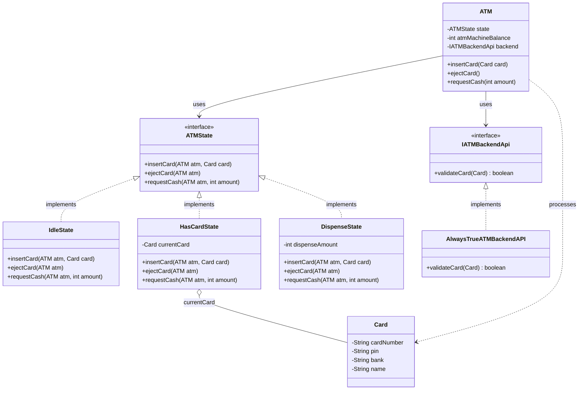

# ATM Machine Low-Level Design (LLD)

This project demonstrates the Low-Level Design (LLD) for an Automated Teller Machine (ATM) using the **State Design Pattern**. It is scoped to focus deeply on modeling the correct structural design for a standard 1-hour Object-Oriented Design interview block.

## Design Requirements
- The ATM must handle one user/transaction at a time.
- The machine should support inserting a card, verifying it, and dispensing cash.
- The balance deduction and hardware actions must follow robust, strictly ordered logical states.
- Exceptions (`IllegalStateException`) must be thrown for invalid actions (e.g., trying to withdraw cash without inserting a card first).

### Out of Scope (For an Interview Scenario)
- Complex UI or Hardware interface integration.
- Connecting to a real Database or REST API (we use straightforward interfaces/adapters for mocking in tests).
- Concurrency handles (an ATM naturally processes sequentially per session).
- Secondary operations like PIN Change or Balance Check (to keep the 1-hour interview focused and finish the core loop).

---

## The Solution: State Design Pattern

The core challenge of designing an ATM is that its behavior fundamentally changes depending on its current state. For example, the `requestCash()` action is completely invalid if a card hasn't been validated yet. Using large IF/ELSE blocks to check `if (hasCard)` or `switch(state)` everywhere quickly becomes an unmaintainable anti-pattern. 

We solve this using the State Design Pattern. The ATM Context delegates all incoming actions to a polymorphic State object, allowing the machine's behavior to change dynamically at runtime as it transitions between states.

### UML Class Diagram

Below is the Unified Modeling Language (UML) Class Diagram representing our State Pattern implementation:

### The Component Structure

#### 1. The Context (`ATM.java`)
The `ATM` class acts as the Context. It holds the `atmMachineBalance`, an adapter to call the backend API, and a reference to the **Interface** `ATMState`. 
When a user interacts with the ATM (e.g., `myAtm.insertCard(card)`), the ATM object doesn't contain the logic to process it; it blindly delegates the call to its current active state: `this.state.insertCard(this, card);`.

#### 2. The State Interface (`ATMState.java`)
A unified interface defining all possible actions a user or system can take on the ATM:
- `insertCard(ATM atm, Card card)`
- `ejectCard(ATM atm)`
- `requestCash(ATM atm, int amount)`

#### 3. The Concrete States (`IdleState`, `HasCardState`, `DispenseState`)
These classes implement the `ATMState` interface and house the absolute logic for that specific scenario.

*   **`IdleState`**: 
    *   *Role*: Waiting for a user to insert a card. 
    *   *Transitions*: Rejects `requestCash` or `ejectCard`. If `insertCard` is called AND the backend validates the card, it triggers the transition: `atm.setState(new HasCardState(card))`. If validation fails, it throws an `IllegalStateException`.
*   **`HasCardState`**: 
    *   *Role*: A valid card is in the machine, waiting for user input. 
    *   *Transitions*: Rejects a second `insertCard`. If `ejectCard` is called, it reverts to `IdleState`. If `requestCash` is called, it checks the ATM's internal balance. If there is enough money, it triggers: `atm.setState(new DispenseState(amount))`.
*   **`DispenseState`**: 
    *   *Role*: Finalizing the transaction and dispatching money.
    *   *Transitions*: Inherently transient. It updates the Context's cash balance, dispenses the cash (mocked via console/logic), and immediately transitions the system back to `atm.setState(new IdleState())`. It rejects `insertCard` and `ejectCard` during this process.

### Why this design excels for Interviews:
*   **Clean Code & SOLID principles**: Each state class has a Single Responsibility. Adding new states (e.g., `ReadPINState` or `BalanceInquiryState`) strictly adheres to the Open/Closed Principle—we add new state classes and update transitions without modifying existing, tested states.
*   **Encapsulation**: The complex transition rules and logic are not sprawling in a monolithic `ATM` service class; the states manage their own rules and boundaries.
*   **Testability**: Since the dependencies (like the API Backend) are injected via constructor/interfaces, the entire state machine can be completely Unit Tested independently using frameworks like JUnit without needing a database, Spring Context, or complex setups.
