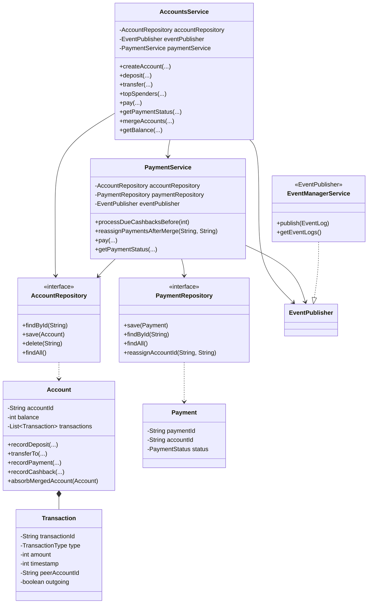

# LLD — Scalable Banking System

> **Start here**: See [DESIGN_GUIDE.md](./DESIGN_GUIDE.md) for interview-oriented design notes, entity relationships, and extension ideas.

This module implements an **in-memory banking** API in **four levels**: core accounts & transfers, top spenders, payments with delayed cashback, then account merge and historical balance queries. Every operation takes a **timestamp** (milliseconds) so the system can reason about ordering, cashback, and replay.

---

## Table of contents

1. [Global rules](#global-rules)
2. [Level 1 — Basic banking](#level-1--basic-banking-operations)
3. [Level 2 — Top spenders](#level-2--top-spenders-ranking)
4. [Level 3 — Payments & cashback](#level-3--payments-and-cashback)
5. [Level 4 — Merge & historical balance](#level-4--account-merge-and-historical-queries)
6. [Package layout](#package-layout)
7. [Architecture & patterns](#architecture--design-patterns)
8. [UML class diagram](#uml-class-diagram)
9. [Wiring the services](#wiring-the-services)
10. [Tests](#tests)
11. [Out of scope](#out-of-scope)

---

## Global rules

- **Timestamps** are passed into every method and used to record when an action occurred (**milliseconds**).
- The implementation maintains an **event log** via `EventPublisher` / `EventManagerService` (creation, deposit, transfer, payment, cashback).
- **Cashback** (Level 3) must be **processed before any other work** at the same logical millisecond when both could apply (see `PaymentService.processDueCashbacksBefore`).
- **Historical balance** (Level 4) uses **transaction replay** up to a chosen `timeAt`, including merged histories.

---

## Level 1 — Basic banking operations

```java
boolean createAccount(Integer timestamp, String accountId)
Optional<Integer> deposit(Integer timestamp, String accountId, int amount)
Optional<Integer> transfer(Integer timestamp, String sourceAccountId, String destinationAccountId, int amount)
```

| # | Functional requirement |
|---|------------------------|
| 1 | Store account data in memory keyed by `accountId`. |
| 2 | Store each transaction with its timestamp for historical lookup. |
| 3 | Reject deposit or transfer if `amount <= 0`. |
| 4 | Transfer updates both source and destination. |
| 5 | Transfer is atomic on the success path (no partial debit/credit). |

---

## Level 2 — Top spenders ranking

```java
List<String> topSpenders(Integer timestamp, int n)
```

| # | Functional requirement |
|---|------------------------|
| 1 | Top **N** accounts by **total outgoing** amount (see below). |
| 2 | Level 2: **transfer** outgoing only; Level 3+: **transfer + pay** outgoing. |
| 3 | Format: `accountId(total)` e.g. `A5(400)`. |
| 4 | Tie-break: **lexicographic** by `accountId`. |
| 5 | Accounts with **0** outgoing may appear if they fall in the top N. |

**Outgoing** is derived from the account’s ledger: `TRANSFER` rows with `outgoing == true`, and (after Level 3) `PAY` rows, each counted if `transaction.timestamp <=` query cutoff.

---

## Level 3 — Payments and cashback

```java
Optional<String> pay(Integer timestamp, String accountId, int amount)
Optional<String> getPaymentStatus(Integer timestamp, String accountId, String paymentId)
```

| # | Functional requirement |
|---|------------------------|
| 1 | Debit balance; assign and return a **payment id**. |
| 2 | After **86_400_000** ms (24h), credit **2%** of payment amount, **rounded down**. |
| 3 | Cashback runs **before** any other operation at the cashback due time (and before other ops at the same `timestamp` when applicable). |
| 4 | `getPaymentStatus` returns **`IN PROGRESS`** or **`CASHBACK RECEIVED`** (strings with spaces, via `PaymentStatus.toApiString()`). |
| 5 | **Top spenders** includes **pay** as outgoing. |

---

## Level 4 — Account merge and historical queries

```java
boolean mergeAccounts(Integer timestamp, String account1, String account2)
Optional<Integer> getBalance(Integer timestamp, String accountId, Integer timeAt)
```

| Area | Functional requirement |
|------|------------------------|
| **mergeAccounts** | Move **balance**, **merged transaction history**, **pending/completed payments** (reassigned to survivor), and **outgoing totals** (via merged ledger) from `account2` into `account1`; **delete** `account2`. |
| **Queries on `account2`** | After merge, should behave as **missing** (`Optional.empty()` where applicable). |
| **Payment ids** | Payments originally tied to `account2` remain queryable under **`account1`** with the same **payment id**. |
| **getBalance** | **Replay** all relevant ledger lines with `timestamp <= timeAt` (inclusive), in deterministic order `(timestamp, transactionId)`, reflecting **merged** history on the survivor. |

---

## Package layout

```
bankingsystem/
├── README.md                 ← this file
├── DESIGN_GUIDE.md           ← interview / deep-dive guide
├── events/
│   └── EventPublisher.java
├── models/
│   ├── Account.java
│   ├── Transaction.java
│   ├── TransactionType.java
│   ├── Payment.java
│   ├── PaymentStatus.java
│   ├── EventLog.java
│   └── EventType.java
├── repository/
│   ├── AccountRepository.java
│   ├── InMemoryAccountRepository.java
│   ├── PaymentRepository.java
│   └── InMemoryPaymentRepository.java
└── services/
    ├── AccountsService.java
    ├── PaymentService.java
    └── EventManagerService.java
```

---

## Architecture & design patterns

| Pattern / idea | Where | Why |
|----------------|-------|-----|
| **Repository** | `AccountRepository`, `PaymentRepository` | Hide storage; swap in-memory for DB in production. |
| **Dependency inversion** | `AccountsService` → interfaces | Services depend on abstractions. |
| **Domain methods on `Account`** | `recordDeposit`, `transferTo`, `recordPayment`, `recordCashback`, `absorbMergedAccount` | Balance + ledger invariants live with the aggregate. |
| **Application services** | `AccountsService`, `PaymentService` | Orchestration, cashback ordering, merge side-effects. |
| **Observer / audit sink** | `EventPublisher` | Chronological `EventLog` without coupling domain to a concrete logger. |
| **Strategy-like ordering** | Cashback sorted by `(dueTime, paymentId)` | Deterministic behavior when multiple cashbacks share a millisecond. |

### SOLID (short)

- **S** — Accounts vs payments vs events separated; `Account` owns ledger rules.
- **O** — New repository or event sink without changing domain rules.
- **L** — Repository implementations substitutable behind interfaces.
- **I** — Small `EventPublisher` (single method).
- **D** — Services depend on `AccountRepository`, `PaymentRepository`, `EventPublisher`, not concrete maps.

---

## UML class diagram



---

## Wiring the services

There is **no** `main` or Gradle `runBanking` task yet; construct the graph in tests or a future demo:

```java
var accounts = new InMemoryAccountRepository();
var payments = new InMemoryPaymentRepository();
var events = new EventManagerService();
var paymentService = new PaymentService(accounts, payments, events);
var banking = new AccountsService(accounts, events, paymentService);
```

---

## Tests

```bash
./gradlew test --tests "com.springmicroservice.lowleveldesignproblems.bankingsystem.**"
```

Key scenarios live in `AccountsServiceTest`: merged balances, payment id reassignment after merge, historical `getBalance` at different `timeAt`, and replay matching balance after `pay`.

---

## Out of scope

- JDBC/JPA persistence, REST controllers, auth.
- Interest, scheduled jobs, or external payment networks.
- Formal distributed transactions; assumes single-process ordering.

For interview-style Q&A and extension hooks, see [DESIGN_GUIDE.md](./DESIGN_GUIDE.md).
