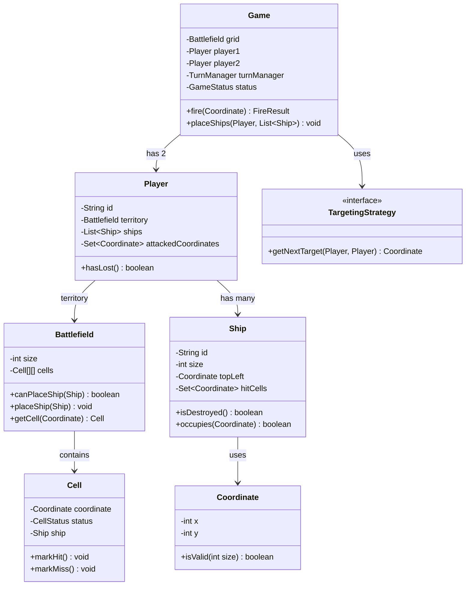

# Battleship Game LLD — Design Guide for Strong Interview Performance

This guide walks you through designing the Battleship game in a way that showcases strong LLD skills. Follow the steps in order.

---

## Phase 1: Clarify & Scope (Interview Tip: Do This First)

Before coding, clarify these with the interviewer (or decide for yourself):

| Question | Your Assumption |
|----------|-----------------|
| **Grid division** | Split vertically: Player 1 gets rows `[0, N/2-1]`, Player 2 gets `[N/2, N-1]`. Or split horizontally. Configurable via `GridDivisionStrategy`. |
| **Ship destruction model** | Each ship occupies multiple cells. **All cells** of a ship must be hit to destroy it. Single hit = marks cell hit; when last cell hit → ship destroyed. |
| **Ship placement** | Manual (input coordinates) or random (random valid position). Configurable per game. |
| **Targeting** | Start with random; support manual targeting (coordinate input). Pluggable via `TargetingStrategy`. |
| **Ship overlap** | Ships must not overlap. They **may** touch (adjacent or diagonal). Validation during placement. |
| **Turn order** | Player 1 fires first. Alternate turns. Miss does **not** give extra turn (unlike some variants). |
| **View battlefield** | Each player has own view: own ships (hidden from opponent), attacked coordinates, hit/miss status. Support fog-of-war for opponent's half. |
| **Hit/miss tracking** | Per-player: count hits, misses. Optional: per-ship hit tracking. |
| **Game termination** | When all ships of **one** player are destroyed. That player loses; opponent wins. |

**Why this matters**: Interviewers care about **clear state modeling**, **turn management**, **spatial validation** (placement, overlap, bounds), and **view abstraction** for different stakeholders.

---

## Phase 2: Identify Core Entities & Relationships

Start with **nouns** from requirements. Map to entities:

### Domain Models

```
Coordinate
├── x (int), y (int)
├── equals(), hashCode()
├── isValid(gridSize) → boolean
└── (immutable; value object)

Cell
├── coordinate
├── cellStatus: EMPTY | OCCUPIED | HIT | MISS
├── ship (optional, when OCCUPIED or HIT)
└── markHit() / markMiss()

Ship
├── id (String, unique)
├── size (int) — square ship = size × size
├── topLeft (Coordinate) — top-left corner
├── cells (Set<Coordinate> or derived from topLeft + size)
├── hitCells (Set<Coordinate>) — cells that have been hit
├── isDestroyed() → boolean (hitCells.size() == cells.size())
└── occupies(Coordinate) → boolean

Battlefield / Grid
├── size (int) — N×N
├── cells (Cell[][]) or Map<Coordinate, Cell>
├── getCell(Coordinate) → Cell
├── isInBounds(Coordinate) → boolean
├── getCellsForShip(topLeft, size) → List<Coordinate>
├── canPlaceShip(ship) → boolean (bounds + no overlap)
└── placeShip(ship) → void

Player
├── id (String)
├── name (String)
├── territory (Battlefield) — half of grid
├── ships (List<Ship>)
├── attackedCoordinates (Set<Coordinate>) — fired at opponent
├── getShipsRemaining() → int
├── hasLost() → boolean (all ships destroyed)
└── getTerritoryView(viewer) → BattlefieldView (for visibility rules)

BattlefieldView (Strategy / Builder)
├── cells — what to expose (HIDDEN | EMPTY | HIT | MISS)
├── getCellRepresentation(Coordinate, viewer) → char or enum
├── PlayerView: own ships visible; opponent sees HIT/MISS only
└── FogOfWarView: opponent's unexplored cells hidden

Game
├── grid (Battlefield — full N×N, logical division)
├── player1, player2 (Player)
├── currentTurn (Player)
├── gameStatus: NOT_STARTED | IN_PROGRESS | PLAYER1_WINS | PLAYER2_WINS
├── turnManager
├── fire(coordinate) → FireResult
├── placeShips(player, ships) → void
└── getView(player, territory) → BattlefieldView

FireResult
├── hit (boolean)
├── shipDestroyed (boolean)
├── coordinate
├── message (String)
└── (optional: gameOver)

TurnManager
├── currentPlayer
├── nextTurn() → void
└── getCurrentPlayer() → Player

TargetingStrategy (interface)
└── getNextTarget(Player attacker, Player target) → Coordinate

RandomTargetingStrategy
└── picks random valid (unfired) coordinate from target's territory

ManualTargetingStrategy
└── delegates to InputProvider.getCoordinate()

GridDivisionStrategy (interface)
└── getTerritoryBounds(playerId, gridSize) → Bounds

VerticalSplitStrategy
└── Player 1: rows 0..N/2-1; Player 2: N/2..N-1

HorizontalSplitStrategy
└── Player 1: cols 0..N/2-1; Player 2: N/2..N-1

GameConfig
├── gridSize (int)
├── shipsPerPlayer (int)
├── shipSizes (List<Integer>) — e.g. [2, 3, 3]
├── gridDivisionStrategy
├── targetingStrategy (random vs manual)
└── placementStrategy (manual vs random)
```

### Key Relationships

- `Game` 1 — 2 `Player` (exactly two)
- `Player` 1 — 1 `Battlefield` (territory = half of grid)
- `Player` 1 — * `Ship`
- `Ship` * — * `Cell` (via coordinates)
- `Battlefield` * — * `Cell`
- `Game` → `TurnManager` → `currentPlayer`
- `Game` → `TargetingStrategy` (for auto targeting)
- `Game` → `GridDivisionStrategy` (for territory split)
- `FireResult` produced by `Game.fire()`

---

## Phase 3: Choose Design Patterns

| Pattern | Where to Use | Why Interviewers Care |
|---------|--------------|------------------------|
| **Strategy** | `TargetingStrategy`, `GridDivisionStrategy`, `ShipPlacementStrategy` | Pluggable targeting (random vs manual), configurable grid split, placement algorithms. |
| **State** | `GameStatus`, `CellStatus` | Game lifecycle; cell representation changes with hits/misses. |
| **Template Method** | `Game.playGame()` — setup → place ships → fire loop → end | Skeleton with hooks; clear flow. |
| **Builder / Factory** | `GameBuilder`, `ShipFactory` | Encapsulate complex setup (grid + players + ships). |
| **Value Object** | `Coordinate`, `FireResult` | Immutable; simplifies equality and hashing. |
| **Observer** (bonus) | `GameEventListener` — onHit, onMiss, onShipDestroyed, onGameOver | Decoupled logging, UI updates, analytics. |
| **Facade** | `Game` as entry point | Single place to start game, fire, get views. |
| **Dependency Injection** | Pass `TargetingStrategy`, `InputProvider` into `Game` | Testable; swap implementations. |

---

## Phase 4: Core Logic — Matches Code

### 4.1 Grid Division & Territory

```
Vertical split (N=10):
  Player 1 territory: rows 0..4 (inclusive)
  Player 2 territory: rows 5..9 (inclusive)

Horizontal split (N=10):
  Player 1 territory: cols 0..4
  Player 2 territory: cols 5..9

Bounds: { minRow, maxRow, minCol, maxCol }
isInTerritory(coord, player) → coord within player's bounds
```

### 4.2 Ship Placement Validation

```
canPlaceShip(ship, battlefield):
  1. topLeft + size → all cells in bounds?
  2. For each cell (r, c) in ship:
       if battlefield.getCell(r,c).isOccupied() → return false (overlap)
  3. return true

placeShip(ship):
  for each cell in ship.cells:
    battlefield.getCell(cell).setShip(ship)
    battlefield.getCell(cell).setStatus(OCCUPIED)
```

### 4.3 Fire Flow

```
fire(attacker, target, coordinate):
  1. Validate: attacker == currentTurn
  2. Validate: coordinate in target's territory
  3. Validate: coordinate not in attacker.attackedCoordinates
  4. targetCell = target.territory.getCell(coordinate)
  5. attacker.attackedCoordinates.add(coordinate)
  6. if targetCell.status == OCCUPIED:
       ship = targetCell.ship
       ship.hitCells.add(coordinate)
       targetCell.markHit()
       shipDestroyed = ship.isDestroyed()
       if shipDestroyed: target.ships.remove(ship)  // or mark destroyed
       nextTurn()
       return FireResult(hit=true, shipDestroyed=shipDestroyed, ...)
  7. else:
       targetCell.markMiss()
       nextTurn()
       return FireResult(hit=false, shipDestroyed=false, ...)
  8. Check game over: if target.hasLost() → set gameStatus
```

### 4.4 Turn Management

```
nextTurn():
  currentTurn = (currentTurn == player1) ? player2 : player1

getCurrentPlayer():
  return currentTurn
```

### 4.5 Game Loop (Template Method)

```
playGame():
  setupGrid()
  placeShipsForPlayer(player1)
  placeShipsForPlayer(player2)
  currentTurn = player1
  gameStatus = IN_PROGRESS

  while (gameStatus == IN_PROGRESS):
    displayView(currentTurn)
    target = getTarget(currentTurn, opponent)
    result = fire(currentTurn, opponent, target)
    displayResult(result)
    if opponent.hasLost():
      gameStatus = (currentTurn == player1) ? PLAYER1_WINS : PLAYER2_WINS

  handleGameOver()
```

### 4.6 Battlefield View (Per-Player Visibility)

```
Player viewing OWN territory:
  - Unexplored cells: EMPTY (or HIDDEN if opponent hasn't fired)
  - Ship cells: SHIP (or HIT if hit)
  - Missed cells: MISS

Player viewing OPPONENT's territory:
  - Unexplored cells: HIDDEN (fog of war)
  - Hit cells: HIT
  - Missed cells: MISS
  - Ship locations: HIDDEN (never revealed until hit)
```

### 4.7 Random Targeting

```
RandomTargetingStrategy.getNextTarget(attacker, target):
  territory = target.territory
  available = all coords in territory - attacker.attackedCoordinates
  if available.isEmpty() → throw or return null (should not happen in valid game)
  return random choice from available
```

### 4.8 Hit/Miss Tracking

```
Player:
  hitCount = count of coordinates in attackedCoordinates that were HIT
  missCount = attackedCoordinates.size() - hitCount

  Or: maintain hitCount, missCount as fields; increment in fire().
```

---

## Phase 5: Package Structure (Matches Code)

```
battleship/
├── models/
│   ├── Coordinate.java          (value object, immutable)
│   ├── Cell.java
│   ├── CellStatus.java          (enum: EMPTY, OCCUPIED, HIT, MISS, HIDDEN)
│   ├── Ship.java
│   ├── FireResult.java
│   └── Bounds.java
├── grid/
│   ├── Battlefield.java
│   ├── GridDivisionStrategy.java
│   ├── VerticalSplitStrategy.java
│   └── HorizontalSplitStrategy.java
├── player/
│   ├── Player.java
│   └── Territory.java           (optional; or Player holds Battlefield)
├── targeting/
│   ├── TargetingStrategy.java
│   ├── RandomTargetingStrategy.java
│   └── ManualTargetingStrategy.java
├── placement/
│   ├── ShipPlacementStrategy.java
│   ├── RandomPlacementStrategy.java
│   └── ManualPlacementStrategy.java
├── view/
│   ├── BattlefieldView.java
│   ├── BattlefieldViewBuilder.java  (builds view for viewer + territory)
│   └── CellRepresentation.java      (enum: WATER, SHIP, HIT, MISS, FOG)
├── game/
│   ├── Game.java
│   ├── GameConfig.java
│   ├── GameStatus.java           (enum)
│   └── TurnManager.java
├── io/                           (optional, for manual input)
│   ├── InputProvider.java
│   └── OutputPresenter.java
├── exceptions/
│   ├── InvalidCoordinateException.java
│   ├── InvalidPlacementException.java
│   ├── OutOfTurnException.java
│   └── CoordinateAlreadyFiredException.java
├── stats/                        (bonus)
│   └── GameStats.java            (hit/miss counts per player)
├── DESIGN_GUIDE.md
├── README.md
└── Main.java
```

---

## Phase 6: Key Validations & Edge Cases

| Scenario | Validation |
|----------|------------|
| **Coordinate in bounds** | `0 <= x, y < gridSize` |
| **Coordinate in player's territory** | Use `GridDivisionStrategy.getTerritoryBounds()` |
| **Ship placement — no overlap** | All cells of ship must be EMPTY; check before place |
| **Ship placement — in bounds** | `topLeft.x + size <= N`, `topLeft.y + size <= N`; and within player's territory |
| **Fire — correct turn** | Only `currentTurn` can fire |
| **Fire — coordinate not already fired** | `!attacker.attackedCoordinates.contains(coord)` |
| **Fire — coordinate in target's territory** | Validate before processing |
| **Equal ships per player** | `GameConfig.shipsPerPlayer`; enforce during setup |
| **Ship sizes** | All ships square; size from config (e.g. [2,3,3]) |
| **Game over** | No more fires after `target.hasLost()` |
| **Odd grid size** | N×N/2 division: floor for P1, rest for P2. E.g. N=5 → P1: 12 cells, P2: 13. Clarify with interviewer. |

---

## Phase 7: Implementation Order (Recommended)

1. **Coordinate** — immutable value object; equals, hashCode, isValid
2. **CellStatus** — enum
3. **Cell** — coordinate, status, optional ship reference
4. **Ship** — id, size, topLeft, hitCells, isDestroyed(), occupies(coord)
5. **Bounds** — minRow, maxRow, minCol, maxCol
6. **GridDivisionStrategy** — interface + VerticalSplitStrategy
7. **Battlefield** — grid of cells, isInBounds, canPlaceShip, placeShip
8. **Player** — id, territory (Battlefield), ships, attackedCoordinates, hasLost()
9. **FireResult** — hit, shipDestroyed, coordinate, message
10. **Game** — grid, players, currentTurn, gameStatus; fire() logic
11. **TurnManager** — nextTurn, getCurrentPlayer
12. **TargetingStrategy** — RandomTargetingStrategy
13. **ShipPlacementStrategy** — RandomPlacementStrategy
14. **GameConfig** — gridSize, shipsPerPlayer, shipSizes
15. **BattlefieldView** — get representation for viewer
16. **ManualTargetingStrategy** + **InputProvider** (bonus)
17. **GameStats** — hit/miss tracking (bonus)
18. **Main** — wire GameBuilder, run playGame()

---

## Phase 8: What Makes a "Strong Hire" LLD

| Attribute | How to Show It |
|-----------|----------------|
| **Clear domain modeling** | `Coordinate`, `Ship`, `Cell` as first-class entities; `FireResult` as explicit return type. |
| **Strategy for extensibility** | `TargetingStrategy`, `GridDivisionStrategy`, `ShipPlacementStrategy` — add ManualTargeting, HorizontalSplit without changing core Game. |
| **Spatial validation** | Rigorous `canPlaceShip` (bounds + overlap); `isInTerritory`; "each coordinate fired once" enforced via `attackedCoordinates`. |
| **View abstraction** | `BattlefieldView` / `BattlefieldViewBuilder` — different representation for own vs opponent territory; fog of war. |
| **Turn management** | Explicit `TurnManager`; validate turn in `fire()`; no fire when game over. |
| **Ship state** | Ship tracks `hitCells`; `isDestroyed()` when all cells hit; integrate with Cell status. |
| **SOLID** | SRP: Game = orchestration; Battlefield = grid + placement; Player = territory + ships. OCP: New strategies without modifying Game. DIP: Game depends on TargetingStrategy interface. |
| **Immutable value objects** | `Coordinate`, `FireResult` — no setters; safe to pass around. |
| **Defensive validation** | Validate before every state change; throw domain exceptions with clear messages. |

---

## Phase 9: Quick Reference — Requirement → Component

| Requirement | Primary Component |
|-------------|-------------------|
| N×N square grid | `Battlefield` with `Cell[][]` or `Map<Coordinate, Cell>` |
| Grid divided equally | `GridDivisionStrategy` — VerticalSplit, HorizontalSplit |
| Square ships (size × size) | `Ship` with `size`, `topLeft`; cells = topLeft + (0..size-1)² |
| Equal ships per player | `GameConfig.shipsPerPlayer`; enforce in setup |
| Unique ship ID | `Ship.id` (UUID or config-driven) |
| Ships must not overlap | `Battlefield.canPlaceShip()` checks all cells EMPTY |
| Ships can touch | No validation against adjacent ships; only overlap |
| Turn-based firing | `TurnManager`; `Game.fire()` checks `currentTurn` |
| Each coordinate fired once | `Player.attackedCoordinates`; validate in `fire()` |
| Hit → mark cell; destroy ship when all cells hit | `Ship.hitCells`; `Ship.isDestroyed()`; `Cell.markHit()` |
| Miss → continue | `Cell.markMiss()`; `nextTurn()` |
| Game ends when all ships destroyed | `Player.hasLost()`; check after each fire |
| View battlefield (different per player) | `BattlefieldView` / `BattlefieldViewBuilder`; fog of war for opponent |
| Track hit/miss | `GameStats` or `Player.hitCount`, `Player.missCount` |
| Manual / non-random targeting | `ManualTargetingStrategy` + `InputProvider.getCoordinate()` |

---

## Phase 10: Sequence Diagrams (Key Flows)

### 10.1 Ship Placement Flow

```
Player          Game            Battlefield      Ship
  |               |                   |            |
  | placeShips()  |                   |            |
  |------------->|                   |            |
  |               | canPlaceShip(ship)|            |
  |               |----------------->|            |
  |               |      true         |            |
  |               |<-----------------|            |
  |               | placeShip(ship)   |            |
  |               |----------------->|            |
  |               |                   | setCell(ship)
  |               |                   |----------->|
  |     ok        |                   |            |
  |<-------------|                   |            |
```

### 10.2 Fire Flow

```
Attacker    Game      TurnManager   Target.Territory   Ship
   |          |            |                |           |
   | fire(c)  |            |                |           |
   |--------->|            |                |           |
   |          | validate turn               |           |
   |          |----------->|                |           |
   |          | currentTurn|                |           |
   |          |<-----------|                |           |
   |          | validate coord not fired    |           |
   |          | validate coord in territory |           |
   |          | getCell(c) |                |           |
   |          |--------------------------->|           |
   |          | Cell(OCCUPIED, ship)        |           |
   |          |<---------------------------|           |
   |          | ship.hit(c)                |           |
   |          |--------------------------------------->|
   |          | markHit()  |                |           |
   |          |--------------------------->|           |
   |          | nextTurn() |                |           |
   |          |----------->|                |           |
   | FireResult|            |                |           |
   |<---------|            |                |           |
```

---

## Phase 11: Interview Tips — How to Present This

1. **Start with the grid and ships** — "I'll model the battlefield as an N×N grid of cells. Each ship is square, identified by top-left coordinate and size. Placement must validate bounds and no overlap."
2. **Call out turn management** — "Players alternate turns. I'll use a TurnManager to track currentPlayer. Every fire validates it's the correct player's turn and that the coordinate hasn't been fired before."
3. **Explain ship destruction** — "A ship is destroyed when all its cells are hit. I'll track hitCells on each Ship and expose isDestroyed()."
4. **View abstraction** — "For the view, each player sees their own ships. For the opponent's territory, we use fog of war — only HIT and MISS are visible, never ship positions until hit."
5. **Strategies for flexibility** — "I'll use TargetingStrategy for random vs manual targeting, and GridDivisionStrategy for how we split the grid. This keeps the Game class focused and makes it easy to add new behaviors."
6. **Bonus features show depth** — Hit/miss stats, manual placement, observer for events (onShipDestroyed, onGameOver).

---

## Phase 12: UML Class Diagram (High-Level)



---

## Run (After Implementation)

```bash
./gradlew runBattleship
# Or add runBattleship task to build.gradle
```
