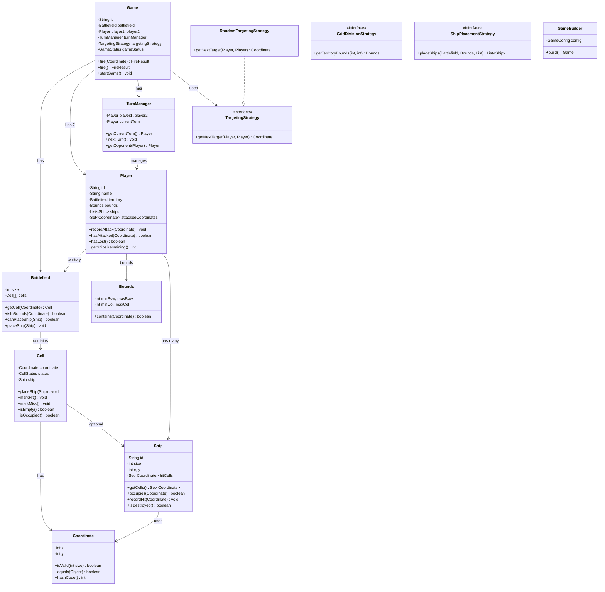
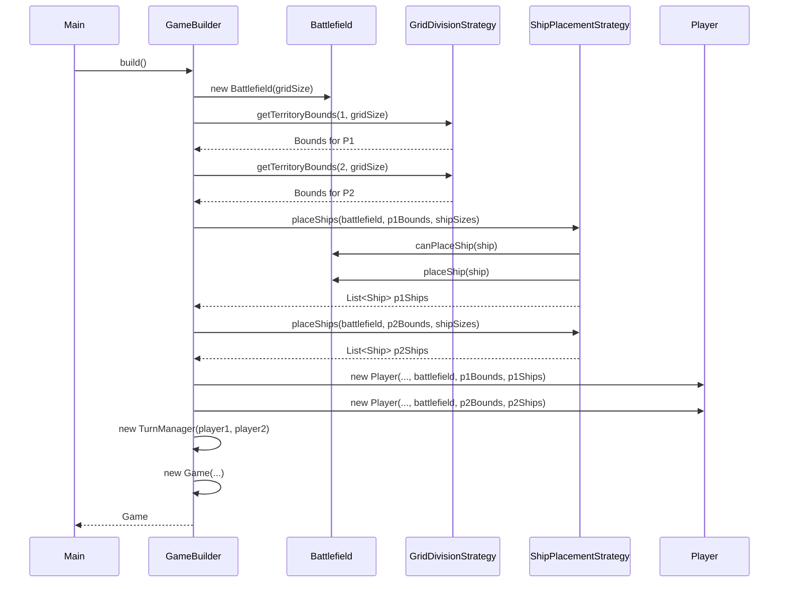
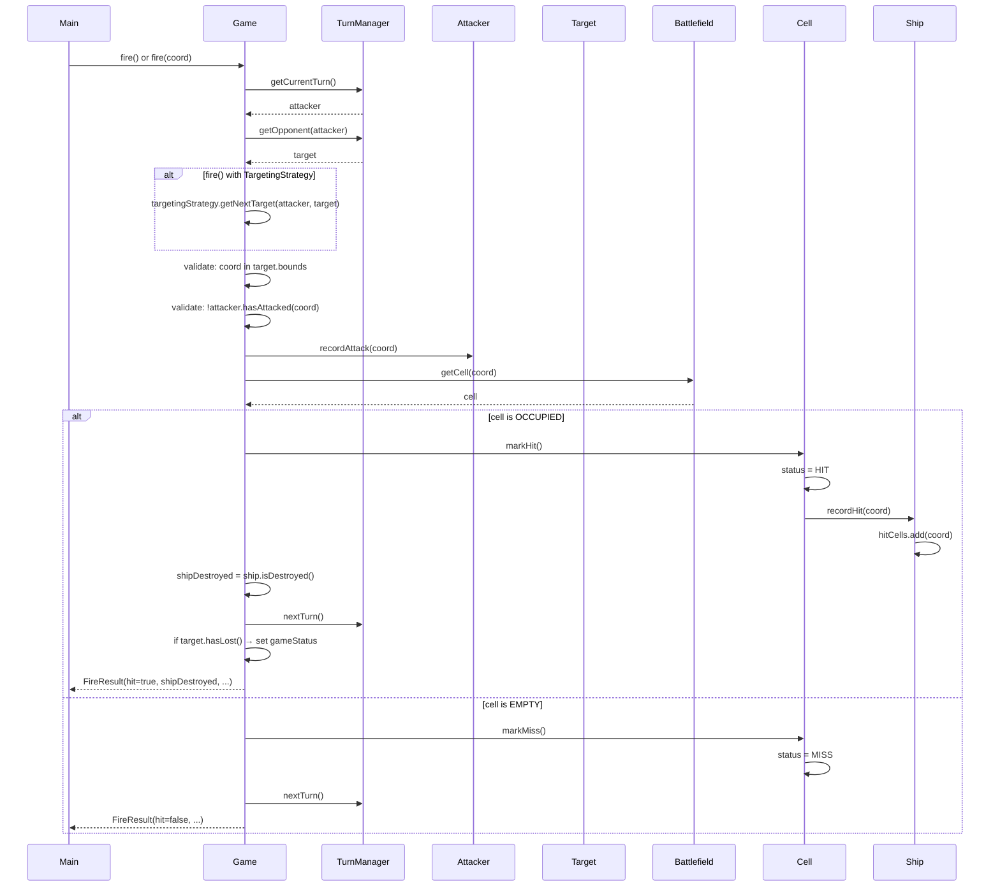
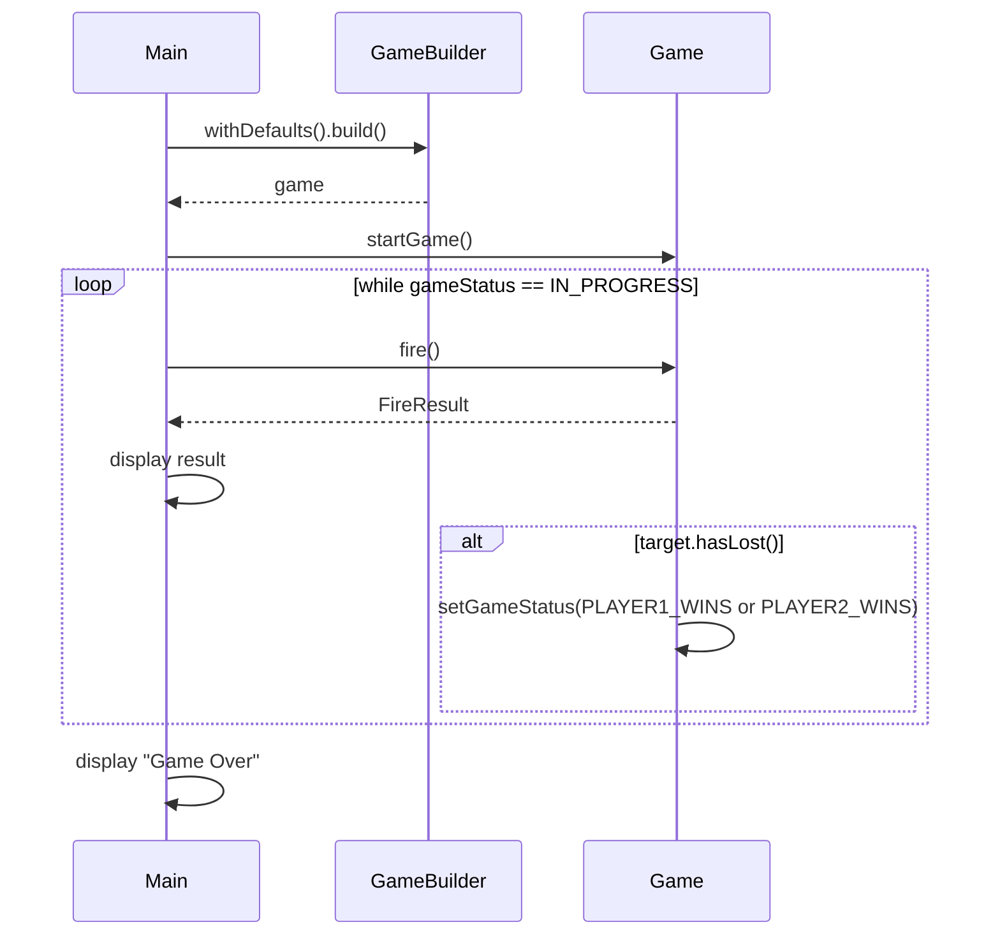

# Battleship Game LLD — Complete Tutorial

> **Start here**: See [DESIGN_GUIDE.md](./DESIGN_GUIDE.md) for a step-by-step design approach and interview tips for strong hire.

A Low-Level Design problem demonstrating **spatial domain modeling**, **turn-based game flow**, **strategy-based extensibility**, **fog-of-war view abstraction**, and **repository pattern** for game persistence. This README is a self-contained tutorial—no need to read the code.

---

## Table of Contents

1. [Functional Requirements](#functional-requirements)
2. [Architecture Overview](#architecture-overview)
3. [Component Diagrams (UML)](#component-diagrams-uml)
4. [Ship Placement & Fire Flow — Sequence Diagrams](#ship-placement--fire-flow--sequence-diagrams)
5. [Fire Flow — Deep Dive](#fire-flow--deep-dive)
6. [Grid Division & Territory — Deep Dive](#grid-division--territory--deep-dive)
7. [Ship Destruction Model — Deep Dive](#ship-destruction-model--deep-dive)
8. [Battlefield View & Fog of War — Deep Dive](#battlefield-view--fog-of-war--deep-dive)
9. [How Components Work Together](#how-components-work-together)
10. [Design Patterns Used](#design-patterns-used)
11. [Running the Application](#running-the-application)
12. [Quick Reference](#quick-reference)

---

## Functional Requirements

| # | Requirement | Solution |
|---|-------------|----------|
| 1 | Square grid of N×N | `Battlefield` with `Cell[][]`; `GameConfig.gridSize` |
| 2 | Grid divided equally (N×N/2 per player) | `GridDivisionStrategy`; `VerticalSplitStrategy` splits rows 0..mid-1 vs mid..N-1 |
| 3 | Ships are square (size × size) | `Ship` with `size`, `topLeft` (x, y); `getCells()` returns all occupied coordinates |
| 4 | Equal ships per player | `GameConfig.shipSizes` (e.g. [2, 2, 3]); `ShipPlacementStrategy.placeShips()` |
| 5 | Unique ship ID | `Ship.id` (UUID); assigned in `RandomPlacementStrategy` |
| 6 | Ships must not overlap | `Battlefield.canPlaceShip()` checks all cells EMPTY; `placeShip()` validates |
| 7 | Ships can touch | No validation against adjacent ships; only overlap check |
| 8 | Turn-based firing | `TurnManager`; `Game.fire()` validates `currentTurn` |
| 9 | Each coordinate fired once | `Player.attackedCoordinates`; `hasAttacked(coord)`; `CoordinateAlreadyFiredException` |
| 10 | Hit → mark cell; all cells hit → ship destroyed | `Cell.markHit()`; `Ship.hitCells`; `Ship.isDestroyed()` |
| 11 | Miss → continue | `Cell.markMiss()`; `turnManager.nextTurn()` |
| 12 | Game ends when all ships destroyed | `Player.hasLost()`; check after each fire; set `GameStatus.PLAYER1_WINS` or `PLAYER2_WINS` |
| 13 | View battlefield (different per player) | `BattlefieldView` with `OWN_TERRITORY` vs `OPPONENT_TERRITORY` (fog of war) |
| 14 | Track hit/miss count | `Player.attackedCoordinates`; derive from cell status or add hitCount/missCount |
| 15 | Random targeting | `RandomTargetingStrategy` picks unfired coord from opponent's territory |
| 16 | Manual targeting (bonus) | `ManualTargetingStrategy` + `InputProvider.getCoordinate()` (extensible) |
| 17 | Save/load games (bonus) | `GameRepository`, `PlayerRepository`; `InMemoryGameRepository`, `InMemoryPlayerRepository` |

---

## Architecture Overview

The system follows a **game-centric architecture** with strategy-based extensibility:

```
┌─────────────────────────────────────────────────────────────────────────────┐
│                              Main (Entry Point)                               │
└─────────────────────────────────────────────────────────────────────────────┘
                                        │
                                        ▼
┌─────────────────────────────────────────────────────────────────────────────┐
│                           GameBuilder.build()                                 │
│  • Creates Battlefield (N×N)                                                 │
│  • GridDivisionStrategy → Bounds for P1, P2                                  │
│  • ShipPlacementStrategy → places ships per player                           │
│  • Creates Player(s) with territory, ships, bounds                           │
│  • Creates TurnManager, Game                                                  │
└─────────────────────────────────────────────────────────────────────────────┘
                                        │
                    ┌───────────────────┼───────────────────┐
                    ▼                   ▼                   ▼
          ┌─────────────────┐  ┌─────────────────┐  ┌─────────────────┐
          │    Battlefield   │  │   TurnManager    │  │ TargetingStrategy│
          │  • Cell[][]      │  │  • currentTurn   │  │  • getNextTarget │
          │  • canPlaceShip  │  │  • nextTurn()    │  │  (Random/Manual)│
          │  • placeShip     │  │  • getOpponent   │  └────────┬────────┘
          │  • getCell       │  └────────┬────────┘            │
          └────────┬─────────┘           │                      │
                   │                    │                      │
                   │     ┌──────────────┴──────────────────────┘
                   │     ▼
          ┌─────────────────────────────────────────────────────────────────┐
          │                          Game                                    │
          │  • fire(Coordinate) / fire()                                     │
          │  • Validates turn, coordinate, applies hit/miss                   │
          │  • Updates gameStatus on win                                      │
          └─────────────────────────────────────────────────────────────────┘
                                        │
          ┌─────────────────────────────┼─────────────────────────────┐
          ▼                             ▼                             ▼
┌─────────────────┐         ┌─────────────────┐         ┌─────────────────┐
│     Player 1     │         │     Player 2     │         │ BattlefieldView  │
│  • territory     │         │  • territory     │         │  • OWN_TERRITORY │
│  • bounds        │         │  • bounds        │         │  • OPPONENT_TERR│
│  • ships         │         │  • ships         │         │  (fog of war)   │
│  • attackedCoord │         │  • attackedCoord │         └─────────────────┘
└─────────────────┘         └─────────────────┘
```

**Key idea**: One shared `Battlefield`; each `Player` has `Bounds` (their half), `ships`, and `attackedCoordinates`. `Game` orchestrates fire flow, validates turn/coordinate, and delegates to `Cell`/`Ship` for hit/miss. Strategies are pluggable (targeting, grid division, placement).

---

## Component Diagrams (UML)

### Package Structure

```
battleship/
├── models/
│   ├── Coordinate.java          (value object, immutable)
│   ├── Cell.java
│   ├── CellStatus.java          (EMPTY, OCCUPIED, HIT, MISS)
│   ├── Ship.java
│   ├── FireResult.java
│   ├── Battlefield.java
│   ├── Player.java
│   └── GameStatus.java
├── grid/
│   ├── Bounds.java
│   ├── GridDivisionStrategy.java
│   └── VerticalSplitStrategy.java
├── targeting/
│   ├── TargetingStrategy.java
│   └── RandomTargetingStrategy.java
├── placement/
│   ├── ShipPlacementStrategy.java
│   └── RandomPlacementStrategy.java
├── game/
│   ├── Game.java
│   ├── GameConfig.java
│   ├── GameBuilder.java
│   └── TurnManager.java
├── view/
│   └── BattlefieldView.java
├── repository/
│   ├── GameRepository.java
│   ├── InMemoryGameRepository.java
│   ├── PlayerRepository.java
│   └── InMemoryPlayerRepository.java
├── exceptions/
│   ├── InvalidCoordinateException.java
│   ├── OutOfTurnException.java
│   └── CoordinateAlreadyFiredException.java
├── DESIGN_GUIDE.md
├── README.md
└── Main.java
```

### UML Class Diagram



---

## Ship Placement & Fire Flow — Sequence Diagrams

### Scenario 1: Game Setup (GameBuilder.build)



### Scenario 2: Fire Flow (Hit)



### Scenario 3: Game Loop (Main.playGame)



---

## Fire Flow — Deep Dive

### Step-by-Step Validation

1. **Game in progress**: `gameStatus == IN_PROGRESS`
2. **Correct turn**: `attacker == turnManager.getCurrentTurn()`
3. **Coordinate in target's territory**: `target.getBounds().contains(coordinate)`
4. **Coordinate not already fired**: `!attacker.hasAttacked(coordinate)`
5. **Apply fire**: If cell OCCUPIED → `markHit()`; else → `markMiss()`
6. **Advance turn**: `turnManager.nextTurn()`
7. **Check game over**: `if (target.hasLost())` → set `gameStatus`

### Exceptions

| Exception | When |
|-----------|------|
| `IllegalStateException` | `fire()` when game not IN_PROGRESS |
| `InvalidCoordinateException` | Coordinate not in target's bounds |
| `CoordinateAlreadyFiredException` | Coordinate already in attacker's `attackedCoordinates` |

---

## Grid Division & Territory — Deep Dive

### Vertical Split (Default)

For `gridSize = 10`:

- **Player 1**: rows 0..4 (top half)
- **Player 2**: rows 5..9 (bottom half)

```
    0 1 2 3 4 5 6 7 8 9
  0 [P1 P1 P1 P1 P1 P1 P1 P1 P1 P1]
  1 [P1 P1 P1 P1 P1 P1 P1 P1 P1 P1]
  ...
  4 [P1 P1 P1 P1 P1 P1 P1 P1 P1 P1]
  5 [P2 P2 P2 P2 P2 P2 P2 P2 P2 P2]
  ...
  9 [P2 P2 P2 P2 P2 P2 P2 P2 P2 P2]
```

### Bounds

`Bounds` encapsulates `minRow`, `maxRow`, `minCol`, `maxCol`. Used for:

1. **Ship placement**: Ships must fit within player's bounds.
2. **Targeting**: Random target picked from coords in target's bounds.
3. **Fire validation**: Coordinate must be in target's bounds.

### Extensibility

`HorizontalSplitStrategy` could split by columns (P1: cols 0..4, P2: cols 5..9). Add new strategy without changing `Game` or `GameBuilder`.

---

## Ship Destruction Model — Deep Dive

### All Cells Must Be Hit

A ship is **destroyed** when every cell it occupies has been hit:

```
Ship (3×3) at (2, 3):
  Cells: (2,3), (2,4), (2,5), (3,3), (3,4), (3,5), (4,3), (4,4), (4,5)
  hitCells grows with each hit.
  isDestroyed() ⟺ hitCells.size() == size * size
```

### Flow

1. Opponent fires at `(3, 4)`.
2. `Battlefield.getCell(3, 4)` returns `Cell` with `status = OCCUPIED`, `ship = Ship`.
3. `Cell.markHit()` sets `status = HIT`, calls `ship.recordHit(coord)`.
4. `Ship.recordHit()` adds coord to `hitCells`.
5. `Ship.isDestroyed()` returns `true` when `hitCells.size() == 9`.
6. `Player.hasLost()` returns `true` when all ships are destroyed.

### Game Over

After each fire, `Game` checks `target.hasLost()`. If true, sets `gameStatus` to `PLAYER1_WINS` or `PLAYER2_WINS`.

---

## Battlefield View & Fog of War — Deep Dive

### View Modes

| Mode | Own Territory | Opponent Territory |
|------|---------------|-------------------|
| **OWN_TERRITORY** | Ships visible (S), HIT (X), MISS (O), EMPTY (.) | N/A |
| **OPPONENT_TERRITORY** | N/A | Fog (~) for unexplored; HIT (X), MISS (O) for explored |

### Representation

- `.` = water (empty)
- `S` = ship (own territory only)
- `X` = hit
- `O` = miss
- `~` = fog (unexplored in opponent view)

### Usage

```java
// Own territory
String ownView = BattlefieldView.render(battlefield, player.getBounds(), ViewMode.OWN_TERRITORY);

// Opponent's territory (fog of war)
String opponentView = BattlefieldView.render(battlefield, opponent.getBounds(), ViewMode.OPPONENT_TERRITORY);
```

---

## How Components Work Together

### Setup Flow

```
GameBuilder.build()
  → Battlefield(gridSize)
  → Bounds for P1, P2 (GridDivisionStrategy)
  → placeShips for P1 (ShipPlacementStrategy)
  → placeShips for P2 (ShipPlacementStrategy)
  → Player(id, name, battlefield, bounds, ships) × 2
  → TurnManager(player1, player2)
  → Game(id, battlefield, player1, player2, turnManager, targetingStrategy, config)
```

### Fire Flow

```
Game.fire(coord) or Game.fire()
  → Validate turn, coord in bounds, not already fired
  → attacker.recordAttack(coord)
  → cell = battlefield.getCell(coord)
  → if cell OCCUPIED: cell.markHit() → ship.recordHit() → shipDestroyed
  → else: cell.markMiss()
  → turnManager.nextTurn()
  → if target.hasLost(): gameStatus = PLAYER1_WINS | PLAYER2_WINS
  → return FireResult
```

### Turn Management

```
TurnManager.nextTurn()
  currentTurn = (currentTurn == player1) ? player2 : player1
```

---

## Design Patterns Used

| Pattern | Where | Why |
|---------|-------|-----|
| **Strategy** | `TargetingStrategy`, `GridDivisionStrategy`, `ShipPlacementStrategy` | Pluggable targeting (random vs manual), grid split, placement algorithms. |
| **Builder** | `GameBuilder` | Encapsulates complex game setup (battlefield, players, ships, strategies). |
| **Value Object** | `Coordinate`, `FireResult`, `Bounds` | Immutable; simplifies equality, hashing, and passing. |
| **Repository** | `GameRepository`, `PlayerRepository` | Abstract storage; in-memory for LLD; swap with DB later. |
| **Facade** | `Game` as entry point | Single API: `fire()`, `startGame()`, `getCurrentTurn()`. |
| **Dependency Injection** | Strategies, repositories passed to `Game` / `GameBuilder` | Testable; swap implementations. |

---

## Running the Application

From the project root:

```bash
./gradlew runBattleship
```

**What the demo does:**

1. `GameBuilder.withDefaults().build()` creates a 10×10 game with:
   - Vertical split (P1: rows 0–4, P2: rows 5–9)
   - 3 ships per player (2×2, 2×2, 3×3)
   - Random placement, random targeting
2. `game.startGame()` sets status to `IN_PROGRESS`.
3. Loop: `game.fire()` (random target) until one player loses all ships.
4. Prints round, current turn, ships remaining, fire result.
5. Prints winner and total rounds.

---

## Quick Reference

| Component | Responsibility |
|-----------|----------------|
| **Coordinate** | Immutable (x, y); `isValid(size)`; equals, hashCode |
| **Cell** | coordinate, status, ship; `placeShip`, `markHit`, `markMiss` |
| **Ship** | id, size, topLeft; `getCells`, `occupies`, `recordHit`, `isDestroyed` |
| **Battlefield** | Cell[][]; `getCell`, `canPlaceShip`, `placeShip`, `isInBounds` |
| **Player** | id, territory, bounds, ships, attackedCoordinates; `hasLost`, `recordAttack` |
| **Bounds** | minRow, maxRow, minCol, maxCol; `contains(Coordinate)` |
| **TurnManager** | currentTurn; `nextTurn`, `getOpponent` |
| **TargetingStrategy** | `getNextTarget(attacker, target)` |
| **GridDivisionStrategy** | `getTerritoryBounds(playerNumber, gridSize)` |
| **ShipPlacementStrategy** | `placeShips(battlefield, bounds, shipSizes)` |
| **Game** | `fire(coord)`, `fire()`, `startGame`; orchestrates flow |
| **GameBuilder** | `build()` → fully configured Game |
| **GameConfig** | gridSize, shipSizes, strategies; `defaultConfig()` |
| **FireResult** | hit, shipDestroyed, coordinate, message |
| **BattlefieldView** | `render(battlefield, bounds, mode)`; OWN vs OPPONENT (fog) |
| **GameRepository** | save, findById, findAll, deleteById |
| **PlayerRepository** | save, findById, findAll, deleteById |

---

*This README serves as a complete tutorial. No code reading required.*
