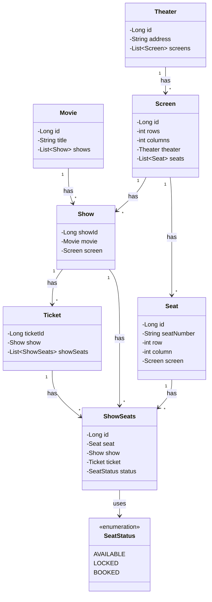
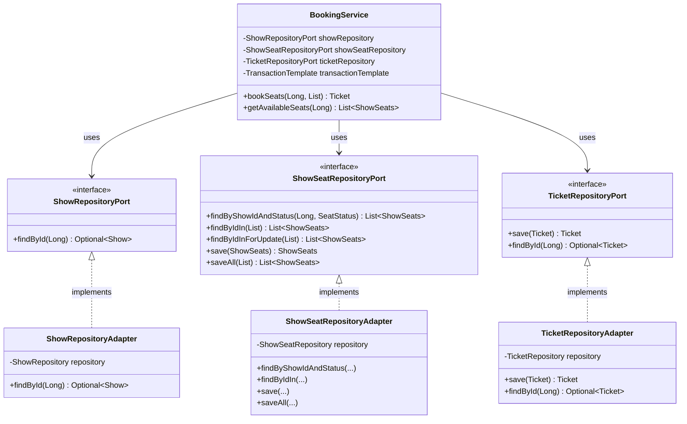
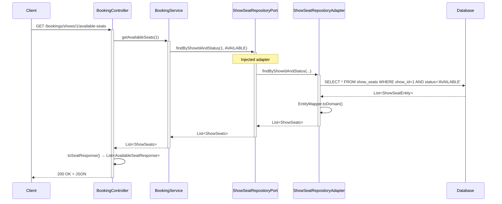
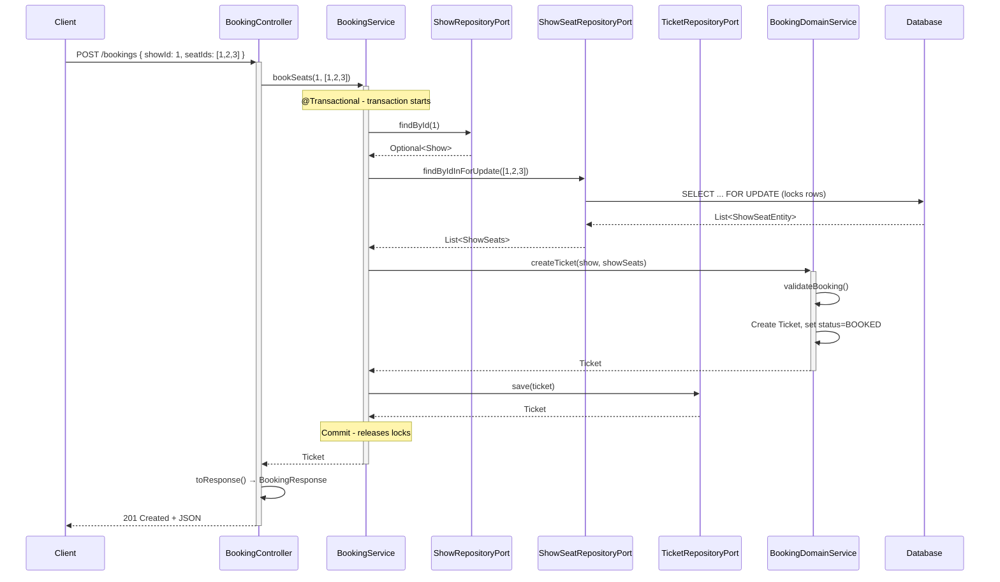
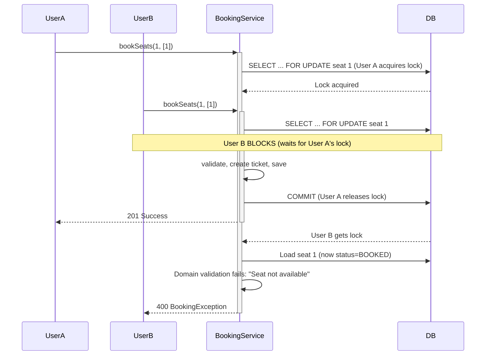

# BookMyShow — Low-Level Design (LLD) Tutorial

A complete tutorial for building a movie ticket booking system using **Domain-Driven Design (DDD)**, **Hexagonal Architecture**, and **Spring Boot**. This guide assumes minimal prior knowledge of LLD and Spring Boot.

---

## Table of Contents

1. [Problem Statement](#1-problem-statement)
2. [Similar Real-World Problems](#2-similar-real-world-problems)
3. [Architecture Overview](#3-architecture-overview)
4. [Package Structure](#4-package-structure)
5. [Spring Boot Concepts Explained](#5-spring-boot-concepts-explained)
6. [Domain Entities Explained](#6-domain-entities-explained)
7. [Infrastructure Layer](#7-infrastructure-layer)
8. [Application Flow](#8-application-flow)
9. [Booking Logic — Detailed Explanation](#9-booking-logic--detailed-explanation)
10. [UML Diagrams](#10-uml-diagrams)
11. [API Reference](#11-api-reference)
12. [How to Run](#12-how-to-run)

---

## 1. Problem Statement

**Goal:** Build a booking service that allows users to:

- View available seats for a movie show
- Book multiple seats for a show
- Handle **concurrent bookings** (two users booking the same seat at the same time)
- Persist data in a database
- Expose functionality via REST API

**Scope:** Focus on the **booking flow only** — no user authentication, payments, or movie search.

---

## 2. Similar Real-World Problems

| Problem | Why Similar |
|---------|-------------|
| **Ticketmaster** | Event ticketing, seat selection, concurrent purchases |
| **RedBus** | Bus seat booking, availability, real-time updates |
| **IRCTC** | Train seat reservation, high concurrency |
| **Airbnb** | Property booking, date conflicts, availability |

All these systems share: **resources** (seats/rooms), **availability**, **concurrent access**, and **booking transactions**.

---

## 3. Architecture Overview

We use two complementary architectural styles:

### 3.1 Domain-Driven Design (DDD)

**Idea:** The **domain** (business logic) is the heart of the application. Everything else (database, HTTP, UI) serves the domain.

**Principles:**
- **Domain models** = Pure Java classes representing business concepts (Movie, Show, Seat, Ticket)
- **Domain services** = Business rules that don't fit in a single entity
- **Domain stays pure** = No database, no HTTP, no framework code inside the domain

### 3.2 Hexagonal Architecture (Ports & Adapters)

**Idea:** The application has a **core** (domain + application logic) and **adapters** that connect to the outside world.

| Term | Meaning |
|------|---------|
| **Port** | Interface that defines *how* the application talks to the outside world (e.g., "I need to save a Ticket") |
| **Adapter** | Implementation of a port using a specific technology (e.g., JPA + PostgreSQL) |

**Why?** The core doesn't care *how* data is stored. We can swap PostgreSQL for MongoDB by changing only the adapter.

```
                    ┌─────────────────────────────────────┐
                    │           REST API (HTTP)             │
                    └─────────────────┬─────────────────────┘
                                      │
                    ┌─────────────────▼─────────────────────┐
                    │     Application Layer (BookingService)  │
                    └─────────────────┬─────────────────────┘
                                      │
        ┌─────────────────────────────┼─────────────────────────────┐
        │                             │                             │
        ▼                             ▼                             ▼
   ShowRepositoryPort         ShowSeatRepositoryPort        TicketRepositoryPort
   (interface)                 (interface)                   (interface)
        │                             │                             │
        └─────────────────────────────┼─────────────────────────────┘
                                      │
                    ┌─────────────────▼─────────────────────┐
                    │   Infrastructure (JPA Adapters + DB)   │
                    └───────────────────────────────────────┘
```

---

## 4. Package Structure

```
bookmyshow/
├── domain/                          # Pure business logic (no Spring, no JPA)
│   ├── models/                      # Domain entities
│   ├── enums/                       # SeatStatus, etc.
│   ├── exceptions/                  # BookingException
│   ├── ports/                       # Repository interfaces (outbound)
│   └── services/                    # BookingDomainService
│
├── application/                     # Use-case orchestration
│   └── booking/
│       └── BookingService.java
│
├── api/                             # REST layer
│   ├── controller/
│   └── dto/
│
└── infrastructure/                  # External systems
    ├── adapter/                     # Implements domain ports
    └── persistence/
        ├── entity/                  # JPA entities
        ├── repository/              # Spring Data JPA
        ├── mapper/                  # Domain ↔ Entity conversion
        └── DataSeeder.java
```

### Why This Structure?

| Package | Purpose | Why Separate? |
|---------|---------|---------------|
| **domain** | Business rules, entities, interfaces | Can be tested without database or HTTP |
| **application** | Orchestrates use cases, calls ports | Keeps domain logic separate from "how" things are done |
| **api** | HTTP controllers, DTOs | Entry point for clients; can change (REST → GraphQL) without touching domain |
| **infrastructure** | Database, JPA, adapters | Can swap H2 for PostgreSQL by changing only this layer |

---

## 5. Spring Boot Concepts Explained

### 5.1 What is Spring Boot?

Spring Boot is a framework that:
- Starts an embedded web server (e.g., Tomcat)
- Manages dependencies and configuration
- Provides **dependency injection** (DI) — objects are created and wired automatically

### 5.2 Key Annotations

| Annotation | Where Used | What It Does |
|------------|------------|--------------|
| `@SpringBootApplication` | Main class | Marks the app entry point; enables auto-configuration |
| `@Component` | DataSeeder, Adapters | Registers the class as a Spring bean (managed by Spring) |
| `@Service` | BookingService | Same as `@Component`, but semantically for "service" classes |
| `@RestController` | BookingController | Marks a class as a REST API controller |
| `@Repository` | JPA repositories | Marks a Spring Data JPA repository |
| `@Entity` | JPA entities | Maps a class to a database table |
| `@Transactional` | Via TransactionTemplate | Ensures a method runs inside a database transaction |
| `@Profile("!test")` | DataSeeder | Bean is created only when the "test" profile is NOT active |

### 5.3 Dependency Injection (DI)

**Without DI:**
```java
// You create everything manually
var showRepo = new ShowRepositoryAdapter(...);
var bookingService = new BookingService(showRepo, ...);
```

**With DI:**
```java
@Service
public class BookingService {
    public BookingService(ShowRepositoryPort showRepository, ...) {
        // Spring automatically injects the adapter that implements ShowRepositoryPort
    }
}
```

Spring scans the classpath, finds implementations of `ShowRepositoryPort`, and injects them into `BookingService`.

### 5.4 Data Seeding

**What is seeding?** Populating the database with initial data so the app can be tested without manual setup.

**How we do it:**
- `DataSeeder` implements `CommandLineRunner`
- Spring runs `run()` after the application starts
- We create: Movie, Theater, Screen, Seats, Show, ShowSeats
- `@Profile("!test")` ensures seeding doesn't run during tests (which use an empty DB)

### 5.5 REST Annotations

| Annotation | Example | Meaning |
|------------|---------|---------|
| `@GetMapping` | `@GetMapping("/shows/{showId}/available-seats")` | Handles HTTP GET requests |
| `@PostMapping` | `@PostMapping` | Handles HTTP POST requests |
| `@PathVariable` | `@PathVariable Long showId` | Extracts path variable from URL |
| `@RequestBody` | `@RequestBody BookingRequest request` | Deserializes JSON body into Java object |
| `@Valid` | `@Valid @RequestBody BookingRequest` | Triggers validation (e.g., `@NotNull`) |
| `@ExceptionHandler` | `@ExceptionHandler(BookingException.class)` | Handles specific exceptions and returns custom HTTP response |

### 5.6 DTOs and Validation

**DTO (Data Transfer Object):** A simple class used to send/receive data over the network. It is separate from domain models.

| DTO | Purpose | Validation |
|-----|---------|------------|
| `BookingRequest` | Input for booking | `@NotNull` on showId, `@NotEmpty` on seatIds |
| `BookingResponse` | Output after booking | None |
| `AvailableSeatResponse` | Output for available seats | None |

**Why DTOs?** Domain models may have circular references or lazy-loaded fields that don't serialize well to JSON. DTOs expose only what the client needs.

---

## 6. Domain Entities Explained

### 6.1 Entity Relationship Overview

```
Movie (1) ──────< (N) Show
Screen (1) ──────< (N) Show
Theater (1) ─────< (N) Screen
Screen (1) ──────< (N) Seat
Show (1) ────────< (N) ShowSeats
Seat (1) ────────< (N) ShowSeats
Ticket (1) ──────< (N) ShowSeats
Show (1) ────────< (N) Ticket
```

### 6.2 Entity Descriptions

#### Movie
- **What:** A film (e.g., "Inception")
- **Fields:** `id`, `title`, `shows`
- **Why:** One movie can have many shows (different times, screens, theaters)

#### Theater
- **What:** A physical cinema (e.g., "PVR Saket")
- **Fields:** `id`, `address`, `screens`
- **Why:** One theater has multiple screens (Screen 1, Screen 2, etc.)

#### Screen
- **What:** A hall inside a theater
- **Fields:** `id`, `rows`, `columns`, `theater`, `seats`
- **Why:** Defines the layout (e.g., 3 rows × 4 columns = 12 seats)

#### Seat
- **What:** A physical seat in a screen (e.g., "A1", "B3")
- **Fields:** `id`, `seatNumber`, `row`, `column`, `screen`
- **Why:** Seats are fixed; they belong to a screen

#### Show
- **What:** A screening of a movie in a specific screen at a specific time
- **Fields:** `showId`, `movie`, `screen`
- **Why:** Links "which movie" to "which screen" — the core of booking

#### ShowSeats
- **What:** Availability of a seat for a specific show
- **Fields:** `id`, `seat`, `show`, `ticket`, `status`
- **Why:** The same physical seat (A1) exists for every show. `ShowSeats` represents "Seat A1 for Show #1" with status AVAILABLE/BOOKED/LOCKED

#### Ticket
- **What:** A confirmed booking of one or more seats for a show
- **Fields:** `ticketId`, `show`, `showSeats`
- **Why:** Groups the booked seats and links them to the show

### 6.3 SeatStatus Enum

| Value | Meaning |
|-------|---------|
| `AVAILABLE` | Seat can be booked |
| `LOCKED` | Temporarily held (e.g., during checkout) |
| `BOOKED` | Seat is sold |

---

## 7. Infrastructure Layer

### 7.1 Why Two Sets of Models?

| Domain Model | JPA Entity | Reason |
|--------------|------------|--------|
| `Movie` | `MovieEntity` | Domain stays pure; JPA needs `@Entity`, `@Table`, etc. |
| `ShowSeats` | `ShowSeatEntity` | Domain has no database annotations |

### 7.2 EntityMapper

Converts between domain and JPA entities:
- `toDomain(Entity)` → Domain model (for application/domain use)
- `toEntity(Domain)` → JPA entity (for persistence)

### 7.3 Ports and Adapters

| Port (Interface) | Adapter (Implementation) | Uses |
|------------------|---------------------------|------|
| `ShowRepositoryPort` | `ShowRepositoryAdapter` | `ShowRepository` (Spring Data JPA) |
| `ShowSeatRepositoryPort` | `ShowSeatRepositoryAdapter` | `ShowSeatRepository` |
| `TicketRepositoryPort` | `TicketRepositoryAdapter` | `TicketRepository` |

The application layer depends only on interfaces. Spring injects the adapters at runtime.

### 7.4 Pessimistic Locking (Concurrency)

We use **pessimistic locking** with `SELECT ... FOR UPDATE` to handle concurrent bookings.

**Repository method:**
```java
@Lock(LockModeType.PESSIMISTIC_WRITE)
@Query("SELECT s FROM ShowSeatEntity s WHERE s.id IN :ids")
List<ShowSeatEntity> findByIdInForUpdate(@Param("ids") List<Long> ids);
```

**How it works:**
1. User A calls `findByIdInForUpdate([1,2,3])` → acquires row locks on seats 1, 2, 3
2. User B calls `findByIdInForUpdate([1])` → **blocks** (waits for User A's lock)
3. User A validates, creates ticket, saves, commits → releases locks
4. User B gets the lock, loads seat 1 (now BOOKED), domain validation fails → `BookingException` 400

**Why pessimistic over optimistic?**
- Short critical section (validate + save = milliseconds)
- First-come-first-served semantics enforced by the database
- No retry logic needed; the lock guarantees exclusive access during the transaction

---

## 8. Application Flow

### 8.1 Get Available Seats

```
Client → GET /bookings/shows/1/available-seats
       → BookingController.getAvailableSeats(1)
       → BookingService.getAvailableSeats(1)
       → ShowSeatRepositoryPort.findByShowIdAndStatus(1, AVAILABLE)
       → ShowSeatRepositoryAdapter → JPA → DB
       → List<ShowSeats> → Map to AvailableSeatResponse → JSON
```

### 8.2 Book Seats

```
Client → POST /bookings { "showId": 1, "seatIds": [1, 2, 3] }
       → BookingController.bookSeats(request)
       → BookingService.bookSeats(1, [1,2,3])  [@Transactional]
           → Load show
           → findByIdInForUpdate([1,2,3])  [SELECT ... FOR UPDATE - locks rows]
           → BookingDomainService.createTicket(show, seats)
             → Validate seats, create Ticket, update status to BOOKED
           → TicketRepositoryPort.save(ticket)
           → Commit [releases locks]
       → Map to BookingResponse → 201 Created
```

---

## 9. Booking Logic — Detailed Explanation

This section walks through the **entire booking flow** step by step, explaining what happens at each layer and why.

### 9.1 Overview: What Happens When a User Books Seats?

When a user sends `POST /bookings { "showId": 1, "seatIds": [1, 2, 3] }`, the system must:

1. **Verify** the show exists
2. **Lock** the requested seats so no one else can book them
3. **Validate** that all seats are available and belong to the show
4. **Create** a Ticket linking the show and seats
5. **Update** each seat's status to BOOKED
6. **Persist** everything to the database

---

### 9.2 Step-by-Step Flow

#### Step 1: Request Arrives at the Controller

```java
@PostMapping
public ResponseEntity<BookingResponse> bookSeats(@Valid @RequestBody BookingRequest request) {
    Ticket ticket = bookingService.bookSeats(request.showId(), request.seatIds());
    // ...
}
```

- `@Valid` triggers validation: `showId` must not be null, `seatIds` must not be empty
- If validation fails, Spring returns 400 before the method runs
- The controller delegates to `BookingService` — it does not contain business logic

---

#### Step 2: BookingService — Load Show and Validate Input

```java
var show = showRepository.findById(showId)
        .orElseThrow(() -> new IllegalArgumentException("Show not found: " + showId));

if (seatIds == null || seatIds.isEmpty()) {
    throw new IllegalArgumentException("No seats selected");
}
```

**Why load the show first?** We need to verify the show exists before locking seats. If the show doesn't exist, we fail fast without acquiring any locks.

---

#### Step 3: Lock the Seats (Pessimistic Locking)

```java
var showSeats = showSeatRepository.findByIdInForUpdate(seatIds);
```

**What `findByIdInForUpdate` does:**
- Executes `SELECT * FROM show_seats WHERE id IN (1, 2, 3) FOR UPDATE`
- **Acquires exclusive row locks** on those rows
- Other transactions trying to lock the same rows **block** until this transaction commits or rolls back

**Why lock before validation?** To prevent a race:
- Without lock: User A and B both read seats as AVAILABLE, both try to book → double booking
- With lock: User A locks first; User B waits; User A commits; User B then sees seats as BOOKED and fails validation

---

#### Step 4: Verify All Requested Seats Were Found

```java
if (showSeats.size() != seatIds.size()) {
    throw new IllegalArgumentException("One or more seats not found");
}
```

**Why?** The user might pass invalid IDs (e.g., 999). `findByIdInForUpdate` returns only existing rows. If we requested 3 seats but got 2, one ID was invalid.

---

#### Step 5: Domain Service — Validate and Create Ticket

```java
var ticket = this.bookingDomainService.createTicket(show, showSeats);
```

**Inside `BookingDomainService.createTicket`:**

**5a. Validation (`validateBooking`):**
- Show must not be null
- ShowSeats list must not be null or empty
- **Each seat must belong to the show** — `seat.getShow().getShowId()` must equal `show.getShowId()`
- **Each seat must be AVAILABLE** — `seat.getStatus() == SeatStatus.AVAILABLE`

If any check fails, `BookingException` is thrown → 400 Bad Request.

**5b. Create Ticket:**
```java
Ticket ticket = new Ticket();
ticket.setShow(show);
ticket.setShowSeats(new ArrayList<>(showSeats));
```

**5c. Update Each Seat:**
```java
for (ShowSeats seat : showSeats) {
    seat.setStatus(SeatStatus.BOOKED);
    seat.setTicket(ticket);
}
```

- Each `ShowSeats` is marked BOOKED
- Each `ShowSeats` references the new Ticket (bidirectional link)

**Why in domain service?** This logic involves multiple entities (Ticket, ShowSeats) and business rules. It doesn't fit in a single entity, so it lives in a domain service.

---

#### Step 6: Persist the Ticket

```java
return ticketRepository.save(ticket);
```

**What happens in `TicketRepositoryAdapter.save`:**
1. Convert domain `Ticket` to JPA `TicketEntity` (via `EntityMapper`)
2. Set `ticket` reference on each `ShowSeatEntity` (bidirectional relationship for JPA)
3. Call `ticketRepository.save(entity)`
4. JPA cascades: saving `TicketEntity` also saves/updates the linked `ShowSeatEntity` rows (status = BOOKED, ticket_id = new ticket)
5. Convert saved entity back to domain `Ticket` and return

**Why set ticket on each ShowSeatEntity?** JPA needs the "many" side to reference the "one" for `@OneToMany(mappedBy = "ticket")` to work. Without it, `ticket_id` would be null in the database.

---

#### Step 7: Transaction Commits

Because `bookSeats` is annotated with `@Transactional`:
- On success: transaction commits → locks released → data visible to other transactions
- On exception: transaction rolls back → locks released → no data changed

---

### 9.3 Concurrency Scenario: Two Users Book the Same Seat

| Time | User A | User B | Database State |
|------|--------|--------|-----------------|
| T1 | `findByIdInForUpdate([1])` | — | A acquires lock on seat 1 |
| T2 | — | `findByIdInForUpdate([1])` | B **blocks** (waits for A) |
| T3 | validate ✓, create ticket, save | (waiting) | Seat 1 status = BOOKED |
| T4 | **COMMIT** (releases lock) | (waiting) | — |
| T5 | — | Gets lock, loads seat 1 | Seat 1 status = BOOKED |
| T6 | — | `validateBooking` → seat not AVAILABLE | `BookingException` thrown |
| T7 | — | **ROLLBACK** | B gets 400 Bad Request |

User B never gets a ticket; User A's booking is preserved.

---

### 9.4 Key Design Decisions

| Decision | Reason |
|----------|--------|
| **Lock seats first, then validate** | Ensures no one else can change the seats while we validate and create the ticket |
| **Domain service for ticket creation** | Logic spans Ticket and ShowSeats; keeps entities focused |
| **Bidirectional Ticket ↔ ShowSeats** | Required for JPA cascade and correct `ticket_id` in DB |
| **`findByIdInForUpdate` vs `findByIdIn`** | Booking needs exclusive access; other reads (e.g., available seats) do not |
| **`@Transactional` on entire method** | Single atomic unit: either all steps succeed or none do |

---

### 9.5 Error Handling Summary

| Error | When | HTTP Status |
|-------|------|-------------|
| Show not found | `showRepository.findById` returns empty | 400 |
| No seats selected | `seatIds` null or empty | 400 |
| One or more seats not found | `showSeats.size() != seatIds.size()` | 400 |
| Seat does not belong to show | Domain validation | 400 |
| Seat not available | Domain validation (another user booked it) | 400 |

---

## 10. UML Diagrams

### 10.1 Class Diagram (Domain Model)



### 10.2 Class Diagram (Ports & Adapters)



### 10.3 Sequence Diagram — Get Available Seats



### 10.4 Sequence Diagram — Book Seats (Success)



### 10.5 Sequence Diagram — Book Seats (Concurrent Conflict with Pessimistic Locking)



---

## 11. API Reference

### 11.1 Get Available Seats

**Request:**
```
GET /bookings/shows/{showId}/available-seats
```

**Example:**
```
GET /bookings/shows/1/available-seats
```

**Response (200 OK):**
```json
[
  {
    "showSeatId": 1,
    "seatId": 1,
    "seatNumber": "A1",
    "row": 0,
    "column": 0
  },
  {
    "showSeatId": 2,
    "seatId": 2,
    "seatNumber": "A2",
    "row": 0,
    "column": 1
  }
]
```

**Use `showSeatId`** when booking (not `seatId`).

---

### 11.2 Book Seats

**Request:**
```
POST /bookings
Content-Type: application/json

{
  "showId": 1,
  "seatIds": [1, 2, 3]
}
```

**Response (201 Created):**
```json
{
  "ticketId": 1,
  "showId": 1,
  "seatIds": [1, 2, 3]
}
```

**Error Responses:**
| Status | Condition |
|--------|-----------|
| 400 Bad Request | Show not found, invalid input, seat not available (or already booked by another user) |

---

## 12. How to Run

### Prerequisites
- Java 17+
- Gradle (or use `./gradlew`)

### Steps

1. **Build the project:**
   ```bash
   ./gradlew build
   ```

2. **Run the application:**
   ```bash
   ./gradlew bootRun
   ```

3. **Test the API:**
   ```bash
   # Get available seats for show 1
   curl http://localhost:8080/bookings/shows/1/available-seats

   # Book seats 1, 2, 3 for show 1
   curl -X POST http://localhost:8080/bookings \
     -H "Content-Type: application/json" \
     -d '{"showId": 1, "seatIds": [1, 2, 3]}'
   ```

4. **H2 Console (optional):**
   - URL: http://localhost:8080/h2-console
   - JDBC URL: `jdbc:h2:mem:lowleveldesign`
   - Username: `pk`
   - Password: `pk123`

---

## Summary

| Concept | Implementation |
|---------|----------------|
| **Domain purity** | Domain models have no JPA/Spring; only Lombok |
| **Ports & Adapters** | Repository interfaces in domain; JPA adapters in infrastructure |
| **Concurrency** | Pessimistic locking (`SELECT ... FOR UPDATE`) via `findByIdInForUpdate` |
| **Data seeding** | `CommandLineRunner` with `@Profile("!test")` |
| **REST API** | `@RestController` with `@GetMapping` / `@PostMapping` |
| **Validation** | `@Valid` + `@NotNull` / `@NotEmpty` on DTOs |
| **Error handling** | `@ExceptionHandler` for domain exceptions |

This design keeps the domain testable, the infrastructure swappable, and the API clear for clients.
