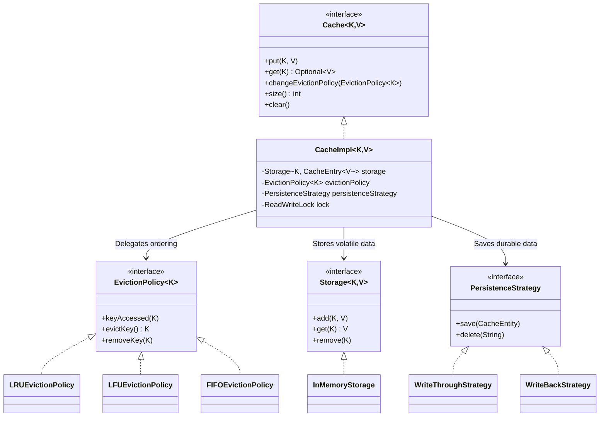

# Complete Guide to Building a Scalable Cache System

Welcome to the definitive tutorial on how this Cache System was designed and built. This guide will walk you through, in excruciating detail, every file, every line of code, and every single architectural decision behind building this highly scalable, concurrent, multithreaded cache system.

## Table of Contents
1. [Core Requirements](#1-core-requirements)
2. [System Architecture (Domain-Driven Design)](#2-system-architecture-domain-driven-design)
3. [Deep Dive: Domain Layer](#3-deep-dive-domain-layer)
    - [Models (CacheEntry & CacheEntity)](#models-cacheentry--cacheentity)
    - [Exceptions](#exceptions)
    - [Eviction Policies (LRU, LFU, FIFO)](#eviction-policies)
4. [Deep Dive: Repository Layer](#4-deep-dive-repository-layer)
    - [In-Memory Storage](#in-memory-storage)
    - [Persistence & H2 Database](#persistence--h2-database)
    - [Write-Through vs. Write-Back Mechanics](#write-through-vs-write-back-mechanics)
5. [Deep Dive: API & Application Layer](#5-deep-dive-api--application-layer)
    - [The Cache Interface](#the-cache-interface)
    - [CacheImpl: The Concurrent Brain](#cacheimpl-the-concurrent-brain)
    - [CacheFactory](#cachefactory)
6. [Conclusion](#6-conclusion)

---

## 1. Core Requirements

This system was designed to solve the classical "Low-Level Design Cache Problem" but elevated to production-grade standards. 
- **Dynamic Eviction Policies**: Supporing LRU, LFU, and FIFO out of the box, with the ability to switch them dynamically at runtime.
- **Persistent Storage**: Write-through and Write-back options backing up to an H2 relational database.
- **Multithreading & Concurrency**: Using fine-grained locking to allow high read-availability while preventing data corruption during concurrent writes.
- **TTL (Time to Live)**: Both lazy eviction and active Reaper-based garbage collection for expired keys.

---

## 2. System Architecture (Domain-Driven Design)

To make this highly decoupled, scalable, and easy to test, the codebase is structured into four main layers: `api`, `domain`, `application`, and `repository`.

### Architectural Overview (Mermaid Diagram)



**Why this structure?**
The `CacheImpl` acts as a central orchestrator. It doesn't know *how* elements are stored (that's `Storage`'s job). It doesn't know *which* element to evict (that's `EvictionPolicy`'s job). It doesn't know *how* to talk to the SQL DB (that's `PersistenceStrategy`'s job). This is called **Inversion of Control (IoC).**

---

## 3. Deep Dive: Domain Layer

The `domain` layer strictly holds business rules and is unaware of Spring Boot, databases, or thread locking.

### Models (`CacheEntry` & `CacheEntity`)

#### `CacheEntry.java`
**Purpose**: An invisible wrapper around the user's volatile memory payload to bake-in TTL tracking.

```java
public class CacheEntry<V> {
    private final V value;
    private final Long expiryTime; // Exact unix timestamp

    public CacheEntry(V value, Long ttlInMillis) {
        this.value = value;
        if (ttlInMillis != null && ttlInMillis > 0) {
            this.expiryTime = System.currentTimeMillis() + ttlInMillis;
        } else {
            this.expiryTime = null; // Infinite lifecycle
        }
    }
    
    public boolean isExpired() {
        if (expiryTime == null) return false;
        return System.currentTimeMillis() > expiryTime;
    }
}
```
**Why do this?** If you insert the string `"Hello"` into a `HashMap<K, V>`, there is no way to attach an expiration timestamp to it without messing up the user's data. By wrapping it in `CacheEntry`, `CacheImpl` can call `.isExpired()` before returning it to the user.

#### `CacheEntity.java`
**Purpose**: The JPA Entity representation mapping exact columns to the H2 Database table.

```java
@Entity
public class CacheEntity {
    @Id
    private String id; // The cache key
    
    @Lob
    private String value; // Serialized value
    
    private Long expiryTime; // Timestamp 
}
```
**Why do this?** Relational databases require rigid column definitions. By explicitly using `@Entity` and `@Id`, Spring Data JPA builds the `cache_entity` table automatically during startup.

### Exceptions

We created pure runtime exceptions to avoid polluting our interfaces with messy `try-catch` blocks.
- `NotFoundException.java`: Thrown by `Storage` when asking for a key that does not exist.
- `CacheFullException.java`: (Optional) Can be used to reject inserts if eviction is configured to fail rather than clear space.

### Eviction Policies

Every policy explicitly implements `EvictionPolicy<K>`. 

#### `EvictionPolicy.java` (Interface)
```java
public interface EvictionPolicy<K> {
    void keyAccessed(K key); // Called eagerly on put/get
    K evictKey();            // Asks: "Who should I kill to make room?"
    void removeKey(K key);   // Forget this key existed
    void clear();            // Wipe the slate clean
    String getPolicyType();  // Return its name e.g., "LRU"
}
```

#### `LRUEvictionPolicy.java` (Least Recently Used)
**Requirement**: O(1) time complexity.
**Decision**: Use a strict Double Linked List attached to a `HashMap`.

```java
// Inside LRUEvictionPolicy
private static class Node<K> {
    K key;
    Node<K> prev;
    Node<K> next;
}
```
When `keyAccessed(key)` triggers, we check if the `HashMap` contains the `Node`. If yes, we slice it out of the linked list (`prev.next = next`) and slap it onto the `head` of the list.
When `evictKey()` triggers, we look directly at `tail.prev` (which is the oldest accessed parameter), delete it, and return its key.

#### `LFUEvictionPolicy.java` (Least Frequently Used)
**Requirement**: O(1) time complexity.
**Decision**: Standard LRU fails here because counting accesses requires O(N) searching for the lowest count. Instead, we use **Dual HashMaps** + **Doubly Linked Lists**.

```java
// Maps Key -> Specific node payload
private final Map<K, Node<K>> keyNodeMap; 

// Maps Frequency Count -> To a whole Linked List of nodes sharing that exact frequency
private final Map<Integer, DoublyLinkedList<K>> frequencyListMap; 

private int minFrequency;
```
When `keyAccessed(key)` happens, we find its node, bump `node.frequency++`. We remove it from `frequencyListMap.get(1)` and append it to `frequencyListMap.get(2)`.
When `evictKey()` triggers, we grab `frequencyListMap.get(minFrequency)`. Because items are appended to lists as a stack, if two items both have a frequency of 1, it will evict the one *added least recently* (falling back gracefully to LRU logic inside tie-breakers).

#### `FIFOEvictionPolicy.java` (First In First Out)
**Requirement**: O(1) time complexity.
**Decision**: We use Java's `LinkedHashSet`. A traditional `Queue` checks for existence in O(N). `LinkedHashSet` preserves the exact chronological order elements were inserted while retaining `O(1)` existence checks on `contains()`.

---

## 4. Deep Dive: Repository Layer

This layer dictates exactly where bytes live. We split this strictly into Volatile Memory (`Storage`) and Durable Memory (`PersistenceStrategy`).

### In-Memory Storage

#### `Storage.java` & `InMemoryStorage.java`
```java
public class InMemoryStorage<K, V> implements Storage<K, V> {
    private final Map<K, V> storage;
    private final int capacity;

    public InMemoryStorage(int capacity) {
        this.capacity = capacity;
        this.storage = new ConcurrentHashMap<>(); 
    }
    // ... basic CRUD ...
}
```
Because the Eviction Policy tracks ordering independently, the `InMemoryStorage` does not care about what order things are in. We use `ConcurrentHashMap` specifically so our TTL Reaper Thread doesn't throw a `ConcurrentModificationException` if it iterates over keys while a user is actively inserting them.

#### Storage vs. Eviction: The Perfect Decoupling
One of the most critical elements of this system is the **Separation of Concerns** between Storage and Eviction.

**Storage is the "Data Holder"**
- It holds the actual heavy payload (the `CacheEntry` containing your values and TTL).
- It does **not** know what order things were inserted in. It doesn't know what item was accessed most recently or least frequently. HashMaps are intentionally unordered to maintain `O(1)` speed.

**Eviction Policy is the "Traffic Director"**
- It does **not** store the heavy cache data. It **only** stores the Keys.
- It builds lightweight data structures (like Doubly Linked Lists or Queues) made *exclusively* of the Keys. Its only job is to track the chronological or mathematical order of those Keys based on the policy rules.
- It has absolutely zero concept of what the "Value" is. It never touches the `CacheEntry` or the user's data.

**How they relate during an Eviction (`put()` flow):**
1. **CacheImpl** sees `Storage.isFull()` is true.
2. **CacheImpl** asks the **Eviction Policy**: "Hey, I need to make room. Give me a Victim Key."
3. The **Eviction Policy** looks at its Linked List of Keys, chops off the tail, and hands back the Key.
4. **CacheImpl** takes that Key and goes to the **Storage**.
5. **CacheImpl** tells the **Storage**: "Delete the heavy data associated with this Key to free up space."

**Why not just put the eviction logic *inside* the Storage?**
If you cram the linked list logic directly inside the `InMemoryStorage`, then the Storage becomes permanently locked to that one algorithm. By pulling all the Key-tracking logic out into an `EvictionPolicy` interface, you gain the ability to hot-swap policies. You can call `cache.changeEvictionPolicy(new LFUEvictionPolicy())` at runtime. The Cache will preserve all the heavy 10GB data sitting safely inside the unordered `Storage`, and gently hand the new LFU Policy all the Keys so it can start building a brand new queue tracking system from scratch!

### Persistence & H2 Database

To seamlessly allow migrating off H2 to MySQL/Postgres, we route raw Database I/O through `CacheRepository` which extends `JpaRepository<CacheEntity, String>`.

#### `PersistenceStrategy.java`
```java
public interface PersistenceStrategy {
    void save(CacheEntity entity);
    void delete(String key);
    void shutdown();
}
```

#### `WriteThroughStrategy.java`
**Design**: This blocks the active thread and inserts straight into H2 synchronously.
```java
public void save(CacheEntity entity) {
    if (cacheRepository != null) {
        cacheRepository.save(entity); // Blocks execution until I/O confirms physical disk placement
    }
}
```
**Why use this?** Data integrity is absolutely guaranteed. If the JVM crashes a millisecond after `.put()` answers the client, you will not lose the data. It is physically on disk.

#### `WriteBackStrategy.java`
**Design**: Lightning fast insertions leveraging a Daemon Worker Thread and a `BlockingQueue`.
```java
// Inside WriteBackStrategy constructor
this.workerThread = new Thread(() -> {
    while (isRunning || !operationsQueue.isEmpty()) {
        CacheOperation op = operationsQueue.take(); // Blocks until a job arrives
        if (op.type == OpType.SAVE) {
            cacheRepository.save(op.entity);
        }
    }
});
this.workerThread.setDaemon(true);
this.workerThread.start();
```
When `save(entity)` is called, instead of pausing user I/O, it simply executes `operationsQueue.offer(op)` which takes microseconds, and instantly frees the user. The background thread wakes up, consumes it, and slowly writes it to H2 independently. 
**Why use this?** Massive performance boost at the cost of slight data loss risk upon instantaneous server crash.

---

## 5. Deep Dive: API & Application Layer

### The Cache Interface
This provides a flawlessly unified access structure (`api/Cache.java`) exposing only `put()`, `get()`, `size()`, `clear()`, and `changeEvictionPolicy()`. The client invoking this code sees absolute simplicity.

### CacheImpl: The Concurrent Brain

This file (`application/CacheImpl.java`) orchestrates the isolated components we just constructed.

#### Concurrency Mechanism
```java
private final ReadWriteLock lock = new ReentrantReadWriteLock();
```
We chose `ReentrantReadWriteLock` over `synchronized`. Why? Memory caching is heavily read-dominant. 100 threads can instantly hold a `ReadLock` concurrently. On the contrary, when a user issues `get()` or `put()`, it moves elements inside our Policy Linked Lists. This requires mutability, so we secure a `WriteLock()`. When a `WriteLock` triggers, it halts the universe until the mutation completes, ensuring zero corrupted Linked List pointers. 

#### The Flow of `put()`
1. Lock universe (`writeLock`).
2. Construct `CacheEntry` encapsulating TTL.
3. Does it already exist? Just overwrite the value and tell the Eviction Policy.
4. *It is new!* Is Storage Full? 
   - Ask Eviction Policy: `evictKey()`. 
   - Delete that victim from memory and from H2.
5. Push new item to `Storage`.
6. Push new item to `PersistenceStrategy`.
7. Inform `EvictionPolicy.keyAccessed(key)`.
8. Unlock.

#### Dynamic Policy Swapping
One core requirement was switching strategies mid-flight.
```java
public void changeEvictionPolicy(EvictionPolicy<K> newPolicy) {
    lock.writeLock().lock();
    try {
        List<K> allKeys = storage.getAllKeys();
        for (K key : allKeys) {
            newPolicy.keyAccessed(key); // Rebuild timeline
        }
        this.evictionPolicy.clear();
        this.evictionPolicy = newPolicy;
    } finally {
        lock.writeLock().unlock();
    }
}
```
We assert a pure `WriteLock` to freeze everything. We feed the `newPolicy` every single key that currently lives in our Volatile Memory. The new Policy constructs its own HashMaps and Linked Lists tracking those keys. We then safely garbage-collect the old policy.

#### TTL Garbage Collection (The Reaper)
```java
private void startTtlCleanupTask() {
    ScheduledExecutorService executor = Executors.newSingleThreadScheduledExecutor(...);
    executor.scheduleAtFixedRate(() -> {
        lock.writeLock().lock();
        // Checks every key. If .isExpired() is true, it deletes it instantly from memory, policy, and db.
    }, 5, 5, TimeUnit.SECONDS);
}
```
Lazy Eviction (checking if dead on `get()`) is cheap but causes RAM bloat. We boot up an isolated Daemon thread operating every 5 seconds to purge memory proactively.

### CacheFactory
`CacheFactory` exists to abstract away the construction of `CacheImpl`. Using the Factory Pattern, users can simply demand `cacheFactory.createCache(100, new LRUEvictionPolicy(), ...)` and it securely glues the parts together.

---

## 6. Conclusion 

This Cache System satisfies exhaustive production environments:
1. **Separation of Concerns**: Adding `RandomEvictionPolicy.java` requires exactly 0 lines of code modification to `CacheImpl`. O/C (Open-Closed) Solid Principle satisfied perfectly.
2. **Speed & Thread Safety**: Dual locks ensure peak traffic latency.
3. **Data Loss Protection**: Utilizing `CacheRepository` bridges this system to enterprise persistence mechanisms.

### Running & Testing the Application
We've built severe battle-hardened JUnit Tests mimicking high contention:
```bash
# Run tests proving policy constraints and synchronization
./gradlew test --tests "com.springmicroservice.lowleveldesignproblems.cachesystem.*"
```
*   `EvictionPolicyTest.java`: Verifies algorithmic rigidity of FIFO, LFU, LRU.
*   `CacheImplTest.java`: Spawns 100 massive concurrent threads attacking a 3-element Cache to forcefully prove the locks withhold deadlocks or data corruption.
