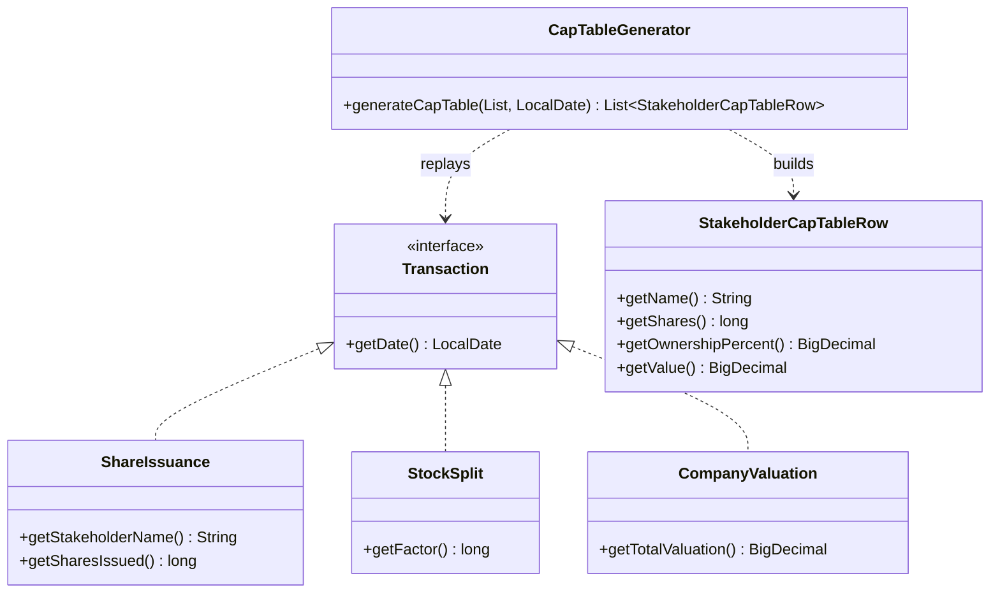

# Cap Table Generator — Low-Level Design (LLD)

> **Interview narrative & build order:** [DESIGN_GUIDELINE.md](./DESIGN_GUIDELINE.md)

This module implements a **small library** (no REST, no database) that replays **dated corporate transactions** and produces a **cap table snapshot as of a given date**: stakeholder **names**, **share counts**, **ownership percentage**, and optional **stake value** from the latest **company valuation** on or before that date.

**Package:** `com.springmicroservice.lowleveldesignproblems.captable`

---

## Problem spec (requirements)

Ownership is tracked via a **cap table** that evolves through **transactions**:

| Transaction | Meaning |
|-------------|---------|
| **Share issuance** | Increases a stakeholder’s shares by a given amount (in **current** share units at issuance time). |
| **Stock split** | Multiplies **every outstanding** share by a factor \(f > 1\); **later** issuances are **not** retroactively scaled (splits only affect shares already on the books). |
| **Company valuation** | Records total company value at a point in time. Used with **total outstanding shares** after all applied events to derive **value per share** and per-stakeholder **value**. |

**API to implement:** `generateCapTable(transactions, asOfDate)` returning, for each stakeholder with a positive position:

- `name`
- `shares`
- `ownershipPercent`
- `value` — from **latest** valuation **at or before** `asOfDate`; **`null`** if no valid valuation exists (shares and % still computed).

**Rules:**

1. Apply transactions **chronologically** up to and **including** `asOfDate`; **ignore** later-dated transactions.
2. **Same calendar day:** apply in order — **stock split → share issuance → company valuation**.
3. **Invalid inputs** are **ignored** (e.g. split factor \(\le 1\), negative issuance size, non-positive valuation).
4. Use **`long`** for share counts and **`Math.multiplyExact` / `Math.addExact`** to surface overflow instead of silent wrap.

The original brief lives in this folder as the **source spec**; this README describes the **implemented** behavior.

---

## The solution (summary)

1. **Filter** non-null transactions with `date <= asOfDate`.
2. **Sort** by date, then by **transaction kind** (split → issuance → valuation) for deterministic same-day ordering.
3. **Simulate** into a `Map<String, Long>` (stakeholder → shares):
   - **Split:** multiply each entry by `factor` (skip if invalid).
   - **Issuance:** add shares (skip if invalid or blank name).
   - **Valuation:** remember the **last valid** total valuation seen.
4. **Derive** `valuePerShare = latestValuation / totalOutstanding` (only if both are usable).
5. **Emit** rows sorted by **name**; ownership % = `100 * shares / totalOutstanding`.

**Core types:**

| Class | Role |
|-------|------|
| `CapTableModels` | Nested types: `Transaction` interface; `ShareIssuance`, `StockSplit`, `CompanyValuation`; output row `StakeholderCapTableRow`. |
| `CapTableGenerator` | `generateCapTable(List<Transaction>, LocalDate)` — stateless service. |

---

### Package structure

```
captable/
├── CapTableModels.java      # Transaction types + result row (POJOs)
├── CapTableGenerator.java   # Replay + cap table construction
├── DESIGN_GUIDELINE.md      # Interview phases, clarifications, walkthrough
└── README.md
```

**Tests:** `src/test/java/.../captable/CapTableGeneratorTest.java`

---

### UML — core types



---

## Design patterns & principles

| Pattern / principle | Where | Why |
|---------------------|--------|-----|
| **Transaction type hierarchy** | `CapTableModels` implementing `Transaction` | Clear polymorphic inputs without a single “fat” DTO. |
| **Service / façade** | `CapTableGenerator` | One entry point; callers build `List<Transaction>` and an as-of date. |
| **Value types** | `BigDecimal` for money and percentages | Avoid floating-point drift. |
| **SOLID: SRP** | Models vs generator | Data vs replay logic separated. |

---

## Programmatic API

| Method | Description |
|--------|-------------|
| `CapTableGenerator#generateCapTable(List<CapTableModels.Transaction>, LocalDate asOfDate)` | Returns sorted list of `StakeholderCapTableRow`; input list is not modified. |

Construct transactions with `new CapTableModels.ShareIssuance(...)`, etc.

---

## Running tests

```bash
./gradlew test --tests "com.springmicroservice.lowleveldesignproblems.captable.CapTableGeneratorTest"
```

All tests under the package:

```bash
./gradlew test --tests "com.springmicroservice.lowleveldesignproblems.captable.*"
```

---

## Quick reference

| Component | Responsibility |
|-----------|----------------|
| `CapTableModels.Transaction` | Common `getDate()` for filter and sort. |
| `ShareIssuance` | Add shares to one stakeholder. |
| `StockSplit` | Scale all current positions. |
| `CompanyValuation` | Update “latest” valuation for value-per-share math at the end. |
| `StakeholderCapTableRow` | Read-only snapshot row (`getValue()` may be `null`). |
| `CapTableGenerator` | Sort, apply, aggregate, round. |
