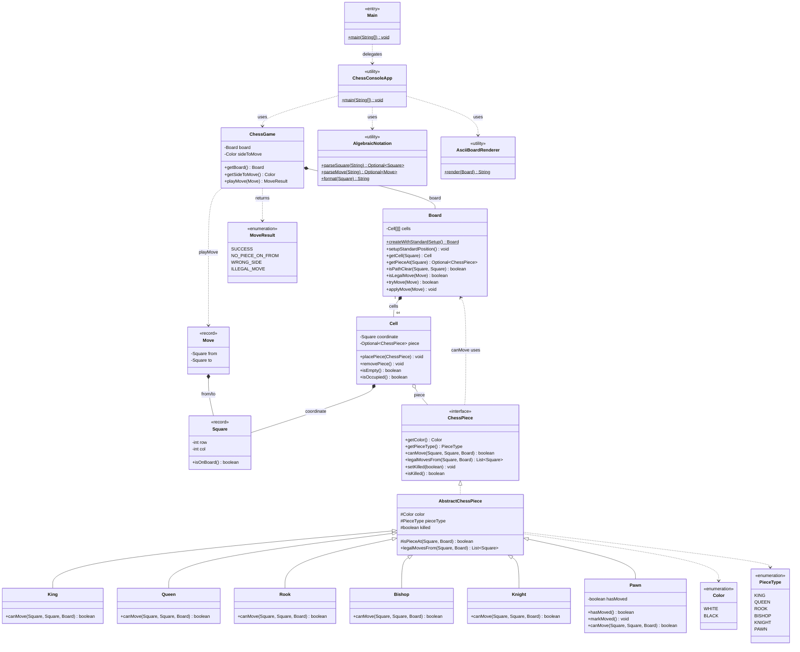
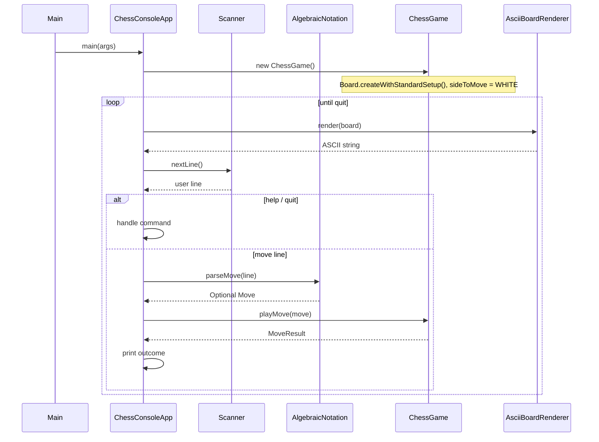
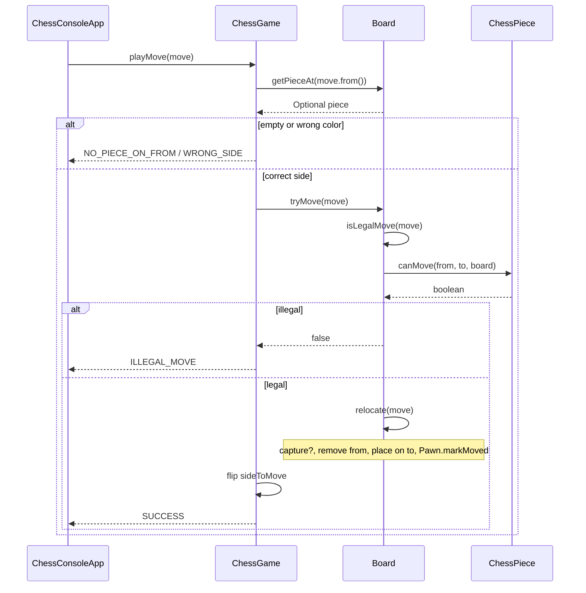

# LLD for Chess

> **Start here**: See [DESIGN_GUIDE.md](./DESIGN_GUIDE.md) for a step-by-step design approach and interview tips.

## Requirements

1. In-memory representation of the board and pieces.
2. Console-based application (no REST API).
3. Standard piece movement rules for an 8×8 board.
4. Two players alternate turns; **White moves first**.
5. Users submit moves as algebraic squares (e.g. `e2 e4`); a dedicated **`Move`** value object holds `from` / `to` **`Square`** coordinates.

### Out of scope (current codebase)

- Castling, en passant (explicitly deferred).
- Check, checkmate, stalemate (deferred — see README “Key Features” / future work).

### Non-functional

- Modular packages (`models`, `game`, `io`).
- Extensible for richer rules, persistence, and alternate UIs.

## Bonus Features (roadmap)

1. **Check / checkmate / stalemate** — filter pseudo-legal moves; game termination state.
2. **Castling & en passant** — extend `Move` or `Board.isLegalMove`.
3. **Promotion** — carry promoted `PieceType` on `Move` or follow-up command.
4. **Undo** — `Stack<Move>` with inverse relocate or board snapshots.
5. **I/O abstraction** — `InputProvider` / `OutputPresenter` (parity with tic-tac-toe) for GUI or automated tests.
6. **Persistence** — save/load FEN or custom snapshot.

---

## Running the Game

```bash
./gradlew runChess
```

Interactive commands: `help`, `quit` / `exit`. Moves: `e2 e4` or `e2e4`.

### Running tests

```bash
./gradlew test --tests "com.springmicroservice.lowleveldesignproblems.chess.**"
```

---

## Architecture & Design Patterns

### Design Patterns Used

| Pattern | Purpose |
|--------|---------|
| **Polymorphism (Strategy-like)** | Each concrete piece (`King`, `Queen`, …) implements `ChessPiece`; movement rules vary without central `switch` on type |
| **Value object** | `Square`, `Move` — immutable coordinates and plies |
| **Facade** | `ChessGame` — single entry for “apply this move” with turn validation + delegation to `Board` |
| **Separation of concerns** | `AlgebraicNotation` / `AsciiBoardRenderer` isolate string formats from rules |

### UML Class Diagram

Below is a Unified Modeling Language (UML) class diagram for the Chess implementation: board model, pieces, game session, I/O helpers, and entry points.



#### UML Relationship Legend

| Symbol | Meaning | Example |
|--------|---------|---------|
| `*--` | **Composition** (strong ownership) | `Board` owns `Cell[][]`; `Move` owns `Square` references |
| `o--` | **Aggregation** | `Cell` holds optional `ChessPiece` |
| `-->` | **Directed association** | `ChessGame` references `Board` |
| `<|..` | **Realization** (implements) | `AbstractChessPiece` implements `ChessPiece` |
| `<|--` | **Inheritance** | `King` extends `AbstractChessPiece` |
| `..>` | **Dependency** (uses) | `ChessConsoleApp` uses `AlgebraicNotation` |

#### Game setup & move flow (sequence diagrams)

**1 — Entry and console loop**



**2 — Successful move (rules + relocation)**



---

### Package Structure

```
chess/
├── Main.java                    # Entry; delegates to ChessConsoleApp
├── ChessConsoleApp.java         # Readline loop, user feedback
├── README.md
├── DESIGN_GUIDE.md
├── game/
│   ├── ChessGame.java           # Turn order, playMove(Move) → MoveResult
│   └── MoveResult.java
├── io/
│   ├── AlgebraicNotation.java # Algebraic ↔ Square / Move
│   └── AsciiBoardRenderer.java # String view of Board
└── models/
    ├── board/
    │   ├── Board.java
    │   └── Cell.java
    ├── helpers/
    │   ├── Move.java
    │   └── Square.java
    └── pieces/
        ├── ChessPiece.java
        ├── AbstractChessPiece.java
        ├── Color.java
        ├── PieceType.java
        ├── King.java
        ├── Queen.java
        ├── Rook.java
        ├── Bishop.java
        ├── Knight.java
        └── Pawn.java
```

### SOLID Principles

- **Single Responsibility**: `Board` holds occupancy and relocation; each `ChessPiece` subtype encodes movement; `ChessGame` encodes turn order; I/O helpers only parse or render.
- **Open/Closed**: New piece types extend `AbstractChessPiece`; new input formats can add classes without changing `Board` rules.
- **Liskov Substitution**: All concrete pieces honor `ChessPiece` contracts (`canMove`, `legalMovesFrom`).
- **Interface Segregation**: Small `ChessPiece` interface focused on rules and state relevant to play.
- **Dependency Inversion**: Pieces depend on `Board` for context (path, occupancy), not on console; `ChessGame` depends on `Board` behavior, not on `System.in`.

### Key Features

- **Layered legality**: `Board.isLegalMove` / `tryMove` implement piece physics; `ChessGame.playMove` adds **whose turn** and **empty-from** checks via `MoveResult`.
- **Dedicated move structure**: `Move` + `Square` as records (good to have requirement).
- **Retry on bad input**: Parse failure or `MoveResult` ≠ `SUCCESS` keeps the loop going without crashing.
- **ASCII board**: Rank 8 at top; white pieces uppercase (`KQRBNP`), black lowercase.
- **Standard starting position**: `Board.createWithStandardSetup()`.

---

## Future extensions

| Feature | Suggested direction |
|---------|---------------------|
| Check / checkmate | Pseudo-legal moves + king attack test; `GameState` enum |
| Castling / en passant | Extend `Move` or post-process in `Board.isLegalMove` |
| Promotion | Optional `PieceType` on `Move` |
| Undo | `Stack<Move>` + inverse or immutable board snapshots |
| More tests | JUnit for `Board.tryMove`, `ChessGame.playMove`, piece `canMove` |
