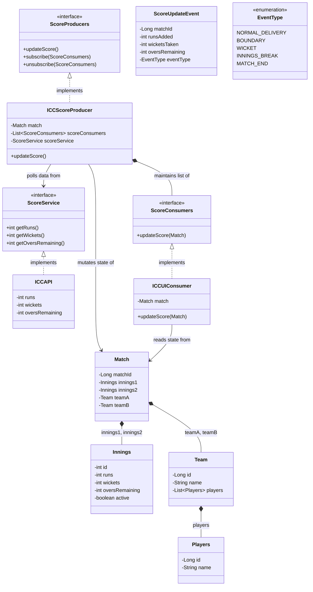
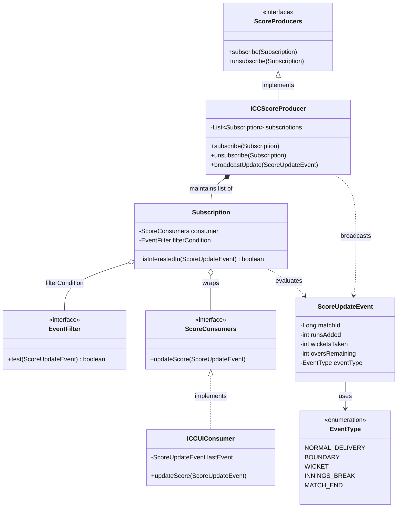
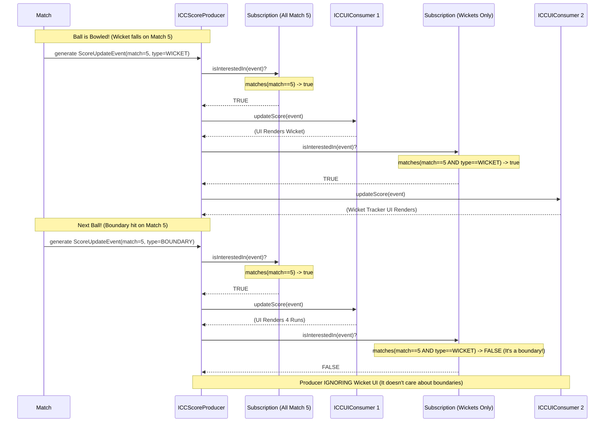

# Cricbuzz Score Update - A Masterclass in the Observer Pattern

Welcome to the definitive guide on designing a highly scalable, real-time cricket score update system. This guide will dismantle the architecture, design patterns, and engineering decisions required to build a system akin to Cricbuzz.

## Table of Contents
1. [Core Requirements](#1-core-requirements)
2. [System Architecture (The Observer Pattern)](#2-system-architecture-the-observer-pattern)
3. [Deep Dive: The Domain Layer](#3-deep-dive-the-domain-layer)
4. [Deep Dive: The Producer (Subject)](#4-deep-dive-the-producer-subject)
5. [Deep Dive: The Consumer (Observer)](#5-deep-dive-the-consumer-observer)
6. [Architectural Limitations & Improvements](#6-architectural-limitations--improvements)

---

## 1. Core Requirements

Building a real-time sports broadcasting system comes with a unique set of challenges compared to a standard CRUD application:
- **Real-Time Data Distribution**: The moment a ball is bowled, the score must disseminate across millions of clients simultaneously.
- **Extreme Decoupling**: The central score engine cannot, and must not, care about who is reading the data. Whether it's an iOS app, a Chrome browser, a smartwatch, or an analytics database, the core engine's job is simply to *broadcast*.
- **Dynamic Subscriptions**: At any given second, thousands of users open the app (subscribing to live updates) and thousands close it (unsubscribing).

**The Solution**: The **Observer Design Pattern** (also known as Publisher/Subscriber or Pub/Sub).

---

## 2. System Architecture (The Observer Pattern)

To achieve maximum scalability and decoupling, the codebase is split into three main actor groups: the **Models** (Domain), the **Producers** (Subjects), and the **Consumers** (Observers).

### Architectural Overview (Mermaid Diagram)



**Why this structure?**
The `ICCScoreProducer` acts as the central brain. It polls an external API (`ScoreService`), updates its internal `Match` model, and then violently broadcasts that model to an unknown array of `ScoreConsumers`. 
The `ICCScoreProducer` has absolutely zero knowledge of what an `ICCUIConsumer` is; it only knows that the consumer adheres to the `ScoreConsumers` contract. This is the definition of **Inversion of Control**.

---

## 3. Deep Dive: The Domain Layer

The domain models represent the physical reality of a cricket match.

### `Match.java`
This is the root aggregate of our system. It holds physical teams and the state of both innings.
```java
@Entity
public class Match {
    @Id @GeneratedValue
    private Long matchId;
    
    private Innings innings1;
    private Innings innings2;
    private Team teamA;
    private Team teamB;
}
```
**Why do this?** Passing atomic integers (`runs=254, wickets=4`) between systems gets messy as the sport scales (What about overs? Run rate? Striker data?). By passing a singular `Match` root aggregate around, the entire hierarchical state of the game travels together safely.

---

## 4. Deep Dive: The Producer (Subject)

The Producer is the source of truth. It is responsible for orchestrating the "Push" mechanic to millions of clients.

### `ScoreProducers.java` (Interface)
This interface forces any concrete producer to implement the three holy tenants of the Observer pattern:
1. `subscribe()`: Allow an observer to opt-in.
2. `unsubscribe()`: Allow an observer to opt-out.
3. `updateScore()`: The trigger that loops through subscribers and pushes data.

### `ICCScoreProducer.java` (The Publisher)
This is where the magic happens. 

```java
public class ICCScoreProducer implements ScoreProducers {
    private Match match;
    private List<ScoreConsumers> scoreConsumers;
    private ScoreService scoreService;

    @Override
    public void updateScore() {
        // 1. Fetch external data
        int over = scoreService.getOversRemaining();
        int wickets = scoreService.getWickets();
        int runs = scoreService.getRuns();
        
        // 2. Mutate System State
        match.getInnings1().setRuns(runs);
        match.getInnings1().setWickets(wickets);
        match.getInnings1().setOversRemaining(over);

        // 3. Broadcast to all active listeners!
        scoreConsumers.forEach((scoreConsumer) -> {
            scoreConsumer.updateScore(match);
        });
    }
}
```

#### The Lifecycle of an Update
Imagine a bowler bowls a dot ball.
1. The **external ICC API** updates its internal database.
2. Our `ICCScoreProducer.updateScore()` is triggered (perhaps via a Cron job or a WebHook).
3. We fetch the updated stats from the external `ScoreService`.
4. We apply those stats to our central `Match` entity, acting as our caching layer.
5. In a massive `forEach` loop, we rapidly execute `.updateScore(match)` on every connected WebSocket, iOS device, Android phone, and web browser that has added themselves to our `List<ScoreConsumers>`.

---

## 5. Deep Dive: The Consumer (Observer)

The consumer is delightfully simple, which is exactly what you want when you have millions of them.

### `ScoreConsumers.java` (Interface)
```java
public interface ScoreConsumers {
    void updateScore(Match match);
}
```
Any system—be it a logger, a database, an SMS alert system, or an iPhone app—only needs to implement this one method to receive real-time updates.

### `ICCUIConsumer.java` (The Concrete Listener)
```java
public class ICCUIConsumer implements ScoreConsumers {
    private Match match;
    
    @Override
    public void updateScore(Match match) {
        this.match = match; // UI automatically re-renders based on this new state
    }
}
```

---

## 6. Architectural Limitations & Improvements

While this is an excellent foundational Low-Level Design, a true enterprise system (like Cricbuzz handling 50 million concurrent World Cup viewers) requires the following upgrades:

### Domain Flaws
* **Hardcoded Innings**: Currently, `updateScore()` strictly mutates `match.getInnings1()`. A cricket match has two innings. The system needs an `activeInnings` flag to determine where to apply the statistics.
* **Uninitialized Collections**: In `ICCScoreProducer`, instantiating the class without explicitly passing a list will result in `scoreConsumers` being `null`, throwing a `NullPointerException` on the first `.subscribe()`. It should be initialized implicitly: `private List<ScoreConsumers> scoreConsumers = new ArrayList<>();`.

### Scaling Flaws (From LLD to HLD)
* **Pushing Heavy Objects**: Currently, `forEach` passes the *entire* `Match` object. If team rosters are nested inside `Team`, we are broadcasting MBs of useless data just to tell a client the score went from 124 to 125. **Fix:** Broadcast a lightweight `ScoreUpdateEvent` DTO containing only deltas.
* **The `forEach` Bottleneck**: Looping through 1,000,000 `ScoreConsumers` synchronously will freeze the Thread and take several seconds. By the time consumer #1,000,000 gets the update, another ball has already been bowled. **Fix:** The `scoreConsumers` list should not be a literal Java `ArrayList`. It should abstract a Distributed Pub/Sub message broker like **Apache Kafka** or **Redis Pub/Sub** to handle parallel fanning-out of the events to WebSockets.

---

## 7. The Push vs. Pull Model Debate

A crucial architectural decision in the Observer pattern is how data flows from the Producer to the Consumer. Our current system uses the **Push Model**.

### The Push Model (Current Implementation)
```java
// The Producer aggressively shoves the entire state onto the Consumer
scoreConsumer.updateScore(match);
```
**Pros**:
- Super simple to implement.
- The Consumer is completely passive; it just receives data and renders it.

**Cons**:
- **Over-fetching**: If a Consumer only cares about the "Current Runs" (e.g., a tiny widget), sending the entire `Match` object (with all players, both innings, and teams) wastes memory and bandwidth.

### The Pull Model (The Alternative)
Instead of pushing data, the Producer pushes a *reference to itself*, and the Consumer queries exactly what it needs.
```java
// The Producer passes itself, saying "Hey, something changed!"
scoreConsumer.updateScore(this);

// Inside the Consumer:
int runs = producer.getMatch().getInnings1().getRuns();
```
**Pros**:
- **Solves Over-fetching**: The Consumer pulls only the exact data fields it needs.

**Cons**:
- **Tight Coupling**: Suddenly, the Consumer needs to know the exact methods and structure of the `ICCScoreProducer`. The beauty of our original design was that the Consumer knew *nothing* about the Producer.

### The Ultimate Solution: The Event Payload (DTO)
To get the decoupling of the *Push Model* with the lightweight nature of the *Pull Model*, enterprise systems use **Event Objects**.
```java
public class ScoreUpdateEvent {
    private int runsAdded;
    private int wicketsTaken;
    private EventType type; // e.g., BOUNDARY, WICKET, DOT_BALL
}
// Consumer Interface
void onScoreUpdate(ScoreUpdateEvent event);
```
This guarantees lightning-fast network transmission and absolute structural safety.

---

## 8. Handling Conditional Subscriptions (Topics & Match Mapping)

Currently, calling `subscribe(scoreConsumer)` forces that consumer to receive updates for *every single match* happening in the system. To allow a user to subscribe to only "India vs Australia", we must introduce **Conditional/Topic-Based Subscriptions**.

### 8.1 Extending the Current Model (Without an Event Broker)
To fix this purely in Java without introducing tools like Kafka, we must redesign the `ScoreProducers` interface to accept a conditional key (like a `MatchId`):

```java
public interface ScoreProducers {
    void subscribe(Long matchId, ScoreConsumers scoreConsumer);
    void unsubscribe(Long matchId, ScoreConsumers scoreConsumer);
}
```

Inside the `ICCScoreProducer`, we must upgrade our basic `List<ScoreConsumers>` into a hash map that organizes consumers by the match they care about:

```java
public class ICCScoreProducer implements ScoreProducers {
    // A map of MatchId -> List of listeners who care about that specific match
    private Map<Long, List<ScoreConsumers>> topicSubscribers = new ConcurrentHashMap<>();

    @Override
    public void subscribe(Long matchId, ScoreConsumers scoreConsumer) {
        // Automatically create a new list for a new match, and add the consumer
        topicSubscribers.computeIfAbsent(matchId, k -> new CopyOnWriteArrayList<>()).add(scoreConsumer);
    }
    
    // When India vs Australia (Match ID 5) updates:
    public void updateScoreForMatch(Long matchId, Match matchData) {
        List<ScoreConsumers> interestedConsumers = topicSubscribers.get(matchId);
        if (interestedConsumers != null) {
            for (ScoreConsumers consumer : interestedConsumers) {
                consumer.updateScore(matchData);
            }
        }
    }
}
```

**Why this works:**
1. **O(1) Topic Filtering**: When a score updates, the producer instantly finds the handful of consumers that care about that match, instead of broadcasting to millions of indifferent users.
2. **Dynamic Topics**: This mapping pattern is identical to how real Event Brokers work. You can swap `Long matchId` for an `Enum Topic` (e.g., `Topic.WICKET_FALL`), allowing consumers to subscribe *only* to wickets if they are an SMS alert system!

### 8.2 Dynamic Filtering (No Interface Changes)
If you want consumers to subscribe to highly specific conditions (e.g., "Only Match 5", AND "Only when Virat Kohli is batting", AND "Only when a boundary is hit") *without* changing the `subscribe()` interface every time a new filter is invented, you must implement the **Predicate Filtering Model**.

Instead of the `ScoreProducers` keeping a blunt `List<ScoreConsumers>`, it holds a `List<Subscription>`.

#### Architecture (UML Class Diagram)



#### The Real-Time Lifecycle (Sequence Diagram)

When a live game event occurs, observe how the Producer blindly routes the `ScoreUpdateEvent` strictly to the components that have explicitly asked for it via their `EventFilter` rules:



#### The Implementation Details

At the heart of Dynamic Filtering is our custom `EventFilter` interface. This replaces the obscure Java 8 `Predicate` with a clear, readable contract:

```java
// Our custom rule interface
public interface EventFilter {
    boolean test(ScoreUpdateEvent event);
}
```

```java
// 1. Create a wrapper class that holds the Consumer AND their rules
public class Subscription {
    private final ScoreConsumers consumer;
    private final EventFilter filterCondition;

    public boolean isInterestedIn(ScoreUpdateEvent event) {
        // If no filter condition is provided, assume they want all events
        if (filterCondition == null) {
            return true;
        }
        return filterCondition.test(event);
    }
}

// 2. The Producer Interface never has to change
public interface ScoreProducers {
    void subscribe(Subscription subscription);
}

// 3. The Producer dynamically evaluates
public void updateScore(ScoreUpdateEvent event) {
    for (Subscription sub : subscriptions) {
        // The Producer asks the subscription's internal EventFilter if it cares!
        if (sub.isInterestedIn(event)) {
            sub.getConsumer().onScoreUpdate(event);
        }
    }
}
```

**Why this is the ultimate LLD pattern:**
The Producer remains completely ignorant of what the Consumer cares about. The Consumer defines its own `EventFilter` rules during instantiation. Because `EventFilter` is a simple interface, even junior developers can implement it using anonymous inner classes:

```java
// A Consumer defining its complex rules locally!
Subscription mySub = new Subscription(
    myConsumer, 
    new EventFilter() {
        @Override
        public boolean test(ScoreUpdateEvent event) {
            return event.getMatchId() == 5L && 
                   event.getEventType() == ScoreUpdateEvent.EventType.WICKET;
        }
    }
);

producer.subscribe(mySub);
```
With this architecture, you can invent an infinite number of search queries and filter conditions without ever touching the `ScoreProducers` interface again.