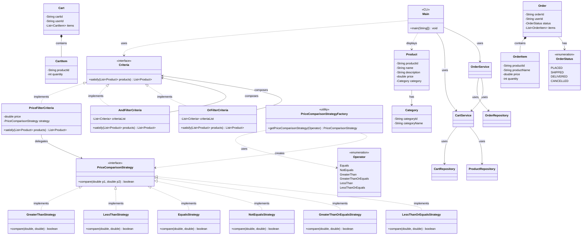

# E-Commerce Low-Level Design (LLD)

> **Start here**: See [DESIGN_GUIDE.md](./DESIGN_GUIDE.md) for a step-by-step design approach and interview tips.

This project demonstrates the Low-Level Design (LLD) for an **E-Commerce System** with product search, cart, and order management. It uses the Specification and Strategy patterns for filtering, plus a clean Repository pattern for in-memory persistence.

## Design Requirements

1. System should allow users to search products from a catalog of products based on different filtration criteria.
2. Users should be able to add products to their carts.
3. Order placing and cancelling of orders at a later stage.
4. System should tell the current status of the order.

### Other Requirements

- In-memory DB needed.
- CLI interface.

---

## The Solution

The system combines multiple patterns:

1. **Specification (Criteria) Pattern** — Product filters implement `Criteria`. `AndFilterCriteria` and `OrFilterCriteria` enable composable boolean expressions.
2. **Strategy Pattern** — Price comparisons (>, <, >=, <=, =, !=) use `PriceComparisonStrategy` implementations via `PriceComparisonStrategyFactory`.
3. **Repository Pattern** — `ProductRepository`, `CartRepository`, and `OrderRepository` abstract storage. In-memory implementations satisfy the in-memory DB requirement.
4. **Service Layer** — `CartService` and `OrderService` orchestrate cart and order flows, delegating persistence to repositories.

### UML Class Diagram



### Component Structure

```
ecommerce/
├── models/
│   ├── Product.java              # Product entity (with productId)
│   ├── Category.java             # Category entity
│   ├── Cart.java                 # User cart
│   ├── CartItem.java             # Product + quantity in cart
│   ├── Order.java                # Placed order
│   ├── OrderItem.java            # Product snapshot at order time
│   └── OrderStatus.java          # PLACED, SHIPPED, DELIVERED, CANCELLED
├── repository/                   # In-memory persistence
│   ├── ProductRepository.java
│   ├── CartRepository.java
│   ├── OrderRepository.java
│   ├── InMemoryProductRepository.java
│   ├── InMemoryCartRepository.java
│   └── InMemoryOrderRepository.java
├── catalog/
│   └── ProductCatalogFactory.java   # Seeds product catalog
├── services/
│   ├── CartService.java          # Add to cart, view cart, clear
│   ├── OrderService.java         # Place order, cancel, status
│   └── filter/
│   ├── Criteria.java             # Specification interface
│   ├── PriceFilterCriteria.java  # Price-based filter
│   ├── AndFilterCriteria.java    # AND combiner
│   ├── OrFilterCriteria.java     # OR combiner
│   ├── strategies/               # Price comparison strategies
│   │   ├── PriceComparisonStrategy.java
│   │   ├── GreaterThanStrategy.java
│   │   ├── LessThanStrategy.java
│   │   ├── EqualsStrategy.java
│   │   ├── NotEqualsStrategy.java
│   │   ├── GreaterThanOrEqualsStrategy.java
│   │   └── LessThanOrEqualsStrategy.java
│       └── factories/
│           └── PriceComparisonStrategyFactory.java
├── utils/
│   └── Operator.java             # Comparison operators enum
├── Main.java                     # CLI entry point (search, cart, order, cancel)
└── README.md
```

### Run

Run `Main.java` from your IDE (right-click → Run). The CLI supports:
- **Search**: List products, filter by price
- **Cart**: Add products (by product ID, e.g. `prod-1`), view cart
- **Order**: Place order (clears cart), view orders, cancel order (PLACED only)

### Tests

```bash
./gradlew test --tests "com.springmicroservice.lowleveldesignproblems.ecommerce.*"
```
