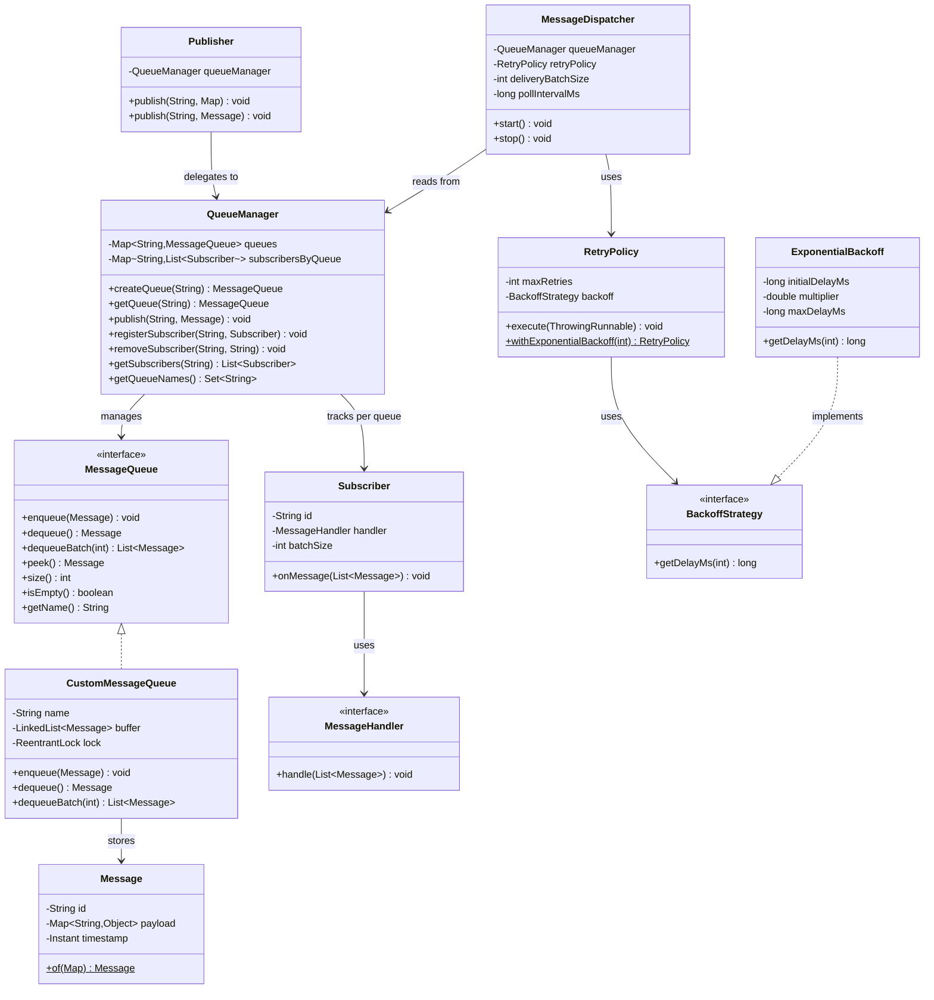
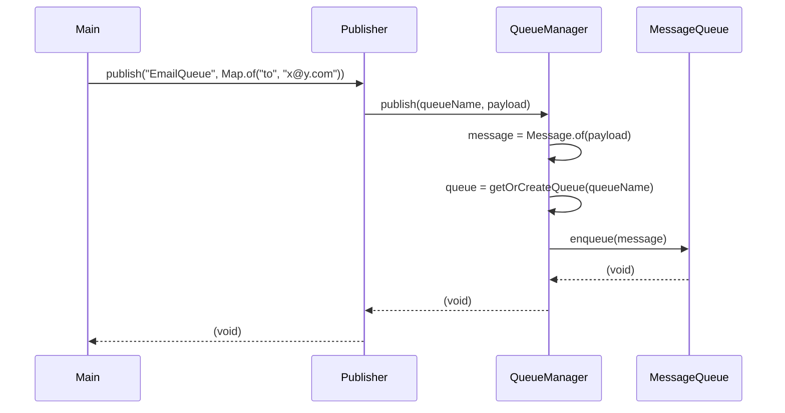
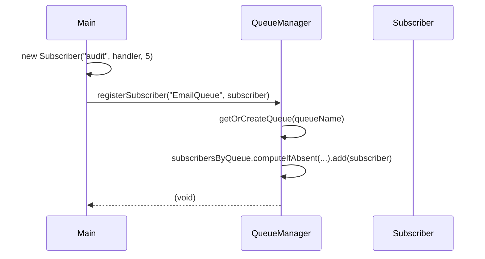
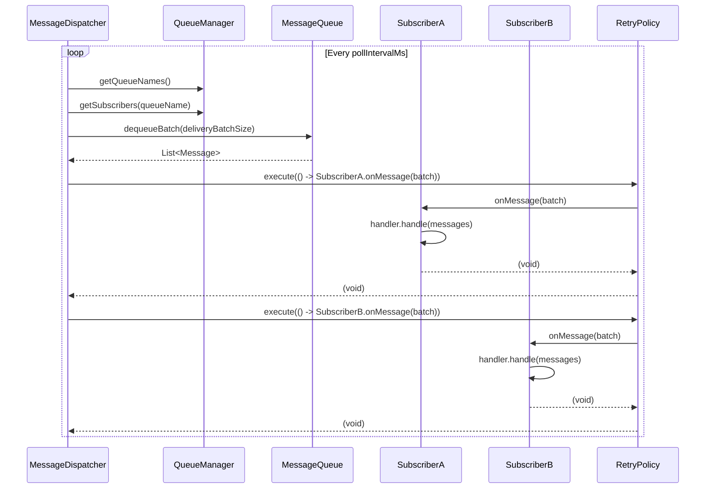
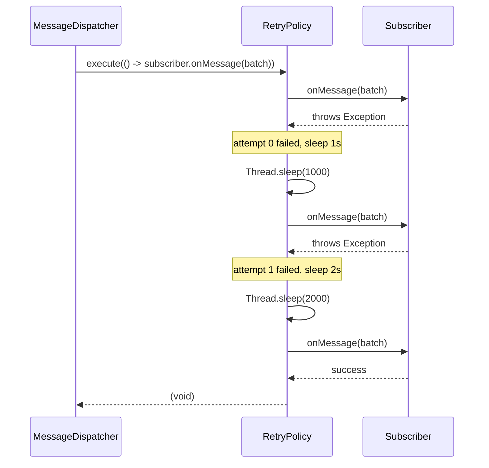

# In-Memory Message Queue (Kafka/Redis Pub-Sub style) — Complete Tutorial

> **Start here**: See [DESIGN_GUIDE.md](./DESIGN_GUIDE.md) for a step-by-step design approach and interview tips for strong hire.

A Low-Level Design problem demonstrating **custom queue implementation** (no `java.util.Queue`), **pub-sub decoupling**, **batch consumption**, **retry with exponential backoff**, and **thread safety**. This README is a self-contained tutorial—no need to read the code.

---

## Table of Contents

1. [Functional Requirements](#functional-requirements)
2. [Architecture Overview](#architecture-overview)
3. [Component Diagrams (UML)](#component-diagrams-uml)
4. [Publish & Delivery Flow — Sequence Diagrams](#publish--delivery-flow--sequence-diagrams)
5. [Custom Queue Implementation — Deep Dive](#custom-queue-implementation--deep-dive)
6. [Pub-Sub Decoupling & Fan-Out — Deep Dive](#pub-sub-decoupling--fan-out--deep-dive)
7. [Retry with Exponential Backoff — Deep Dive](#retry-with-exponential-backoff--deep-dive)
8. [How Components Work Together](#how-components-work-together)
9. [Design Patterns Used](#design-patterns-used)
10. [Running the Application](#running-the-application)
11. [Quick Reference](#quick-reference)

---

## Functional Requirements

| # | Requirement | Solution |
|---|-------------|----------|
| 1 | Custom Queue (no Java Queue) | `CustomMessageQueue` — LinkedList-backed, our own `MessageQueue` interface |
| 2 | Each queue operates independently | Named queues in `QueueManager`; `Map<queueName, MessageQueue>` |
| 3 | Named queues (EmailQueue, etc.) | `createQueue(name)`, `getQueue(name)` |
| 4 | Publisher pushes JSON (`Map<String, Object>`) | `Message.of(payload)` + `Publisher.publish(queueName, payload)` |
| 5 | Multiple subscribers per queue, add/remove at runtime | `QueueManager.registerSubscriber()`, `removeSubscriber()` |
| 6 | Callback to receive messages | `MessageHandler` (functional interface) + `Subscriber.onMessage()` |
| 7 | Batch consumption | `queue.dequeueBatch(batchSize)`; subscriber receives `List<Message>` |
| 8 | Loosely coupled, failure handling | Publisher/Subscriber never meet; `RetryPolicy` around callback |
| 9 | Retry mechanism | `RetryPolicy.execute()` with configurable max retries |
| 10 | Retry with backoff (bonus) | `ExponentialBackoff` (1s → 2s → 4s → cap) |
| 11 | Thread-safe queue (bonus) | `ReentrantLock` on `CustomMessageQueue` operations |
| 12 | Configurable delay between pulls (bonus) | `MessageDispatcher` uses `ScheduledExecutorService.scheduleWithFixedDelay` |

---

## Architecture Overview

The system follows a **broker + dispatcher architecture**:

```
┌───────────────────────────────────────────────────────────────────┐
│                          Main (Entry Point)                        │
└───────────────────────────────────────────────────────────────────┘
                                    │
          ┌─────────────────────────┼─────────────────────────┐
          ▼                         ▼                         ▼
┌─────────────────┐     ┌─────────────────────┐     ┌─────────────────────┐
│    Publisher    │     │    QueueManager     │     │  MessageDispatcher  │
│  publish(...)   │     │  (Central Broker)   │     │  (Background Worker)│
└────────┬────────┘     │  • createQueue      │     │  • Polls queues     │
         │              │  • registerSubscriber│     │  • Dequeue batch    │
         │              │  • publish          │     │  • Deliver to each  │
         └──────────────►  • removeSubscriber │     │    subscriber      │
                          └────────┬──────────┘     │  • Retry on failure│
                                   │                 └─────────┬───────────┘
                                   │                           │
                    ┌──────────────┴──────────────┐            │
                    ▼                             ▼            │
          ┌─────────────────┐           ┌─────────────────────┐
          │ CustomMessageQueue│          │  List<Subscriber>    │
          │ (per queue name)  │          │  (per queue)         │
          │  • enqueue       │          │  • MessageHandler    │
          │  • dequeueBatch  │          │    callback          │
          │  • ReentrantLock │          └─────────────────────┘
          └─────────────────┘
```

**Key idea**: Publisher pushes to QueueManager → enqueues in the named queue. Dispatcher polls queues, dequeues batches, delivers the **same batch** to all subscribers (fan-out). Subscribers are decoupled from publishers; retry ensures one failing subscriber doesn't block others.

---

## Component Diagrams (UML)

### Package Structure

```
messagequeue/
├── models/
│   └── Message.java              (id, payload Map, timestamp)
├── queue/
│   ├── MessageQueue.java         (interface)
│   └── CustomMessageQueue.java   (LinkedList + ReentrantLock)
├── broker/
│   ├── MessageHandler.java       (functional interface)
│   ├── Subscriber.java           (id, handler, batchSize)
│   ├── QueueManager.java         (queues + subscribers map)
│   └── Publisher.java            (thin facade over QueueManager)
├── dispatcher/
│   └── MessageDispatcher.java    (poll → dequeue → deliver)
├── retry/
│   ├── BackoffStrategy.java      (interface)
│   ├── ExponentialBackoff.java   (1s, 2s, 4s...)
│   └── RetryPolicy.java          (execute with retry)
├── exceptions/
│   └── QueueNotFoundException.java
├── DESIGN_GUIDE.md
├── README.md
└── Main.java
```

### UML Class Diagram



---

## Publish & Delivery Flow — Sequence Diagrams

### Scenario 1: Publish a Message

When a publisher pushes a message, it flows through the broker into the queue.



### Scenario 2: Register Subscriber

Subscribers register a callback; they can be added at runtime.



### Scenario 3: Dispatcher Delivers Batch (Fan-Out)

The dispatcher polls, dequeues a batch, and delivers the **same batch** to every subscriber.



### Scenario 4: Retry on Subscriber Failure

If a subscriber's callback throws, the retry policy backs off and retries.



---

## Custom Queue Implementation — Deep Dive

### Why No java.util.Queue?

The requirement explicitly asks for a **custom queue**. Using `LinkedList` internally for storage is fine—we're not exposing `java.util.Queue` as our API. Our `MessageQueue` interface defines the contract: `enqueue`, `dequeue`, `dequeueBatch`, `peek`, `size`, `isEmpty`.

### LinkedList vs Circular Buffer

| Approach | Pros | Cons |
|----------|------|------|
| **LinkedList** (current) | Unbounded, O(1) enqueue/dequeue, simple | No fixed capacity; unbounded growth |
| **Circular buffer** | Bounded, cache-friendly, no allocations | Fixed capacity; need to handle "full" |

For an in-memory LLD, **LinkedList** is a pragmatic choice. Mention circular buffer as an alternative for bounded queues in production.

### Thread Safety

`CustomMessageQueue` uses `ReentrantLock`:

```java
lock.lock();
try {
    buffer.addLast(message);  // or removeFirst, etc.
} finally {
    lock.unlock();
}
```

Every `enqueue`, `dequeue`, `dequeueBatch`, `peek`, `size`, `isEmpty` is protected. Multiple publishers and the dispatcher can run concurrently without corruption.

---

## Pub-Sub Decoupling & Fan-Out — Deep Dive

### Decoupling

- **Publisher** knows only: queue name + payload. It does not know who subscribes.
- **Subscriber** knows only: "I get a `List<Message>` when the dispatcher calls me." It does not know who published.
- **QueueManager** is the broker: it holds queues and subscriber lists. The **dispatcher** reads from queues and invokes subscriber callbacks.

### Fan-Out Semantics

When the dispatcher dequeues a batch, it delivers the **same batch** to **every** subscriber of that queue. This is **fan-out** (like Redis PUBSUB): one message reaches all interested consumers.

```
Queue: [M1, M2, M3]
       ↓ dequeueBatch(3)
Batch: [M1, M2, M3]
       ├──→ Subscriber A.handle([M1,M2,M3])
       └──→ Subscriber B.handle([M1,M2,M3])
```

Messages are **consumed** (removed from queue) once. All subscribers process the same batch before it's gone.

### Why Batch Size?

- **deliveryBatchSize** (dispatcher): How many messages to dequeue per poll. Larger = fewer polls, more latency per delivery.
- **Subscriber.batchSize**: Reserved for future per-subscriber tuning; currently the dispatcher uses a queue-level delivery batch size.

---

## Retry with Exponential Backoff — Deep Dive

### The Problem

A subscriber's callback might fail (network, parsing, DB down). Without retry, we'd lose the message and never recover.

### The Solution

`RetryPolicy.execute(runnable)` wraps the callback:

1. Run the callback.
2. On exception: sleep `backoff.getDelayMs(attempt)`.
3. Retry until `maxRetries` attempts are exhausted.
4. Rethrow the last exception; dispatcher logs and continues to the next subscriber.

---

### Retry Strategy Internals (Code Walkthrough)

#### 1. Dispatcher invokes retry around subscriber callback

The dispatcher wraps each subscriber delivery in `retryPolicy.execute()`. If the callback throws, the policy retries; if it still fails after all retries, the dispatcher catches, logs, and continues to the next subscriber.

```java
// MessageDispatcher.deliverToSubscriber()
private void deliverToSubscriber(String queueName, Subscriber subscriber, List<Message> batch) {
    try {
        retryPolicy.execute(() -> subscriber.onMessage(batch));
    } catch (Exception e) {
        LOG.log(Level.SEVERE, "Subscriber %s failed after retries for queue %s: %s"
                .formatted(subscriber.getId(), queueName, e.getMessage()), e);
        // Optionally: re-queue batch to DLQ or dead-letter; for now we log and drop
    }
}
```

#### 2. RetryPolicy: loop, attempt, sleep, retry

`RetryPolicy.execute()` runs the action in a loop. On exception it sleeps via the backoff strategy, then retries. After `maxRetries` attempts (so `maxRetries + 1` total runs), it rethrows.

```java
// RetryPolicy.execute()
public void execute(ThrowingRunnable action) throws Exception {
    Exception lastException = null;
    for (int attempt = 0; attempt <= maxRetries; attempt++) {
        try {
            action.run();
            return;  // success — exit immediately
        } catch (Exception e) {
            lastException = e;
            if (attempt < maxRetries) {
                long delayMs = backoff.getDelayMs(attempt);
                try {
                    Thread.sleep(delayMs);
                } catch (InterruptedException ie) {
                    Thread.currentThread().interrupt();
                    throw new RuntimeException("Interrupted during retry backoff", ie);
                }
            }
        }
    }
    if (lastException != null) {
        throw lastException;
    }
}
```

**Key points:**

- `attempt` is 0-based: first failure → sleep `backoff.getDelayMs(0)`, then retry.
- `attempt <= maxRetries` means we try up to `maxRetries + 1` times (e.g. maxRetries=3 → 4 attempts).
- `ThrowingRunnable` is a custom `@FunctionalInterface` that allows `run() throws Exception` (unlike `Runnable`).

#### 3. ExponentialBackoff: delay formula

The strategy computes delay as `initialDelayMs * multiplier^attempt`, capped at `maxDelayMs`.

```java
// ExponentialBackoff.getDelayMs()
@Override
public long getDelayMs(int attempt) {
    long delay = (long) (initialDelayMs * Math.pow(multiplier, attempt));
    return Math.min(delay, maxDelayMs);
}
```

Constructor defaults:

```java
// ExponentialBackoff default constructor
public ExponentialBackoff() {
    this(1000, 2.0, 30_000);  // 1s, 2s, 4s... capped at 30s
}
```

#### 4. Factory for convenience

```java
// RetryPolicy.withExponentialBackoff()
public static RetryPolicy withExponentialBackoff(int maxRetries) {
    return new RetryPolicy(maxRetries, new ExponentialBackoff());
}
```

Usage: `RetryPolicy.withExponentialBackoff(3)` → up to 4 attempts with 1s, 2s, 4s delays between retries.

---

### ExponentialBackoff Formula

```
delay = initialDelayMs * (multiplier ^ attempt)
capped at maxDelayMs
```

Default: `initialDelayMs=1000`, `multiplier=2`, `maxDelayMs=30000`.

| Attempt | Delay |
|---------|-------|
| 0 | 1s |
| 1 | 2s |
| 2 | 4s |
| 3 | 8s |
| 4 | 16s |
| 5 | 30s (cap) |

### One Subscriber's Failure Doesn't Block Others

The dispatcher iterates over subscribers and calls `deliverToSubscriber` for each. Each call is wrapped in `retryPolicy.execute()`. If Subscriber A fails after all retries, the dispatcher logs and moves on to Subscriber B. Subscriber B still gets the batch.

---

## How Components Work Together

### Publish Flow

```
Main → Publisher.publish(queueName, payload)
     → QueueManager.publish() → Message.of(payload)
     → queue = getOrCreateQueue(queueName)
     → queue.enqueue(message)
```

### Subscribe Flow

```
Main → Subscriber(id, handler, batchSize)
     → QueueManager.registerSubscriber(queueName, subscriber)
     → subscribersByQueue.computeIfAbsent(queueName, ...).add(subscriber)
```

### Delivery Flow (Dispatcher Loop)

```
Dispatcher (every pollIntervalMs):
  for each queueName in getQueueNames():
    subscribers = getSubscribers(queueName)
    if empty: continue
    queue = getQueue(queueName)
    if queue.isEmpty(): continue
    batch = queue.dequeueBatch(deliveryBatchSize)
    for each subscriber:
      retryPolicy.execute(() -> subscriber.onMessage(batch))
      on final failure: log, continue
```

### Remove Subscriber

```
Main → QueueManager.removeSubscriber(queueName, subscriberId)
     → subscribersByQueue.get(queueName).removeIf(s -> s.getId().equals(id))
```

---

## Design Patterns Used

| Pattern | Where | Why |
|---------|-------|-----|
| **Observer / Pub-Sub** | Subscriber registers callback; Dispatcher delivers | Decoupled publisher and subscriber. |
| **Strategy** | `BackoffStrategy` (ExponentialBackoff) | Pluggable retry behavior; add LinearBackoff without changing RetryPolicy. |
| **Facade** | `Publisher` over `QueueManager` | Clean API: "I am a publisher, I push messages." |
| **Custom Data Structure** | `CustomMessageQueue` | No `java.util.Queue`; demonstrates DS understanding. |
| **Executor / Scheduler** | `ScheduledExecutorService` in Dispatcher | Configurable poll interval; async delivery. |
| **Thread Safety** | `ReentrantLock`, `CopyOnWriteArrayList` | Safe concurrent publish + multi-subscriber delivery. |

---

## Running the Application

From the project root:

```bash
./gradlew runMessagequeue
```

**What the demo does:**

1. Creates `QueueManager`, `Publisher`, `MessageDispatcher` (retry 3x, batch 10, poll 100ms).
2. Creates queue `EmailQueue`.
3. Registers 2 subscribers: `email-logger` (batch 5) and `audit` (batch 3).
4. Starts the dispatcher (background thread).
5. Publishes 3 messages: Welcome, Order confirmed, Password reset.
6. Both subscribers receive the same 3 messages (fan-out).
7. Removes `audit` subscriber.
8. Publishes 1 more message; only `email-logger` receives it.
9. Stops the dispatcher.

---

## Quick Reference

| Component | Responsibility |
|-----------|-----------------|
| **Message** | Payload (Map), id, timestamp; `Message.of(payload)` factory |
| **MessageQueue** | Interface: enqueue, dequeue, dequeueBatch, peek |
| **CustomMessageQueue** | LinkedList + ReentrantLock; thread-safe |
| **MessageHandler** | Functional interface: `void handle(List<Message>)` |
| **Subscriber** | id, handler, batchSize; `onMessage()` called by dispatcher |
| **QueueManager** | Central broker: createQueue, publish, registerSubscriber, removeSubscriber |
| **Publisher** | Thin facade: `publish(queueName, payload)` |
| **MessageDispatcher** | Polls queues, dequeues batch, delivers to all subscribers with retry |
| **RetryPolicy** | `execute(runnable)` with backoff; rethrows after max retries |
| **ExponentialBackoff** | 1s → 2s → 4s... capped at maxDelayMs |

---

*This README serves as a complete tutorial. No code reading required.*
