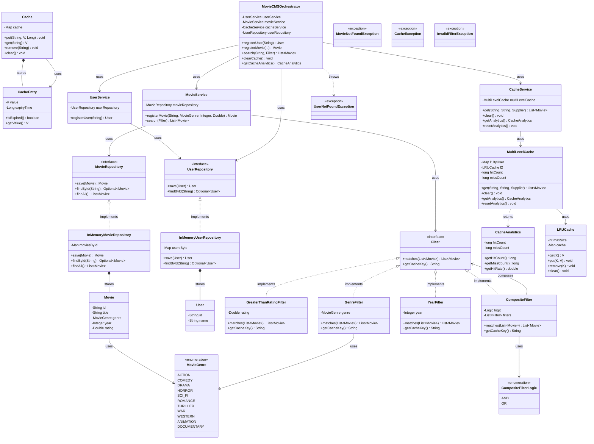
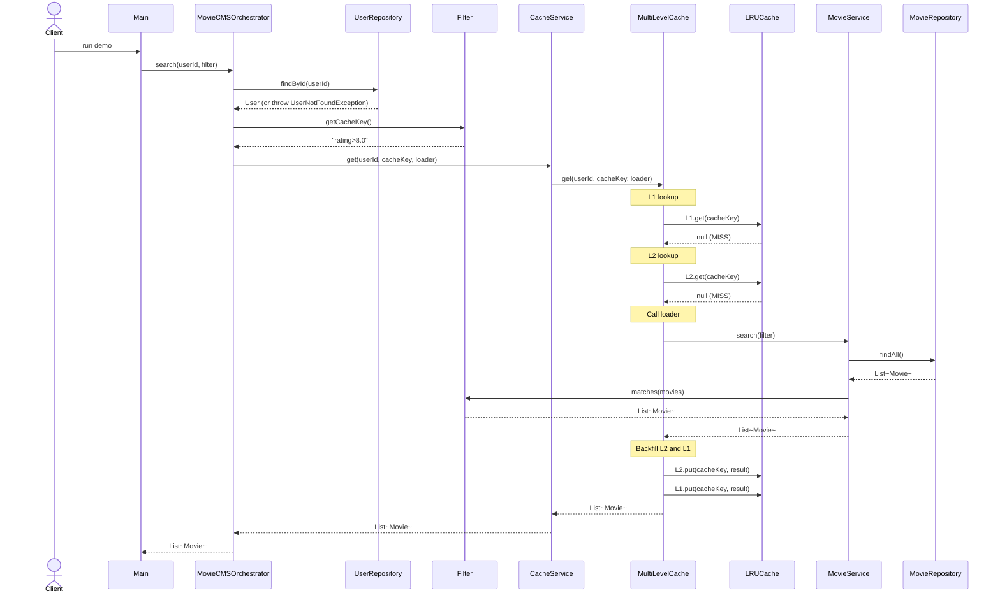
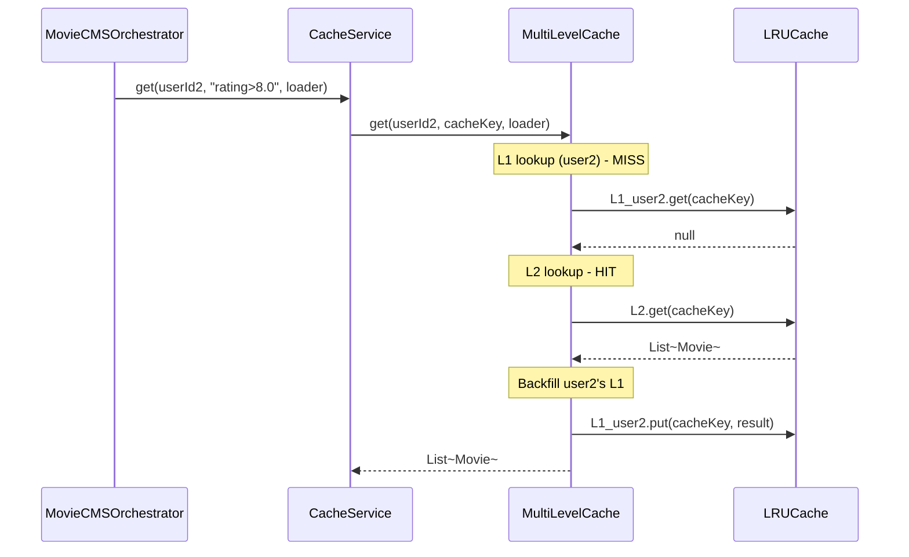
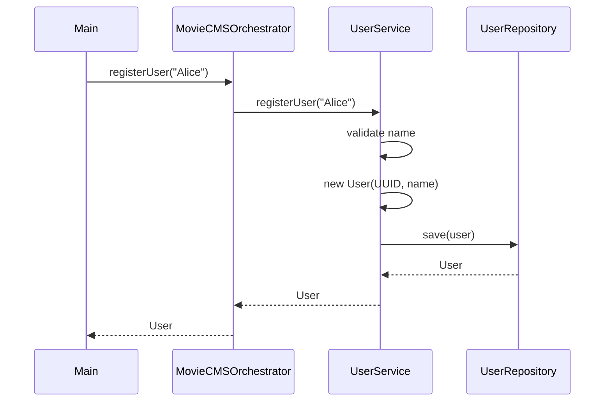
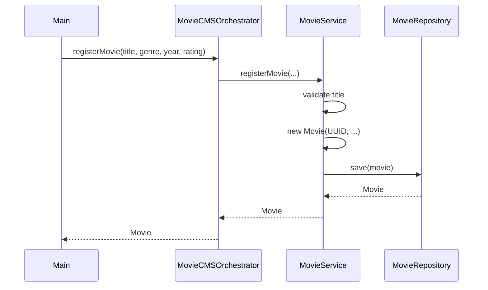
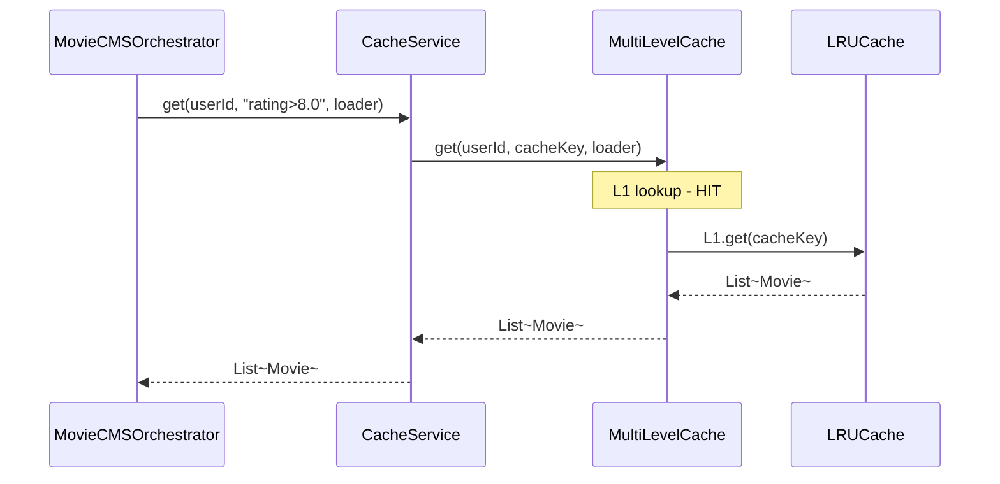

# Movie Content Management System — Complete Tutorial

A Low-Level Design problem demonstrating **user/movie registration**, **pluggable filter-based search**, and **multi-level caching** with LRU eviction. This README is a self-contained tutorial—no need to read the code.

---

## Table of Contents

1. [Functional Requirements](#functional-requirements)
2. [Architecture Overview](#architecture-overview)
3. [Component Diagrams (UML)](#component-diagrams-uml)
4. [How Search Works — Sequence Diagram](#how-search-works--sequence-diagram)
5. [Why Cache Key Is Needed — Deep Dive](#why-cache-key-is-needed--deep-dive)
6. [Multi-Level Cache Flow](#multi-level-cache-flow)
7. [Filter Design & Composite Pattern](#filter-design--composite-pattern)
8. [How Components Work Together](#how-components-work-together)
9. [Design Patterns Used](#design-patterns-used)
10. [Running the Application](#running-the-application)

---

## Functional Requirements

| # | Requirement | Solution |
|---|-------------|----------|
| 1 | Movie registration | `MovieService` + `MovieRepository` |
| 2 | User registration | `UserService` + `UserRepository` |
| 3 | Movie search (single filter) | `Filter` implementations (e.g., `GreaterThanRatingFilter`) |
| 4 | Movie search (multi filter) | `CompositeFilter` with AND/OR logic |
| 5 | Multi-level cache (L1: 5/user, L2: 20 global) | `MultiLevelCache` + `LRUCache` |
| 6 | Cache analytics (hit vs miss) | `CacheAnalytics` + counters in `MultiLevelCache` |
| 7 | Cache maintenance (clear) | `CacheService.clear()` |
| 8 | Error handling | Custom exceptions (`UserNotFoundException`, etc.) |

---

## Architecture Overview

The system follows a **layered architecture**:

```
┌─────────────────────────────────────────────────────────────────┐
│                     Main (Entry Point)                           │
└─────────────────────────────────────────────────────────────────┘
                                │
                                ▼
┌─────────────────────────────────────────────────────────────────┐
│              MovieCMSOrchestrator (Controller)                   │
│  Coordinates: registration, search, cache maintenance, analytics  │
└─────────────────────────────────────────────────────────────────┘
                                │
          ┌─────────────────────┼─────────────────────┐
          ▼                     ▼                     ▼
┌─────────────────┐   ┌─────────────────┐   ┌─────────────────┐
│  UserService     │   │  MovieService   │   │  CacheService   │
│  (User reg.)    │   │  (Movie reg.,   │   │  (Multi-level   │
│                 │   │   Search)       │   │   cache,        │
│                 │   │                 │   │   analytics)    │
└────────┬────────┘   └────────┬───────┘   └────────┬───────┘
         │                      │                     │
         ▼                      ▼                     ▼
┌─────────────────┐   ┌─────────────────┐   ┌─────────────────┐
│ UserRepository  │   │ MovieRepository │   │ MultiLevelCache  │
│ (In-Memory)     │   │ (In-Memory)     │   │ (L1 + L2 + LRU)  │
└─────────────────┘   └─────────────────┘   └─────────────────┘
```

**Key idea**: The orchestrator is the single entry point. Services have single responsibilities. Repositories abstract storage. Caching is transparent to `MovieService`—it only knows how to search; the orchestrator decides when to use cache.

---

## Component Diagrams (UML)

### Package Structure

```
moviecms/
├── models/           # Domain entities & filters
│   ├── Movie
│   ├── User
│   ├── Filter (interface)
│   ├── GreaterThanRatingFilter
│   ├── GenreFilter
│   ├── YearFilter
│   ├── CompositeFilter
│   ├── MovieGenre (enum)
│   ├── Cache
│   └── CacheEntry
├── repositories/     # Data access
│   ├── MovieRepository (interface)
│   ├── UserRepository (interface)
│   ├── InMemoryMovieRepository
│   └── InMemoryUserRepository
├── services/         # Business logic
│   ├── UserService
│   ├── MovieService
│   ├── CacheService
│   └── CacheAnalytics
├── cache/            # Caching layer
│   ├── LRUCache
│   └── MultiLevelCache
├── exceptions/       # Error handling
│   ├── MovieNotFoundException
│   ├── UserNotFoundException
│   ├── CacheException
│   └── InvalidFilterException
├── orchestrator/
│   └── MovieCMSOrchestrator
└── Main.java
```

### UML Class Diagram (Complete)



---

## How Search Works — Sequence Diagrams

### Scenario 1: Search with Cache Miss

When a user searches for movies (e.g., "rating > 8") and the cache does not contain the result, the flow proceeds through L1 → L2 → loader → primary store.



### Scenario 2: Search with Cache Hit (L2)

When another user searches the same filter, L1 misses (user-specific) but L2 hits. Result is returned and backfilled to L1.



### Scenario 3: User Registration



### Scenario 4: Movie Registration



### Scenario 5: Cache Hit on L1 (Same User, Same Filter)

When the same user searches the same filter again, L1 returns immediately—L2 and loader are never called.



**Summary:** Three cache outcomes—L1 hit (fastest), L2 hit (fast), Primary miss (slowest, triggers loader and backfill).

---

## Why Cache Key Is Needed — Deep Dive

### The Problem

The cache stores search results in a key-value structure:

```
Map<cacheKey, List<Movie>>
```

To look up cached results, we need a **string key** that uniquely identifies the search. The filter object itself cannot be used as a key (we need a `String` for the map). So: **how do we turn a Filter into a cache key?**

### Why the Filter Owns the Cache Key

| Reason | Explanation |
|--------|-------------|
| **Encapsulation** | Only the filter knows what makes its search unique. `GreaterThanRatingFilter(8.0)` is uniquely identified by `"rating>8.0"`. The cache doesn't need to know filter internals. |
| **Consistency** | Same search must always produce the same key. `getCacheKey()` is deterministic: `GreaterThanRatingFilter(8.0)` → `"rating>8.0"` every time. |
| **Uniqueness** | Different searches must not collide. `GenreFilter(ACTION)` → `"genre:ACTION"` vs `YearFilter(2014)` → `"year:2014"`. |
| **Extensibility** | New filters (e.g., `LanguageFilter`) implement `getCacheKey()` without changing cache or orchestrator. |

### What Happens Without a Cache Key?

1. **Using `filter.toString()`** — Unreliable. Default `Object.toString()` includes hash, which differs per instance. Same criteria → different keys → cache miss.
2. **Using `filter.hashCode()`** — Same issue. Two `GreaterThanRatingFilter(8.0)` instances can have different `hashCode()`.
3. **Hardcoding in orchestrator** — The orchestrator would need to know every filter type and how to build keys. Violates Open/Closed Principle.

### Cache Key Examples

| Filter | Cache Key |
|--------|-----------|
| `GreaterThanRatingFilter(8.0)` | `"rating>8.0"` |
| `GenreFilter(ACTION)` | `"genre:ACTION"` |
| `YearFilter(2014)` | `"year:2014"` |
| `CompositeFilter(AND, [GenreFilter(SCI_FI), YearFilter(2014)])` | `"composite:AND:genre:SCI_FI\|year:2014"` |

The orchestrator calls `filter.getCacheKey()` and passes it to `CacheService.get(userId, cacheKey, loader)`. The cache uses this key for L1 and L2 lookups.

---

## Multi-Level Cache Flow

### Hierarchy

```
User Request
     │
     ▼
┌─────────────┐
│ L1 Cache    │  5 entries per user (LRU)
│ (per user)  │  Key: cacheKey (e.g. "rating>8.0")
└──────┬──────┘
       │ MISS
       ▼
┌─────────────┐
│ L2 Cache    │  20 entries global (LRU)
│ (shared)    │  Key: cacheKey
└──────┬──────┘
       │ MISS
       ▼
┌─────────────┐
│ Primary     │  MovieRepository.findAll() + Filter.matches()
│ (unlimited) │
└─────────────┘
```

### Flow on Cache Miss

1. **L1 check** — `l1ByUser.get(userId).get(cacheKey)`. User-specific. If hit → return, increment hit count.
2. **L2 check** — `l2.get(cacheKey)`. If hit → return, **backfill L1**, increment hit count.
3. **Loader** — Call `movieService.search(filter)`. Increment miss count.
4. **Backfill** — Put result in L2, then in L1 (so next request for same user hits L1).

### LRU Eviction

When L1 (capacity 5) or L2 (capacity 20) is full and a new entry is added, the **least recently used** entry is evicted. Implemented via `LinkedHashMap` with `accessOrder=true`.

---

## Filter Design & Composite Pattern

### Single Filter

Each filter implements:

- `matches(movies)` — Returns the subset of movies that match.
- `getCacheKey()` — Returns a unique string for caching.

Example: `GreaterThanRatingFilter(8.0)` keeps movies with `rating > 8.0`.

### Multi-Filter (CompositeFilter)

**AND logic**: Chain filters. Start with all movies, apply filter 1 → subset, apply filter 2 → smaller subset.

```
movies → GenreFilter(SCI_FI) → subset1 → YearFilter(2014) → final result
```

**OR logic**: Apply each filter to the original list, then union and deduplicate by movie ID.

### Adding a New Filter

1. Create class implementing `Filter`.
2. Implement `matches(List<Movie> movies)`.
3. Implement `getCacheKey()` with a unique, deterministic string.
4. No changes needed in orchestrator, cache, or other filters.

---

## How Components Work Together

### Registration Flow

```
Main → Orchestrator.registerUser("Alice")
     → UserService.registerUser()
     → UserRepository.save()
     → returns User with generated ID
```

Same pattern for `registerMovie`.

### Search Flow (Summary)

```
Main → Orchestrator.search(userId, filter)
     → UserRepository.findById(userId)  // validate user
     → cacheKey = filter.getCacheKey()
     → CacheService.get(userId, cacheKey, () -> MovieService.search(filter))
        → MultiLevelCache: L1 → L2 → loader
        → loader runs MovieService.search(filter)
           → MovieRepository.findAll()
           → filter.matches(allMovies)
     → returns List<Movie>
```

### Cache Analytics

`MultiLevelCache` counts hits (L1 or L2 returned data) and misses (loader was called). `getCacheAnalytics()` returns `CacheAnalytics(hitCount, missCount, hitRate)`.

### Cache Maintenance

`CacheService.clear()` clears all L1 caches (per user) and L2 cache. Used for maintenance or when data changes.

---

## Design Patterns Used

| Pattern | Where | Why |
|---------|-------|-----|
| **Repository** | `MovieRepository`, `UserRepository` | Abstraction over storage. Swap in-memory for DB without changing services. |
| **Strategy** | `Filter` interface | Different search criteria (rating, genre, year) are interchangeable strategies. |
| **Composite** | `CompositeFilter` | Combine filters with AND/OR; tree structure. |
| **Chain of Responsibility** | L1 → L2 → loader | Each level tries to satisfy the request; passes to next on miss. |
| **Dependency Injection** | Services take repositories via constructor | Testability; easy to mock. |
| **Facade** | `MovieCMSOrchestrator` | Single entry point hides complexity of services, cache, repositories. |

---

## Running the Application

From the project root:

```bash
./gradlew runMoviecms
```

**What the demo does:**

1. Registers users Alice and Bob.
2. Registers 4 movies (Inception, The Dark Knight, Interstellar, Comedy Central).
3. **Single filter**: Search "rating > 8" for Alice (cache miss → primary → backfill).
4. **Multi-filter**: Search "SCI_FI AND year 2014" for Alice (cache miss).
5. **Same search, different user**: Bob searches "rating > 8" → L2 hit (Alice's search already populated L2), backfill Bob's L1.
6. Prints cache analytics (hits, misses, hit rate).
7. Clears cache.

---

## Quick Reference

| Component | Responsibility |
|-----------|-----------------|
| **MovieCMSOrchestrator** | Entry point; coordinates all operations. |
| **UserService** | User registration. |
| **MovieService** | Movie registration; unfiltered search (no cache). |
| **CacheService** | Multi-level cache facade; analytics; clear. |
| **MultiLevelCache** | L1 (5/user) + L2 (20 global); LRU; loader on miss. |
| **Filter** | `matches()` + `getCacheKey()`; extensible search criteria. |
| **Repositories** | Data persistence (in-memory for LLD). |

---

*This README serves as a complete tutorial. No code reading required.*
