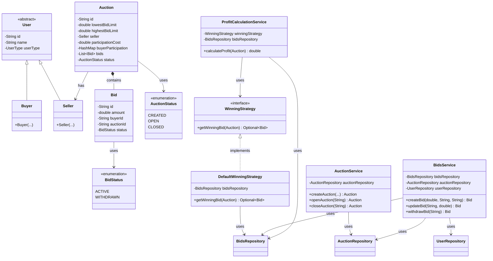

# Online Auction Low-Level Design (LLD)

> **Start here**: See [DESIGN_GUIDE.md](./DESIGN_GUIDE.md) for a step-by-step design approach and interview tips.

This project demonstrates the Low-Level Design (LLD) for an **Online Auction System** where sellers create auctions, buyers place bids, and winners are selected using a configurable strategy. It uses the Strategy pattern for winner selection, Repository pattern for in-memory persistence, and a clean Service layer for business logic.

## Design Requirements

1. Users can sell or buy products.
2. Sellers can create auctions and buyers can participate.
3. Buyers can create, update, or withdraw bids until auction is closed.
4. Highest unique bid wins; preferred buyers break ties.
5. Seller profit/loss is calculated per the given formula.

### Functional

**Users:**
- **Buyers** — Participate in multiple auctions, place bids.
- **Sellers** — Create multiple auctions, track profit and loss.

**Auctions:**
- Each auction has: id, lowest/highest bid limits, seller, participation cost.
- Seller receives 20% of participation cost; 80% goes to platform.
- Participation cost is paid when placing first bid.

**Bids:**
- Create, update, or withdraw until auction is closed.
- Bid amount must lie within bid limits.
- Multiple auctions can run simultaneously.

**Winner Selection:**
- Highest bid wins (must be uniquely determined).
- If no unique bid, no winner.
- **Preferred buyers** (participated in >1 auction) break ties.
- If multiple preferred at same max, fallback to next highest unique bid.

**Seller Profit/Loss:**
```
If winner exists:
  profit = winning_bid_amount + (no_of_bidders * 0.2 * participation_cost) - avg(lowest, highest)

If no winner:
  profit = no_of_bidders * 0.2 * participation_cost
```

---

## The Solution

The system combines multiple patterns:

1. **Strategy Pattern** — `WinningStrategy` for winner selection. `DefaultWinningStrategy` implements unique highest bid + preferred buyer tiebreaker.
2. **Repository Pattern** — `AuctionRepository`, `BidsRepository`, `UserRepository` with in-memory implementations.
3. **Service Layer** — `AuctionService`, `BidsService`, `ProfitCalculationService` orchestrate flows and enforce business rules.

### UML Class Diagram



### Component Structure

```
onlineauction/
├── models/
│   ├── User.java              # Abstract base
│   ├── Buyer.java
│   ├── Seller.java
│   ├── Auction.java
│   ├── Bid.java
│   ├── AuctionStatus.java     # CREATED, OPEN, CLOSED
│   ├── BidStatus.java         # ACTIVE, WITHDRAWN
│   └── UserType.java
├── repositories/
│   ├── AuctionRepository.java
│   ├── BidsRepository.java
│   ├── UserRepository.java
│   ├── InMemoryAuctionRepository.java
│   ├── InMemoryBidsRepository.java
│   └── InMemoryUserRespository.java
├── services/
│   ├── AuctionService.java    # Create, open, close auction
│   ├── BidsService.java       # Create, update, withdraw bid
│   └── ProfitCalculationService.java
├── strategies/
│   ├── WinningStrategy.java
│   └── DefaultWinningStrategy.java   # Unique highest + preferred tiebreaker
├── Main.java                  # Demo flow
├── DESIGN_GUIDE.md
└── README.md
```

---

## Run

Run `Main.java` from your IDE (right-click → Run). The demo:

1. Creates seller and buyers, saves to `UserRepository`
2. Creates auction (CREATED), opens it (OPEN)
3. Places bids (participation paid on first bid)
4. Closes auction
5. Calculates and prints seller profit/loss

---

## Tests

```bash
./gradlew test --tests "com.springmicroservice.lowleveldesignproblems.onlineauction.*"
```

**DefaultWinningStrategyTest** covers:
- **Normal winner** — Single highest bid wins
- **Preferred buyer** — Tie at max; preferred buyer wins; fallback to next unique
- **No winner** — Tied at max (no preferred), no active bids, null auction, all amounts duplicated
