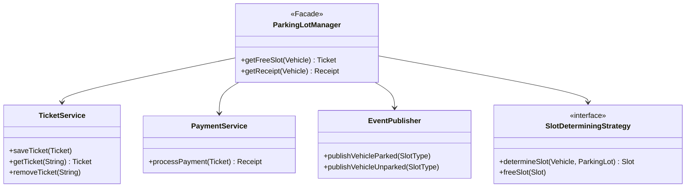
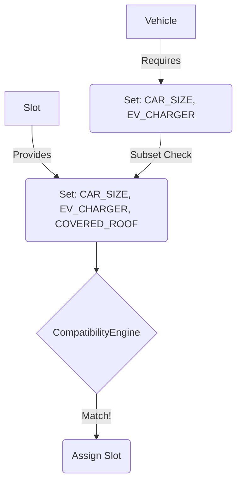
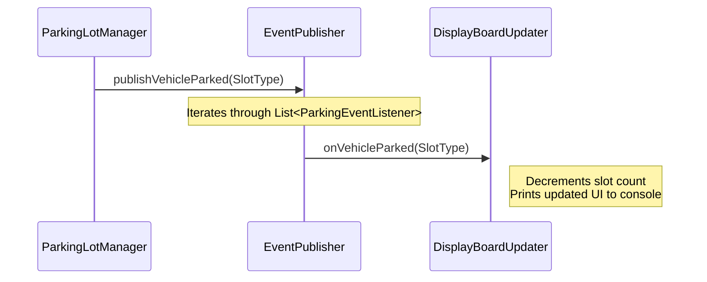

# Complete Guide to Building a Scalable Parking Lot System

Welcome to the definitive tutorial on the **Parking Lot Low-Level Design (LLD)**. If you've searched online for "Parking Lot LLD", you've probably seen a hundred solutions that look exactly the same: a massive `ParkingLot` class filled with `if (vehicleType == CAR)` statements and a hashmap tracking whether a slot is free.

This guide will walk you through, in excruciating detail, how we built an **Enterprise-Grade** system that strictly follows **SOLID Principles**, throws away brittle `Enums` in favor of a dynamic Capability-Based matching system, and leverages powerful design patterns to handle real-world complexity (like a vehicle that is both Electric *and* Hydrogen-powered).

## Table of Contents
1. [Core Requirements](#1-core-requirements)
2. [System Architecture (Domain-Driven Design)](#2-system-architecture-domain-driven-design)
3. [Deep Dive: Domain Layer (The Capability Engine)](#3-deep-dive-domain-layer-the-capability-engine)
    - [The Flaw of Enums](#the-flaw-of-enums)
    - [Feature Sets & Models](#feature-sets--models)
    - [Stateful Slots](#stateful-slots)
4. [Deep Dive: Strategy Layer](#4-deep-dive-strategy-layer)
    - [SlotDeterminingStrategy (Best Fit Matcher)](#slotdeterminingstrategy-best-fit-matcher)
    - [PaymentStrategy](#paymentstrategy)
5. [Deep Dive: Application & API Layer](#5-deep-dive-application--api-layer)
    - [ParkingLotManager (Facade)](#parkinglotmanager-facade)
    - [Observer Pattern (Real-Time Display Boards)](#observer-pattern-real-time-display-boards)
6. [Conclusion & Testing](#6-conclusion--testing)

---

## 1. Core Requirements

This system goes beyond basic assignment and handles:
- **Dynamic Capabilities**: Matching vehicles not just by "Type", but by arbitrary capability sets (e.g., an Electric-Hybrid car needing a charger but fitting in a standard spot if needed).
- **Real-Time Eventing**: Powering external display boards securely without coupling UI to core business logic.
- **Pluggable Architecture**: Dynamically swapping payment structures (Hourly vs. Flat Rate) and slot-finding algorithms (First Free vs. Nearest to Elevator).
- **Thread Safety & Encapsulation**: Ensuring that strategies remain entirely stateless.

---

## 2. System Architecture (Domain-Driven Design)

To make this highly decoupled and scalable, the codebase is structured into cohesive layers: `models`, `strategies`, and `services`.

### Architectural Overview (Class Diagram)



**Why this structure? (Applying SOLID Principles)**
Initially, a single `ParkingLotManager` "God Class" handled *everything*: finding slots, storing tickets in a map, calculating payments, and freeing slots. This drastically violated the **Single Responsibility Principle (SRP)**.

We refactored the system so the `ParkingLotManager` acts strictly as a **Facade**. It delegates:
- Ticket persistence to `TicketService`
- Pricing calculations to `PaymentService`
- External notifications to `EventPublisher`

This is perfect **Inversion of Control (IoC)**. The manager doesn't care *how* a ticket is saved (in memory or a DB), it just tells the `TicketService` to save it.

---

## 3. Deep Dive: Domain Layer (The Capability Engine)

### The Flaw of Enums
Imagine we have an `ELECTRIC_CAR` slot. We write `if (vehicle == ELECTRIC_CAR && slot == EV_SLOT)`. All is well. 
But what if tomorrow we introduce a solar-powered, hydrogen-electric truck? Do we create a `SOLAR_HYDROGEN_EV_TRUCK_SLOT` enum? This causes a combinatorial explosion of types.

### Feature Sets & Models
Instead of giving a Slot a single "Identity", we give it a **Set of Capabilities** using the `ParkingFeature` enum.

```java
public enum ParkingFeature {
    CAR_SIZE, BIKE_SIZE, EV_CHARGER, HYDROGEN_PUMP, SOLAR_PANEL
}
```

* A standard Car strictly requires: `[CAR_SIZE]`
* An Electric Car requires: `[CAR_SIZE, EV_CHARGER]`
* A Premium Slot provides: `[CAR_SIZE, EV_CHARGER, COVERED_ROOF]`

The `CompatibilityEngine` throws away brittle `if/else` checks perfectly. It performs a simple mathematical subset check: *Does this slot provide everything my vehicle requires?*

```java
// Inside CompatibilityEngine.java
public static boolean canFit(Vehicle vehicle, Slot slot) {
    // Subset matching: The slot must provide AT LEAST everything the vehicle requires.
    return slot.getProvidedFeatures().containsAll(vehicle.getVehicleType().getRequiredFeatures());
}
```



### Stateful Slots (Encapsulation)
Often, developers store a `HashMap<Integer, Boolean> isOccupied` inside their search algorithms to track free slots. **This is a mistake!** It makes strategies stateful and dangerous in concurrent environments.

We moved state directly into the domain models. The `Slot` interface requires `isFree()`, `assignVehicle()`, and `freeSlot()` methods. Features like `CarSlot` now maintain a `parkedVehicle` internally, meaning our routing algorithms hold zero state.

---

## 4. Deep Dive: Strategy Layer

We use the Strategy pattern heavily to keep our systems Open for Extension and Closed for Modification (OCP).

### SlotDeterminingStrategy (Best Fit Matcher)
The `FirstFreeSlotStrategy` doesn't just grab any slot that physically fits. To prevent a standard gas car from stealing an EV charger slot when a regular spot is available, it uses a **"Best Fit" Algorithm**.

```java
// Inside FirstFreeSlotStrategy.java
int extraFeatures = slot.getProvidedFeatures().size() - vehicle.getVehicleType().getRequiredFeatures().size();

if (extraFeatures < minExtraFeatures) {
    bestSlot = slot;
    minExtraFeatures = extraFeatures;
    
    // Exact match found (0 wasted features)
    if (extraFeatures == 0) { break; }
}
```
If an EV takes an EV slot, `extraFeatures` is `0`. If a normal Car takes an EV slot, `extraFeatures` is `1`. The strategy iterates the floor to actively minimize wasted features!

### PaymentStrategy
Similarly, billing logic is isolated. You can easily hot-swap `HourlyPaymentStrategy` for a `FlatRateStrategy` at runtime depending on the day of the week.

**Applying the Open/Closed Principle (OCP)**: 
If the business decides to add a new `VIPSubscriptionStrategy`, you simply create a new class implementing `PaymentStrategy`. You do **not** have to touch the core `ParkingLotManager` or `PaymentService`. The system is open for extension but closed for modification.

---

## 5. Deep Dive: Application & API Layer

### ParkingLotManager (Facade)
The `ParkingLotManager` orchestrates the services elegantly when a user exits:

```java
public Receipt getReceipt(Vehicle vehicle) {
    Ticket ticket = ticketService.getTicket(vehicle.getVehicleNum());
    
    ticket.setOutTime(System.currentTimeMillis());
    slotDeterminingStrategy.freeSlot(ticket.getSlot()); // Stateful Slot frees itself!
    ticketService.removeTicket(vehicle.getVehicleNum());
    
    eventPublisher.publishVehicleUnparked(ticket.getSlot().getType()); // Tell the Displays!

    return paymentService.processPayment(ticket); // Delegate Pricing!
}
```

### Observer Pattern (Real-Time Display Boards)
How does the external display board know when a spot frees up without tightly coupling it to our core parking logic? We use the **Observer Pattern**.


1. `EventPublisher` maintains a list of pure abstractions: `List<ParkingEventListener>`.
2. `DisplayBoardUpdater` implants itself into that list.
3. When `publishVehicleParked` triggers, it cascades to the updater, which adjusts the visual counts automatically.

**The Power of Loose Coupling**:
The core parking logic (`ParkingLotManager`) remains blissfully unaware that a UI even exists! This is the "Hollywood Principle" in action: *Don't call us, we'll call you.* If tomorrow we want to add an `AnalyticsService` or an `EmailNotificationService`, they simply implement `ParkingEventListener` and subscribe to the events. The core domain code never has to change.

---

## 6. Conclusion & Testing

This Parking Lot System satisfies exhaustive production-ready Low-Level Design specs:
1. **Separation of Concerns**: Micro-services cleanly handle their own domain boundaries.
2. **Scalability**: Sub-set matching gracefully allows infinite future vehicle-types without nested `if` statements.

### Running & Testing the Application
We built highly detailed JUnit 5 Tests isolating the Sub-Set Math and "Best Fit" ordering behaviors.

```bash
# Run tests proving capability math and Best-Fit logic constraints
./gradlew test --tests "com.springmicroservice.lowleveldesignproblems.parkinglot.strategies.*"
```

* `testStandardCarFitsInEVSlot`: Mathematically proves subset match execution.
* `testNormalCarPrefersStandardSlot`: Sets up multiple matching spots and proves the algorithm successfully averts standard cars from hogging premium EV hardware.
