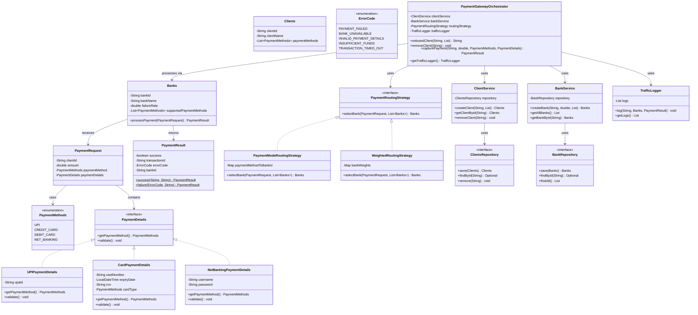
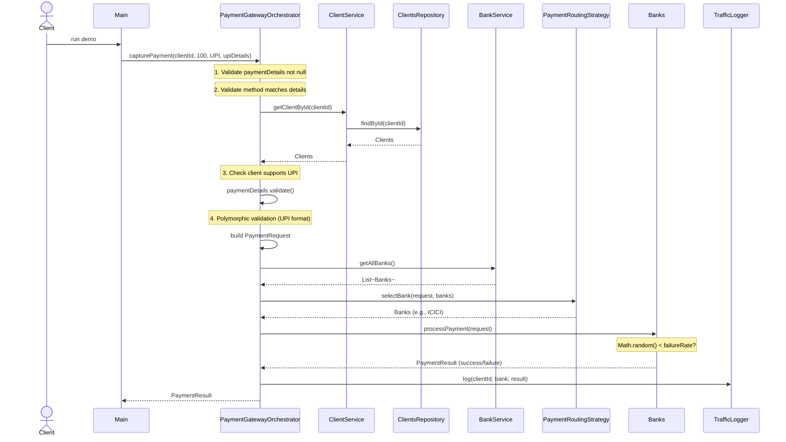
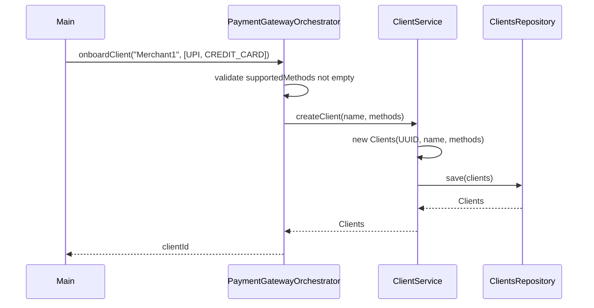
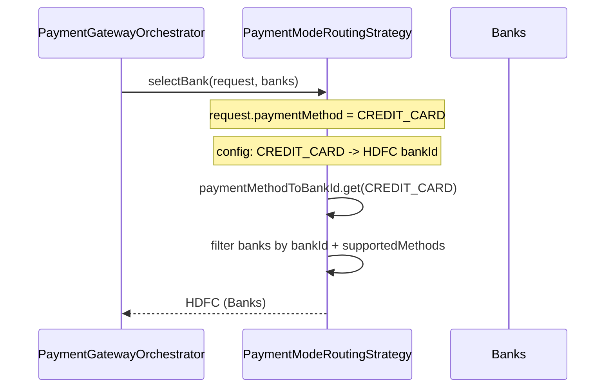
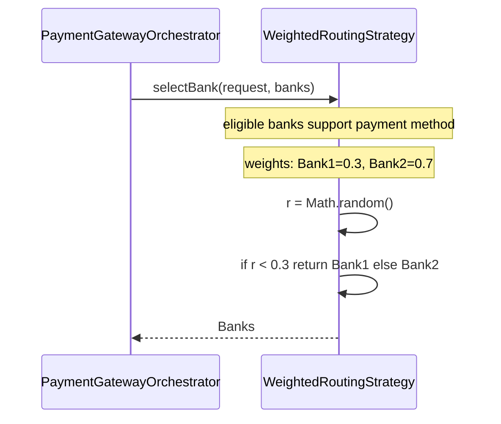
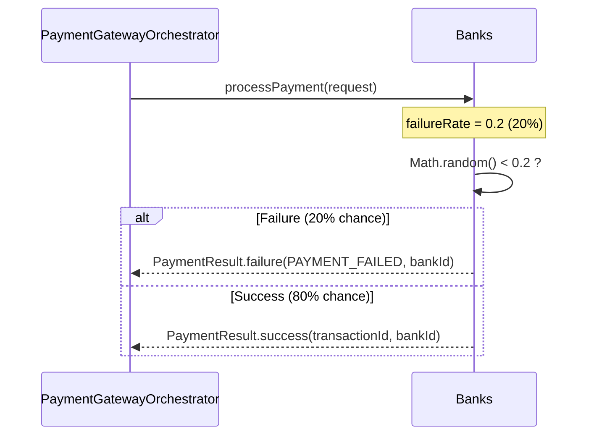

# Payment Gateway (Paytm-style) — Complete Tutorial

> **Start here**: See [DESIGN_GUIDE.md](./DESIGN_GUIDE.md) for a step-by-step design approach and interview tips for strong hire.

A Low-Level Design problem demonstrating **client onboarding**, **polymorphic payment methods** (UPI, Cards, NetBanking), **pluggable routing strategies** (mode-based and weighted distribution), and **traffic logging**. This README is a self-contained tutorial—no need to read the code.

---

## Table of Contents

1. [Functional Requirements](#functional-requirements)
2. [Architecture Overview](#architecture-overview)
3. [Component Diagrams (UML)](#component-diagrams-uml)
4. [Payment Capture Flow — Sequence Diagram](#payment-capture-flow--sequence-diagram)
5. [Why Polymorphic PaymentDetails — Deep Dive](#why-polymorphic-paymentdetails--deep-dive)
6. [Payment Routing Strategies — Deep Dive](#payment-routing-strategies--deep-dive)
7. [Bank Processing & Mock Failure](#bank-processing--mock-failure)
8. [How Components Work Together](#how-components-work-together)
9. [Design Patterns Used](#design-patterns-used)
10. [Running the Application](#running-the-application)
11. [Quick Reference](#quick-reference)

---

## Functional Requirements

| # | Requirement | Solution |
|---|-------------|----------|
| 1 | Client onboarding | `PaymentGatewayOrchestrator.onboardClient()` → `ClientService` |
| 2 | Client removal | `PaymentGatewayOrchestrator.removeClient()` |
| 3 | Client supports subset of payment methods | `Clients.paymentMethods` |
| 4 | Payment processed through bank | `Banks.processPayment()` |
| 5 | Random success/failure | `Banks.failureRate` + `Math.random()` |
| 6 | UPI, CREDIT_CARD, DEBIT_CARD, NET_BANKING | `PaymentMethods` enum + `PaymentDetails` implementations |
| 7 | Method-specific input (vpa, card, netbanking) | Polymorphic `PaymentDetails` (UPI, Card, NetBanking) |
| 8 | Routing by payment mode (e.g., all CC → HDFC) | `PaymentModeRoutingStrategy` |
| 9 | Routing by distribution (30% / 70%) | `WeightedRoutingStrategy` |
| 10 | Traffic logs | `TrafficLogger` |
| 11 | Error codes | `ErrorCode` enum in `PaymentResult` |
| 12 | Bank-level mock failure config | `Banks.failureRate` |

---

## Architecture Overview

The system follows a **facade + layered architecture**:

```
┌───────────────────────────────────────────────────────────────────┐
│                          Main (Entry Point)                        │
└───────────────────────────────────────────────────────────────────┘
                                    │
                                    ▼
┌───────────────────────────────────────────────────────────────────┐
│              PaymentGatewayOrchestrator (Facade)                   │
│  Coordinates: onboarding, capture, routing, traffic logging        │
└───────────────────────────────────────────────────────────────────┘
                                    │
        ┌───────────────────────────┼───────────────────────────┐
        ▼                           ▼                           ▼
┌───────────────┐         ┌─────────────────┐         ┌─────────────────┐
│ ClientService │         │   BankService   │         │ TrafficLogger   │
│ (onboard,     │         │ (create bank,   │         │ (audit trail)   │
│  remove)     │         │  getAllBanks)   │         │                 │
└───────┬───────┘         └────────┬────────┘         └─────────────────┘
        │                          │
        ▼                          ▼
┌───────────────┐         ┌─────────────────┐
│ClientsRepository│       │ BankRepository  │
│ (In-Memory)   │         │ (In-Memory)    │
└───────────────┘         └─────────────────┘
                                    │
                                    ▼
                    ┌───────────────────────────────┐
                    │ PaymentRoutingStrategy        │
                    │ (injectable)                  │
                    │ • PaymentModeRoutingStrategy  │
                    │ • WeightedRoutingStrategy     │
                    └───────────────────────────────┘
                                    │
                                    ▼
                    ┌───────────────────────────────┐
                    │ Banks.processPayment()        │
                    │ (random success/failure)       │
                    └───────────────────────────────┘
```

**Key idea**: The orchestrator is the single entry point. It validates the client, validates payment details polymorphically, delegates bank selection to the routing strategy, processes through the bank, and logs traffic. Services and repositories are decoupled; the routing strategy is pluggable.

---

## Component Diagrams (UML)

### Package Structure

```
paymentgateway/
├── models/
│   ├── Clients.java
│   ├── Banks.java
│   ├── PaymentMethods.java (enum)
│   ├── PaymentRequest.java
│   ├── PaymentResult.java
│   ├── ErrorCode.java (enum)
│   └── details/
│       ├── PaymentDetails.java (interface)
│       ├── UPIPaymentDetails.java
│       ├── CardPaymentDetails.java
│       └── NetBankingPaymentDetails.java
├── strategies/
│   ├── PaymentRoutingStrategy.java (interface)
│   ├── PaymentModeRoutingStrategy.java
│   └── WeightedRoutingStrategy.java
├── repository/
│   ├── ClientsRepository.java
│   ├── BankRepository.java
│   └── impl/
│       ├── InMemoryClientsRepository.java
│       └── InMemoryBankRepository.java
├── services/
│   ├── ClientService.java
│   ├── BankService.java
│   └── TrafficLogger.java
├── exceptions/
│   ├── UnsupportedPaymentMethodException.java
│   └── InvalidPaymentDetailsException.java
├── PaymentGatewayOrchestrator.java
└── Main.java
```

### UML Class Diagram



---

## Payment Capture Flow — Sequence Diagram

### Scenario 1: Successful UPI Payment (Cache Not Applicable — Payment Flow)

When a client captures a UPI payment, the flow validates client, validates UPI details, selects bank via routing, processes, and logs.



### Scenario 2: Client Onboarding



### Scenario 3: Bank Selection — PaymentModeRoutingStrategy

When routing by payment mode (e.g., all CREDIT_CARD → HDFC), the strategy looks up the configured bank for the payment method.



### Scenario 4: Bank Selection — WeightedRoutingStrategy

When routing by distribution (30% Bank1, 70% Bank2), the strategy uses weighted random selection.



### Scenario 5: Bank Processing with Mock Failure

Each bank has a configurable `failureRate`. When processing, the bank randomly fails with that probability.



---

## Why Polymorphic PaymentDetails — Deep Dive

### The Problem

Each payment method has **different input fields**:

| Method | Fields |
|--------|--------|
| UPI | `vpaId` (format: `user@bank`) |
| Cards | `cardNumber`, `expiryDate`, `cvv`, `cardType` (CREDIT/DEBIT) |
| NetBanking | `username`, `password` |

A naive approach would be a single DTO with optional fields:

```java
// BAD: One giant DTO
class PaymentDetails {
    Optional<String> vpaId;
    Optional<String> cardNumber;
    Optional<String> expiry;
    Optional<String> cvv;
    Optional<String> username;
    Optional<String> password;
}
```

This leads to:

- **Giant switch/if-else** in validation: `if (method == UPI) validate vpa; else if (method == CREDIT_CARD) validate card; ...`
- **Violation of OCP**: Adding a new method (e.g., WALLET) requires touching validation, serialization, and routing.
- **Easy to misuse**: Caller might set both `vpaId` and `cardNumber`; which one applies?

### The Solution: Polymorphic PaymentDetails

Each payment method has its **own class** implementing a common interface:

```java
public interface PaymentDetails {
    PaymentMethods getPaymentMethod();
    void validate();
}
```

| Implementation | Own Fields | validate() Logic |
|----------------|------------|------------------|
| `UPIPaymentDetails` | `vpaId` | Non-null, contains `@` |
| `CardPaymentDetails` | `cardNumber`, `expiry`, `cvv`, `cardType` | Length, future expiry, cvv digits |
| `NetBankingPaymentDetails` | `username`, `password` | Non-null |

**Benefits:**

1. **No switch on payment method**: The orchestrator calls `paymentDetails.validate()` — each type validates itself.
2. **Open/Closed**: New method = new class + `validate()`. No changes to orchestrator.
3. **Type safety**: A `UPIPaymentDetails` cannot accidentally hold card fields.

### Adding a New Payment Method

1. Add enum value to `PaymentMethods` (e.g., `WALLET`).
2. Create `WalletPaymentDetails implements PaymentDetails` with `walletId`, `pin`, etc.
3. Implement `getPaymentMethod()` and `validate()`.
4. No changes to `PaymentGatewayOrchestrator`, `Banks`, or routing strategies.

---

## Payment Routing Strategies — Deep Dive

### PaymentModeRoutingStrategy

**Use case**: "All credit card transactions go to HDFC; all UPI goes to ICICI."

**Configuration**: `Map<PaymentMethods, String>` — payment method → bankId.

```java
Map.of(
    PaymentMethods.CREDIT_CARD, "hdfc-id",
    PaymentMethods.UPI, "icici-id"
);
```

**Logic**:

1. Look up `bankId` for `request.getPaymentMethod()`.
2. Find bank in list matching `bankId` and supporting the method.
3. Return that bank, or `null` if not found.

### WeightedRoutingStrategy

**Use case**: "30% of UPI transactions to Bank1, 70% to Bank2."

**Configuration**: `Map<String, Double>` — bankId → weight.

```java
Map.of("bank1-id", 0.3, "bank2-id", 0.7);
```

**Logic**:

1. Filter banks that support the payment method and have positive weight.
2. Normalize weights (sum to 1.0).
3. `r = Math.random()`; walk cumulative weights until `r < cumulative` → return that bank.

**Example**: Weights 0.3 and 0.7. If `r = 0.25` → Bank1. If `r = 0.5` → Bank2.

### Pluggable Strategy

The orchestrator receives `PaymentRoutingStrategy` via constructor. You can inject `PaymentModeRoutingStrategy` for production and `WeightedRoutingStrategy` for load testing — no code changes in the orchestrator.

---

## Bank Processing & Mock Failure

### Configurable failureRate

Each `Banks` instance has a `failureRate` (0.0 to 1.0). During `processPayment()`:

```java
if (Math.random() < failureRate) {
    return PaymentResult.failure(ErrorCode.PAYMENT_FAILED, bankId);
}
return PaymentResult.success(UUID.randomUUID().toString(), bankId);
```

**Use cases:**

- **Testing**: Set `failureRate = 0.5` to simulate 50% failures.
- **Production mock**: Set `failureRate = 0.1` for a test bank that occasionally fails.
- **Staging**: Set `failureRate = 0.0` for a stable test environment.

### ErrorCode Enum

`PaymentResult` includes an optional `ErrorCode`:

- `PAYMENT_FAILED` — Bank randomly rejected (mock).
- `BANK_UNAVAILABLE` — No bank could be selected by routing.
- `INVALID_PAYMENT_DETAILS` — Validation failed (null, wrong format, etc.).
- `INSUFFICIENT_FUNDS`, `TRANSACTION_TIMED_OUT` — Extensible for future use.

---

## How Components Work Together

### Onboarding Flow

```
Main → Orchestrator.onboardClient("Merchant1", [UPI, CREDIT_CARD])
     → validate supportedMethods not empty
     → ClientService.createClient()
     → ClientsRepository.save()
     → return clientId
```

### Capture Flow (Summary)

```
Main → Orchestrator.capturePayment(clientId, amount, method, details)
     → validate details not null, method matches details
     → ClientService.getClientById() — validate client exists
     → validate client supports method (null-safe)
     → paymentDetails.validate() — polymorphic
     → build PaymentRequest
     → BankService.getAllBanks()
     → PaymentRoutingStrategy.selectBank(request, banks)
     → if bank == null → return PaymentResult.failure(BANK_UNAVAILABLE)
     → bank.processPayment(request)
     → TrafficLogger.log(clientId, bank, result)
     → return PaymentResult
```

### Traffic Logging

Every capture attempt (success or failure) is logged:

- `clientId`, `bankId`, `PaymentResult`, `timestamp`
- Stored in `TrafficLogger` for audit and analytics
- Access via `orchestrator.getTrafficLogger().getLogs()`

### Remove Client

```
Main → Orchestrator.removeClient(clientId)
     → ClientService.removeClient()
     → ClientsRepository.remove(clientId)
```

---

## Design Patterns Used

| Pattern | Where | Why |
|---------|-------|-----|
| **Facade** | `PaymentGatewayOrchestrator` | Single entry point; hides ClientService, BankService, routing, and logging. |
| **Strategy** | `PaymentRoutingStrategy` | Pluggable routing; swap PaymentMode vs Weighted without touching orchestrator. |
| **Polymorphism** | `PaymentDetails` (UPI, Card, NetBanking) | Each method has its own schema and validation; no switch/if-else. |
| **Repository** | `ClientsRepository`, `BankRepository` | Abstraction over storage; swap in-memory for DB. |
| **Dependency Injection** | Services and strategies via constructor | Testability; inject mocks for routing and repositories. |

---

## Running the Application

From the project root:

```bash
./gradlew runPaymentgateway
```

**What the demo does:**

1. Creates banks: HDFC (CC/Debit), ICICI (UPI/NetBanking), each with 20% failure rate.
2. Configures `PaymentModeRoutingStrategy`: CREDIT_CARD/DEBIT_CARD → HDFC, UPI/NET_BANKING → ICICI.
3. Onboards client "Merchant1" with UPI and CREDIT_CARD.
4. **Capture UPI payment** — routes to ICICI, processes (success or random failure), logs.
5. **Capture Credit Card payment** — routes to HDFC, processes, logs.
6. **Attempt NetBanking** (client doesn't support) — throws `UnsupportedPaymentMethodException`.
7. **Traffic logs** — prints all captured payments (client, bank, success, transactionId).
8. **Remove client** — removes Merchant1 from the gateway.

---

## Quick Reference

| Component | Responsibility |
|-----------|-----------------|
| **PaymentGatewayOrchestrator** | Facade; onboard, remove, capture; delegates to services and routing. |
| **ClientService** | Create client, get by ID, remove. |
| **BankService** | Create bank, get all banks, get by ID. |
| **PaymentRoutingStrategy** | Select bank for a payment request; implementations: PaymentMode, Weighted. |
| **PaymentDetails** | Polymorphic input for UPI, Card, NetBanking; owns `validate()`. |
| **Banks** | Process payment; random failure based on `failureRate`. |
| **TrafficLogger** | Log every capture attempt for audit. |
| **Repositories** | In-memory persistence for clients and banks. |

---

*This README serves as a complete tutorial. No code reading required.*
