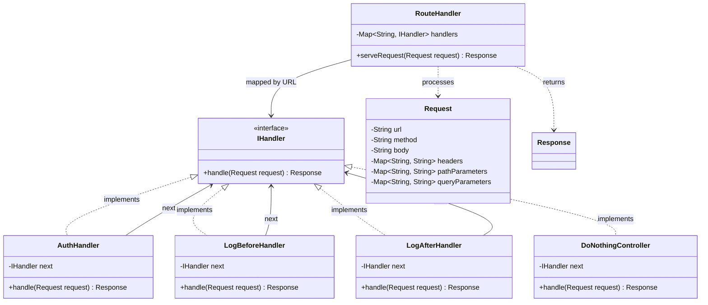

# Route handler / Middleware design

## Requirements:

Design a route handler:

1. route handler should match the incoming request to a controller
2. Should allow handling of request via middlewares before reaching the controller
3. Order of middleware can be different for reach route.
4. Logic of route handler can be run before or after processing the request.

Out of scope / Extensions:

1. Most specific controller should be matched, we assume we match from a list, first match is first chosen.

---

## Solution: Chain of Responsibility Pattern

To allow various middleware (e.g., Logging, Authentication) to process a request before or after the main `Controller` logic executes, the **Chain of Responsibility** pattern is used. 

By implementing an `IHandler` interface, each link in the chain (a specific middleware or the final controller) is completely decoupled. The `RouteHandler` itself simply holds a map of routes to the starting `IHandler` for each path, ensuring O(1) route resolution.

### UML Class Diagram

