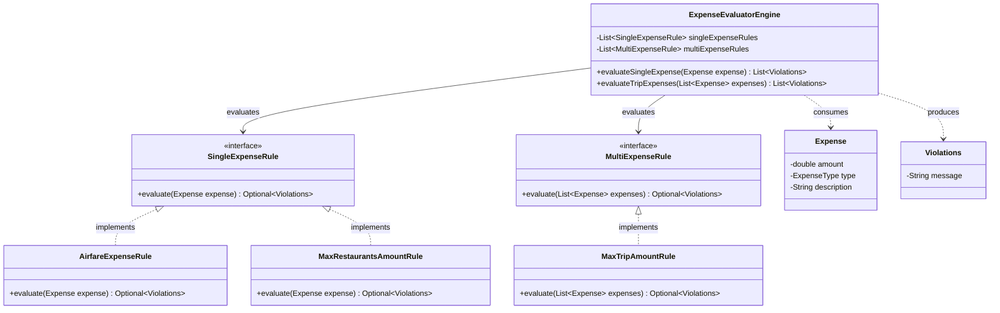

# Rule Engine Low-Level Design (LLD)

This project demonstrates the Low-Level Design (LLD) for a **Business Expense Rule Engine**. It is scoped to focus on extensibility, decoupled architecture, and applying SOLID principles to evaluate corporate expenses against dynamic policies.

## Design Requirements
You are tasked with designing a system that evaluates business expenses submitted by employees. Managers can define rules to control expenses, ensuring employees do not misuse corporate cards. The engine must:
1. Evaluate individual expenses against single-expense rules.
2. Evaluate aggregated trip-level expenses against multi-expense rules.
3. Flag any violations clearly and aggregate them.

### Active Rules to Evaluate
**Single-Expense Rules:**
1. No restaurant expense can exceed $75.
2. No airfare expenses are allowed.
3. No entertainment expenses are allowed. 
4. No single expense can exceed $250.

**Multi-Expense (Trip-Level) Rules:**
1. A trip cannot exceed $2000 in total expenses. 
2. Total meal (restaurant) expenses per trip cannot exceed $1000.

### Out of Scope (For an Interview Scenario)
- Prioritized execution of rules or complex Rule Strategizing (Rules execute concurrently/sequentially as provided).
- Database interactions (Rules are generated in-memory for testing).
- External REST API dependencies.

---

## The Solution: Extensible Rule Pattern

The core challenge of a Rule Engine is scalability. Hardcoding validation checks (e.g., `if (expense.type == AIRFARE) return false`) inside the `ExpenseService` violates the Open/Closed Principle. If a manager adds 100 new rules, the main service class becomes massive, fragile, and impossible to test.

We solve this by separating the validation logic from the orchestrator. The Engine blindly accepts a `List<Rules>` and an `Expense` object, running through the rules dynamically.

### UML Class Diagram

Below is the Unified Modeling Language (UML) Class Diagram representing the Extensible Rule Pattern implementation:

### The Component Structure

#### 1. The Engine (`ExpenseEvaluatorEngine.java`)
This acts as the orchestrator. It is constructed with predefined lists of `SingleExpenseRule` and `MultiExpenseRule` dependencies. When an incoming evaluation request arrives:
- It streams through the injected rules.
- It aggregates any returned `Violations`.
- **Key Takeaway**: The engine *never* has to change when new business rules are added.

#### 2. The Rule Interfaces (`SingleExpenseRule.java`, `MultiExpenseRule.java`)
These interfaces define the contract that every specific rule must follow. This satisfies the Interface Segregation Principle by ensuring rules that only act on single expenses do not have to implement boilerplate for trip-level lists.

#### 3. The Concrete Rules
These classes implement the logic for one specific, isolated business requirement:
*   `AirfareExpenseRule`: Checks if `type == AIRFARE`.
*   `MaxRestaurantsAmountRule`: Checks if `type == RESTAURANT` and `amount > 75`.
*   `MaxTripAmountRule`: Sums all expenses and checks if `total > 2000`.

### Why this design excels for LLD Interviews:
*   **SOLID Principles Masterclass**: 
    *   **Dependency Injection**: The Engine depends entirely on abstractions (`Interfaces`), injecting concrete rules during instantiation.
    *   **Open/Closed Principle**: You can add customized rules (e.g. `WeekendOnlyRule`) forever by simply passing a new class into the Engine, without modifying the Engine's source code.
    *   **Single Responsibility Principle**: Every rule is highly isolated. If the restaurant cap changes from $75 to $100, only the `MaxRestaurantsAmountRule` is touched.
*   **Clean Testability**: You do not have to test the engine with massive payloads. You can write simple JUnit tests for individual Rule behaviors, and another for checking the Engine's aggregator capability using mock lists.
