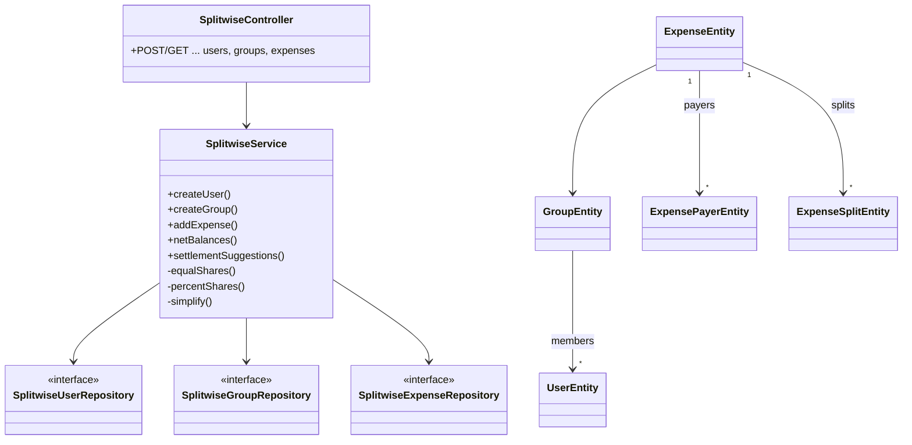
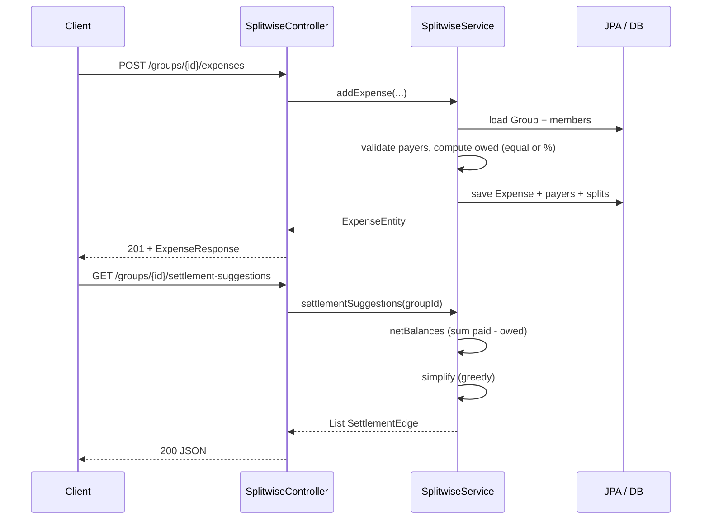

# Splitwise — Low-Level Design (LLD)

> **Start here**: See [DESIGN_GUIDELINE.md](./DESIGN_GUIDELINE.md) for interview-style phases, balance/settlement math, edge cases, and how to explain the design in ~90 minutes.

This module implements a **minimal Splitwise-style expense sharing** service: users join **groups**, log **expenses** with **multiple payers** and **equal or percentage** splits, view **per-member net balances**, and get **suggested settlement payments** (fewest cash transfers). Storage is **H2 + JPA** (same datasource as the rest of the app). The API is **Spring REST** under `/api/splitwise/...`.

The codebase is intentionally **small** (one façade service, one controller, DTOs in one file) so it fits a **~1.5 hour** interview discussion.

---

## Design Requirements (Problem Spec)

1. Use a **dedicated database** for persistence.
2. Expose a **REST API** for the system.
3. Users can **create groups** and **belong to groups**.
4. Users can **create expenses** involving **other group members** (only members may appear as payers or split participants).
5. Each expense may be split **equally** or by **percentage** (percentages sum to 100).
6. Users can see **transactions suggested to settle** the group (minimal directed payments from net debtors to net creditors).

**Bonus (implemented in code):**

- **Expense history** — list expenses per group (`GET .../expenses`).
- **Add / remove group members** — remove blocked if the user appears on any expense in that group.
- **All expenses for a user** — union of expenses where they **owe** (split line) or **paid** (`GET /users/{id}/expenses`).

**Not implemented** (to keep scope small): persisting “settlement completed” history as separate rows; the suggested transfers are **derived only** from expenses.

---

## The Solution (Summary)

1. **Data model** — `User`, `Group` (many-to-many members), `Expense` (total amount, split type, time). Each expense has **`ExpensePayer`** rows (who paid how much) and **`ExpenseSplit`** rows (who owes how much). Multi-payer is first-class.
2. **Single service** — `SplitwiseService` holds validation, **equal/percent** share computation (cent-safe), **net balance** aggregation, and **greedy settlement simplification** (largest debtor ↔ largest creditor).
3. **Single REST controller** — `SplitwiseController` maps JSON ↔ entities; Jakarta Validation on request DTOs.
4. **Errors** — `SplitwiseException` with `notFound` vs `badRequest`; `SplitwiseExceptionHandler` maps to 404/400.

### UML — Core components



---

### Sequence — Add expense and later get settlement suggestions



---

### Package structure (as implemented)

```
splitwise/
├── api/
│   ├── SplitwiseApiDtos.java              # All request/response records (nested)
│   ├── controller/
│   │   └── SplitwiseController.java       # REST under /api/splitwise
│   └── exception/
│       └── SplitwiseExceptionHandler.java
├── domain/
│   └── SplitType.java                     # EQUAL | PERCENT
├── exception/
│   └── SplitwiseException.java            # notFound vs badRequest
├── persistence/
│   ├── entity/
│   │   ├── UserEntity.java
│   │   ├── GroupEntity.java
│   │   ├── ExpenseEntity.java
│   │   ├── ExpensePayerEntity.java
│   │   └── ExpenseSplitEntity.java
│   └── repository/
│       ├── SplitwiseUserRepository.java
│       ├── SplitwiseGroupRepository.java
│       └── SplitwiseExpenseRepository.java
├── service/
│   └── SplitwiseService.java              # All business logic + private math
├── DESIGN_GUIDELINE.md
└── README.md
```

Repository interfaces are prefixed **`Splitwise*`** to avoid Spring bean name clashes with other modules’ `UserRepository`-style interfaces.

---

## Design Patterns Used

| Pattern | Where | Why |
|---------|--------|-----|
| **Repository** | `SplitwiseUserRepository`, `SplitwiseGroupRepository`, `SplitwiseExpenseRepository` | Spring Data JPA; persistence behind small interfaces. |
| **Facade** | `SplitwiseService` | One entry point for users, groups, expenses, balances, suggestions. |
| **DTO / record** | `SplitwiseApiDtos` | Stable JSON contracts; validation annotations. |
| **Centralized exception handling** | `SplitwiseExceptionHandler` | HTTP status mapping for the splitwise controllers only (`basePackages`). |

---

## REST API (summary)

| Method | Path | Description |
|--------|------|-------------|
| `POST` | `/api/splitwise/users` | Create user (`CreateUserRequest`: name, email). |
| `GET` | `/api/splitwise/users/{userId}` | Get user. |
| `GET` | `/api/splitwise/users/{userId}/expenses` | All expenses where user owes or paid (bonus). |
| `POST` | `/api/splitwise/groups` | Create group (`name`, `creatorUserId`, `memberUserIds`). |
| `GET` | `/api/splitwise/groups/{groupId}` | Group + member ids. |
| `POST` | `/api/splitwise/groups/{groupId}/members` | Add member (`AddMemberRequest`). |
| `DELETE` | `/api/splitwise/groups/{groupId}/members/{userId}` | Remove member (blocked if on an expense). |
| `POST` | `/api/splitwise/groups/{groupId}/expenses` | Create expense (`CreateExpenseRequest`; EQUAL needs `equalParticipantUserIds`, PERCENT needs `percentLines`). |
| `GET` | `/api/splitwise/groups/{groupId}/expenses` | List expenses (newest first). |
| `GET` | `/api/splitwise/groups/{groupId}/balances` | Per-member net balance (paid − owed). |
| `GET` | `/api/splitwise/groups/{groupId}/settlement-suggestions` | Suggested payments (from → to, amount). |

---

## Running & examples

**Run the Spring Boot app** (default port `8080`):

```bash
./gradlew bootRun
```

**Create two users and a group, then add an equal-split expense:**

```bash
# Users
curl -s -X POST http://localhost:8080/api/splitwise/users -H "Content-Type: application/json" \
  -d '{"name":"Alice","email":"alice@example.com"}'
curl -s -X POST http://localhost:8080/api/splitwise/users -H "Content-Type: application/json" \
  -d '{"name":"Bob","email":"bob@example.com"}'

# Group (replace ids 1,2 with your returned ids)
curl -s -X POST http://localhost:8080/api/splitwise/groups -H "Content-Type: application/json" \
  -d '{"name":"Trip","creatorUserId":1,"memberUserIds":[2]}'

# Expense: $120, Alice paid all, equal between Alice and Bob (group id 1)
curl -s -X POST http://localhost:8080/api/splitwise/groups/1/expenses -H "Content-Type: application/json" \
  -d '{
    "amount":"120.00",
    "description":"Dinner",
    "splitType":"EQUAL",
    "payers":[{"userId":1,"paidAmount":"120.00"}],
    "equalParticipantUserIds":[1,2]
  }'

# Balances and suggestions
curl -s http://localhost:8080/api/splitwise/groups/1/balances
curl -s http://localhost:8080/api/splitwise/groups/1/settlement-suggestions
```

**Run tests** (full project):

```bash
./gradlew test
```

---

## Quick reference

| Component | Responsibility |
|-----------|----------------|
| **SplitwiseService** | Users, groups, members, expenses; `netBalances`; `settlementSuggestions`; private `equalShares`, `percentShares`, `simplify`. |
| **SplitwiseController** | HTTP; maps entities to `SplitwiseApiDtos`; `@Transactional` on some GETs for lazy JPA collections. |
| **SplitwiseExceptionHandler** | `SplitwiseException` → 404/400; `MethodArgumentNotValidException` → 400. |
| **Entities** | `ExpensePayer` = money in; `ExpenseSplit` = share owed; net = Σ paid − Σ owed per user per group. |

---

## Related configuration

Shared `application.properties` enables H2, JPA (`ddl-auto=update`), and optional batch fetching. The Splitwise module does not add its own `application-*.yaml`; it uses the global datasource.
