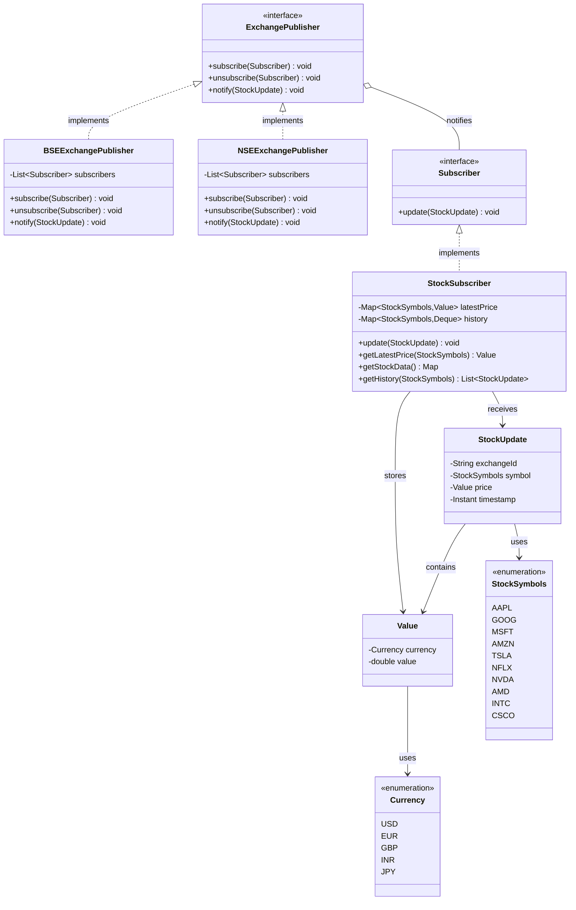
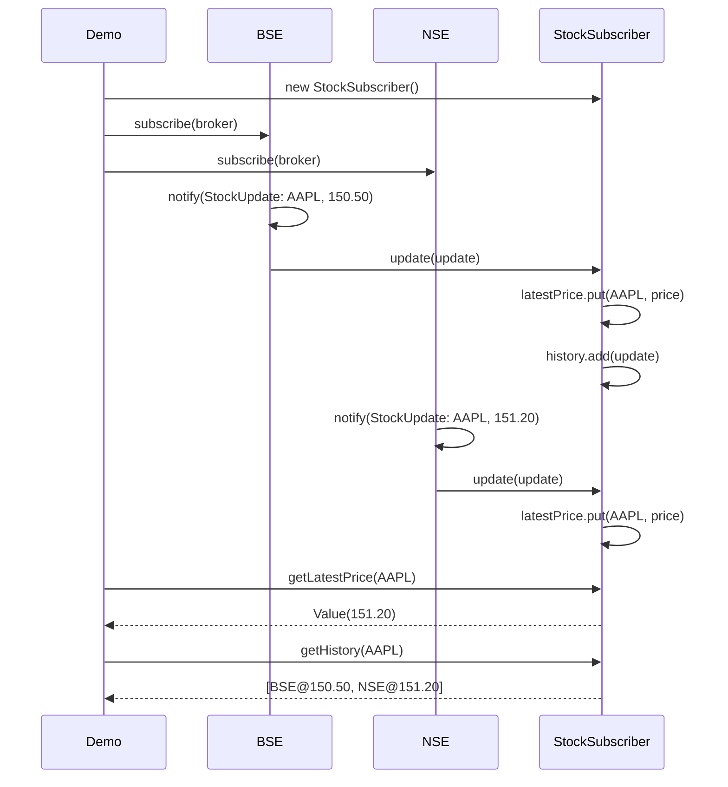

# Stock Broker / Trading — Low-Level Design (LLD)

> **Start here**: See [DESIGN_GUIDELINE.md](./DESIGN_GUIDELINE.md) for design principles, patterns, and guidelines.

This project demonstrates the Low-Level Design for a **Stock Broker System** where multiple stock exchanges (BSE, NSE) push price updates, and the broker displays the latest prices and stores historical data. It uses the **Observer (Pub-Sub) pattern** for loose coupling between exchanges and subscribers, with thread-safe data structures for concurrent updates.

---

## Design Requirements

1. Multiple stock exchanges might be sending data over to us.
2. Stock broker should show the latest stock price.
3. Should be able to store historical price of the stock. (good to have)

---

## The Solution

The system uses:

1. **Observer / Pub-Sub Pattern** — Exchanges publish `StockUpdate`; subscribers (e.g., `StockSubscriber`) receive and process updates. Multiple exchanges and subscribers can be added without coupling.
2. **Thread Safety** — `CopyOnWriteArrayList` for subscriber lists; `ConcurrentHashMap` and `ConcurrentLinkedDeque` for latest prices and history. Safe under concurrent pushes from multiple exchanges.
3. **Exchange Identity** — Each update carries `exchangeId`, `symbol`, `price`, `timestamp` so the broker can distinguish BSE vs NSE for the same symbol.

### UML Class Diagram



### Component Structure

```
stockbroker/
├── publishers/
│   ├── ExchangePublisher.java      # Interface: subscribe, unsubscribe, notify
│   ├── BSEExchangePublisher.java  # BSE exchange implementation
│   └── NSEExchangePublisher.java   # NSE exchange implementation
├── subscribers/
│   ├── Subscriber.java             # Interface: update(StockUpdate)
│   └── StockSubscriber.java       # Broker: latest price + history, thread-safe
├── utils/
│   ├── StockUpdate.java            # exchangeId, symbol, price, timestamp
│   ├── Value.java                  # currency + amount (price)
│   ├── StockSymbols.java           # AAPL, GOOG, MSFT, etc.
│   └── Currency.java               # USD, EUR, INR, etc.
├── StockBrokerDemo.java            # Demo: BSE + NSE → StockSubscriber
├── DESIGN_GUIDELINE.md
└── README.md
```

### Publish Flow — Sequence Diagram



---

## Design Patterns Used

| Pattern | Where | Why |
|---------|-------|-----|
| **Observer / Pub-Sub** | ExchangePublisher ↔ Subscriber | Decoupled; multiple exchanges push, broker receives without knowing the source. |
| **Strategy (extensible)** | Adding new exchanges | Implement `ExchangePublisher`; no changes to subscribers. |
| **Thread Safety** | CopyOnWriteArrayList, ConcurrentHashMap | Multiple exchanges can push concurrently; subscribers are iterated safely. |

---

## Running the Application

From the project root:

```bash
./gradlew runStockbroker
```

**What the demo does:**

1. Creates `StockSubscriber` (broker).
2. Subscribes broker to BSE and NSE exchanges.
3. BSE sends AAPL at 150.50, NSE sends AAPL at 151.20, BSE sends GOOG at 142.75.
4. Prints latest prices (AAPL: 151.20, GOOG: 142.75).
5. Prints history for AAPL (both BSE and NSE updates with timestamps).

---

## Quick Reference

| Component | Responsibility |
|-----------|-----------------|
| **ExchangePublisher** | Interface: subscribe, unsubscribe, notify |
| **BSEExchangePublisher / NSEExchangePublisher** | Concrete exchanges; CopyOnWriteArrayList for subscribers |
| **Subscriber** | Interface: update(StockUpdate) |
| **StockSubscriber** | Stores latest price per symbol; bounded history (100 per symbol); thread-safe |
| **StockUpdate** | exchangeId, symbol, price, timestamp |
| **Value** | currency + amount (the price) |
| **StockBrokerDemo** | Wires BSE, NSE, and StockSubscriber; runs demo flow |
