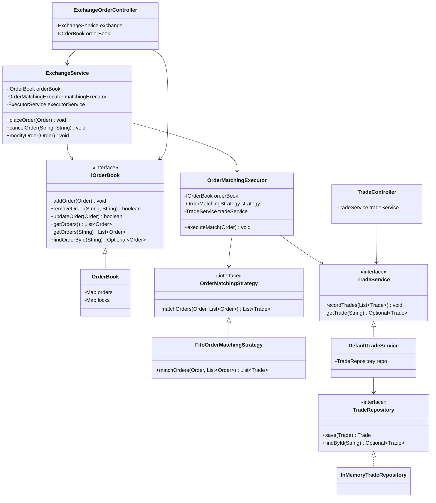
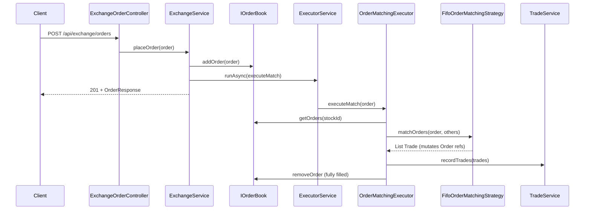

# Stock Exchange — Low-Level Design (LLD)

> **Start here**: See [DESIGN_GUIDELINE.md](./DESIGN_GUIDELINE.md) for interview-style phases, matching semantics, concurrency notes, and anti-patterns.

This module demonstrates the Low-Level Design for an **in-memory stock exchange**: users place, modify, and cancel orders; buy and sell orders **match at equal price** with **FIFO** among orders at the same price; **trades** are recorded; concurrency is handled with per-symbol locks and an injectable executor. The surface API is **Spring REST** (`/api/exchange/...`), wired via `StockExchangeConfig`.

---

## Design Requirements (Problem Spec)

1. Registered users can **place**, **modify**, and **cancel** orders.
2. Users can **query order status** (via REST: get order by id).
3. **Match** buy and sell orders when prices are **equal**; at the same price, match **oldest orders first** (FIFO).
4. Handle **concurrent** placement, modification, cancellation, and execution safely.
5. Maintain an **order book per symbol** for resting orders.
6. Persist (in-memory, swappable) **user**, **order**, and **trade** fields as described in the original brief (see models/DTOs; user registration is optional—use arbitrary `userId` strings in API calls).

**Nice to have:** trade / order expiry (not implemented).

**Expectations:** Clean structure, exceptions, repository abstractions, executable code.

---

## The Solution

The implementation combines:

1. **Strategy pattern** — `OrderMatchingStrategy` with `FifoOrderMatchingStrategy` (price equality + FIFO traversal of resting orders).
2. **Repository pattern** — `TradeRepository` + `InMemoryTradeRepository` for executed trades; `IOrderBook` abstracts resting-order storage (`OrderBook` implementation).
3. **Separation of concerns** — `ExchangeService` exposes place/cancel/modify and schedules async matching; `OrderMatchingExecutor` runs match → `TradeService.recordTrades` → prune fully filled orders; **DIP** via `TradeService` interface and injected `ExecutorService`.
4. **Concurrency** — `OrderBook` uses per-symbol `ReentrantReadWriteLock` for list mutations; `OrderMatchingExecutor` uses a **per-`stockId` mutex** so async jobs do not double-match; `CompletableFuture` + injected thread pool for matching.
5. **REST + validation** — `ExchangeOrderController` / `TradeController` with Jakarta validation on request DTOs; `StockExchangeExceptionHandler` maps domain exceptions to HTTP status codes.

### Implementation note (order book shape)

The reference design in the guideline uses separate buy/sell **price-level queues**. The current `OrderBook` stores a **list of orders per symbol**; FIFO at a price is preserved by **iteration order** together with `FifoOrderMatchingStrategy`. Evolving to explicit bid/ask books is a natural extension.

---

### UML — Core components



---

### Sequence — Place order and match (async)



---

### Package structure (as implemented)

```
stockexchange/
├── api/
│   ├── controller/
│   │   ├── ExchangeOrderController.java   # REST: orders
│   │   └── TradeController.java           # REST: trades
│   └── exception/
│       └── StockExchangeExceptionHandler.java
├── config/
│   └── StockExchangeConfig.java           # Spring @Beans
├── dto/                                   # Request/response records
├── exceptions/                            # TradingException hierarchy
├── models/                                # Order, Trade, User, Stock, enums
├── orderbook/
│   ├── IOrderBook.java
│   └── impl/OrderBook.java
├── repository/
│   ├── TradeRepository.java
│   └── InMemoryTradeRepository.java
├── services/
│   ├── ExchangeService.java
│   ├── OrderMatchingExecutor.java
│   ├── TradeService.java                  # interface
│   ├── DefaultTradeService.java
│   └── strategies/
│       ├── OrderMatchingStrategy.java
│       └── FifoOrderMatchingStrategy.java
├── DESIGN_GUIDELINE.md
└── README.md
```

---

## Design Patterns Used

| Pattern | Where | Why |
|---------|--------|-----|
| **Strategy** | `OrderMatchingStrategy` / `FifoOrderMatchingStrategy` | Swap matching rules without changing the executor. |
| **Repository** | `TradeRepository`, `InMemoryTradeRepository` | Persist trades behind an interface; DB impl later. |
| **Dependency inversion** | `IOrderBook`, `TradeService`, `ExecutorService` injection | Testability and alternative implementations. |
| **Facade (API)** | `ExchangeService` + REST controllers | Simple entry points over matching and book updates. |

---

## REST API (summary)

| Method | Path | Description |
|--------|------|-------------|
| `POST` | `/api/exchange/orders` | Place order (`PlaceOrderRequest` JSON). |
| `GET` | `/api/exchange/orders/{orderId}` | Order snapshot (404 if not on book, e.g. fully filled). |
| `PUT` | `/api/exchange/orders/{orderId}` | Modify (`ModifyOrderRequest`; path id must match body). |
| `DELETE` | `/api/exchange/orders/{orderId}?userId=` | Cancel (403 if wrong user). |
| `GET` | `/api/exchange/trades/{tradeId}` | Single trade. |
| `GET` | `/api/exchange/trades?stockId=` **or** `?orderId=` | List trades (400 if both missing). |

Matching runs **asynchronously** after place/modify; poll GET order or trades after a short delay for fills.

---

## Running & tests

**Run the Spring Boot app** (serves REST on the default port, e.g. `8080`):

```bash
./gradlew bootRun
```

Example:

```bash
curl -s -X POST http://localhost:8080/api/exchange/orders \
  -H "Content-Type: application/json" \
  -d '{"userId":"u1","stockId":"REL","orderType":"BUY","quantity":10,"price":100}'
```

**Integration tests** (full context + `MockMvc`):

```bash
./gradlew test --tests "com.springmicroservice.lowleveldesignproblems.stockexchange.api.StockExchangeIntegrationTest"
```

**All stockexchange tests** (includes the above):

```bash
./gradlew test --tests "com.springmicroservice.lowleveldesignproblems.stockexchange.*"
```

---

## Quick reference

| Component | Responsibility |
|-----------|----------------|
| **ExchangeService** | Add/update/remove on book; schedule `OrderMatchingExecutor` on executor. |
| **OrderMatchingExecutor** | Per-symbol lock; strategy match; record trades; drop fully filled orders. |
| **TradeService** | Port for saving/querying executed trades. |
| **DefaultTradeService** | Delegates to `TradeRepository`. |
| **IOrderBook / OrderBook** | Per-symbol resting orders; read/write locks; `findOrderById`. |
| **FifoOrderMatchingStrategy** | Equal-price matches; FIFO via stream order; updates fill/remaining on `Order`. |
| **StockExchangeConfig** | Wires beans for the application context. |
| **ExchangeOrderController** | HTTP API for orders; maps DTOs ↔ domain. |
| **TradeController** | HTTP API for trade queries. |
| **StockExchangeExceptionHandler** | Maps `TradingException` subclasses to HTTP errors. |
