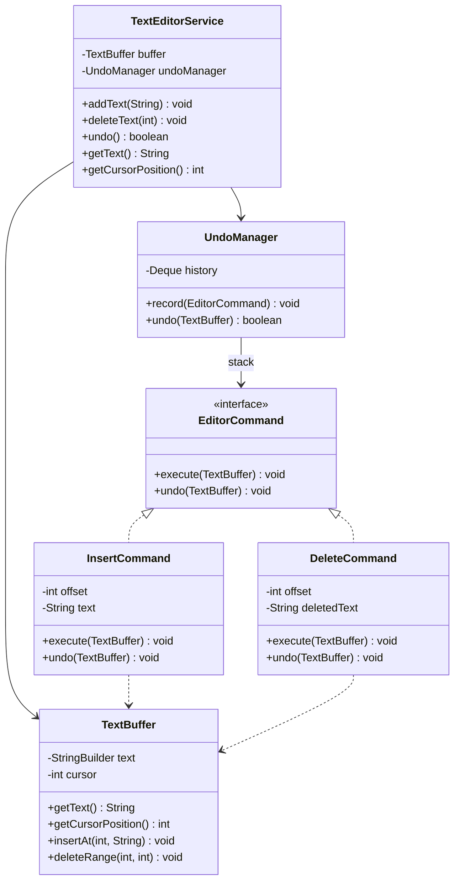
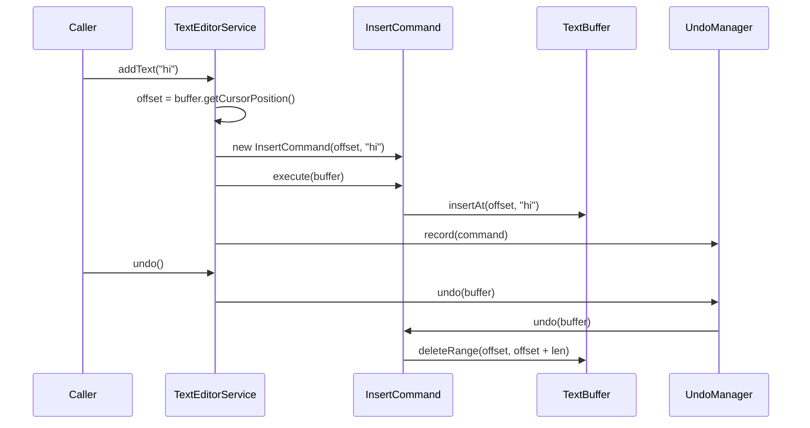

# Text Editor — Low-Level Design (LLD)

> **Start here**: See [DESIGN_GUIDELINE.md](./DESIGN_GUIDELINE.md) for interview-style phases, clarification questions, undo semantics, and optional extensions.

This module implements an **in-memory text editor** with a **service layer** only: **add text** at a cursor, **delete** characters before the cursor (backspace-style), and **undo** the last successful operation. There is **no UI**, **no HTTP API**, and **no persistence** — the design fits a typical LLD interview scope.

**Package:** `com.springmicroservice.lowleveldesignproblems.texteditor`

---

## Design Requirements (Problem Spec)

1. **Add text** to the document (at the current cursor).
2. **Undo** the last operation that changed the buffer.
3. **Delete** some text (implemented as up to **N characters before the cursor**).

**Constraints (as stated in the brief):**

- No UI.
- No server, networking, or database.

**Expectations:** A clear **service** entry point (`TextEditorService`), testable behavior, and a sensible undo story.

---

## The Solution

The implementation uses:

1. **Command pattern** — `EditorCommand` with **`execute(TextBuffer)`** (apply change) and **`undo(TextBuffer)`** (reverse it). Concrete types: `InsertCommand`, `DeleteCommand`.
2. **Facade** — `TextEditorService` is the only class callers need; it creates commands, runs **`execute`**, records them in `UndoManager`, and exposes **`undo()`**.
3. **Encapsulated buffer** — `TextBuffer` holds a `StringBuilder` and a **cursor**; all index/cursor rules for insert/delete live here.
4. **Undo history** — `UndoManager` keeps a **stack** (`Deque`) of commands; **last recorded command is undone first** (LIFO).

**Delete semantics:** `deleteText(n)` removes characters in the range `[cursor - n, cursor)` (clamped to the document start), equivalent to **backspace** up to `n` characters.

---

### UML — Core components



---

### Sequence — Add text and undo



---

### Package structure (as implemented)

```
texteditor/
├── TextBuffer.java          # Document + cursor; insert/delete primitives
├── EditorCommand.java       # Command: execute + undo
├── InsertCommand.java       # Insert at offset; undo = delete range
├── DeleteCommand.java       # Delete range; undo = insert back
├── UndoManager.java         # LIFO stack of commands
├── TextEditorService.java   # Service layer (facade)
├── DESIGN_GUIDELINE.md
└── README.md
```

**Tests** (JUnit 5): `src/test/java/.../texteditor/TextEditorServiceTest.java`

---

## Design Patterns Used

| Pattern | Where | Why |
|---------|--------|-----|
| **Command** | `EditorCommand`, `InsertCommand`, `DeleteCommand` | Each edit is an object with **execute** and **undo**; history is a stack of the same objects. |
| **Facade** | `TextEditorService` | Single entry point over buffer + undo stack; hides command types from callers. |

**Alternatives (not implemented):** **Memento** (full buffer snapshots) for undo — simpler mentally but heavier memory; **Redo** — second stack mirroring undo.

---

## Programmatic API (service layer)

There is no REST layer for this problem. Use `TextEditorService` directly from tests or a future UI.

| Method | Description |
|--------|-------------|
| `addText(String text)` | Inserts at the current cursor (`null` throws; empty string is a no-op). Records an `InsertCommand`. |
| `deleteText(int characterCount)` | Deletes up to `characterCount` characters **before** the cursor; no-op if nothing to remove. Records a `DeleteCommand`. |
| `undo()` | Pops the last command and calls **`undo(buffer)`**; returns `false` if history was empty. |
| `getText()` | Full document text. |
| `getCursorPosition()` | Cursor index `0 … length`. |

---

## Running & tests

This module is plain Java (no dedicated `bootRun` entry). **Run unit tests:**

```bash
./gradlew test --tests "com.springmicroservice.lowleveldesignproblems.texteditor.TextEditorServiceTest"
```

**All tests under the package:**

```bash
./gradlew test --tests "com.springmicroservice.lowleveldesignproblems.texteditor.*"
```

---

## Quick reference

| Component | Responsibility |
|-----------|----------------|
| **TextBuffer** | Mutable text + cursor; `insertAt`, `deleteRange`, `deleteBeforeCursor` (available on buffer if needed elsewhere). |
| **EditorCommand** | Contract: **`execute`** then **`undo`** on a `TextBuffer`. |
| **InsertCommand** | **`execute`:** insert string at `offset`; **`undo`:** delete `[offset, offset + length)`. |
| **DeleteCommand** | **`execute`:** delete `[offset, offset + deletedText.length())`; **`undo`:** insert `deletedText` at `offset`. |
| **UndoManager** | `record` / `undo`; stack discipline (most recent undo first). |
| **TextEditorService** | Validates input, builds commands, **`execute`**, `record`, exposes `undo` and read-only getters. |
