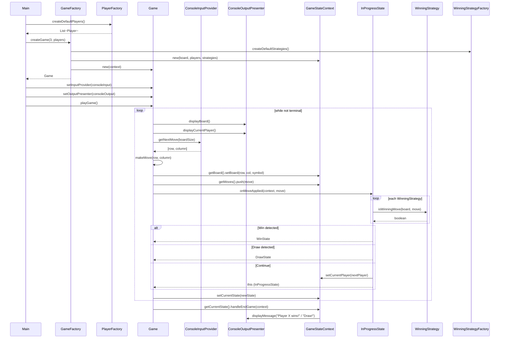

# LLD for Tic Tac Toe

## Requirements

1. Game board is of size N x N.
2. N can be configurable.
3. Supports 2 players (extensible to N players).
4. Players take alternate turns.
5. Normal winning conditions for the game.

## Bonus Features

1. Undo moves strategy
2. **N players** — `PlayerFactory.createPlayers(n)` with symbols P1, P2, P3...
3. **Configurable win length** — win with `winLength` in a row (e.g. 3 on 5×5)
4. AI player support (future enhancement)
5. Handle edge cases (validation, retry on invalid move)

---

## Running the Game

```bash
./gradlew runTictactoe
```

---

## Architecture & Design Patterns

### Design Patterns Used

| Pattern | Purpose |
|--------|---------|
| **State** | Game state (InProgress, Win, Draw) with transitions and behavior |
| **Strategy** | Pluggable winning strategies (Row, Column, MajorDiagonal, MinorDiagonal) |
| **Factory** | Creation of winning strategies, players, and game setup |
| **Template Method** | Game loop skeleton with customizable hooks (I/O, display) |

### UML Class Diagram

Below is the Unified Modeling Language (UML) Class Diagram representing the Tic Tac Toe implementation with State, Strategy, Factory, and Template Method patterns:

```mermaid
classDiagram
    %% --- Models ---
    class Board {
        -int size
        -int winLength
        -String[][] board
        +Board(int size)
        +Board(int size, int winLength)
        +printBoard() void
        +getBoard() String[][]
        +getSize() int
        +getWinLength() int
        +getCell(int row, int column) String
        +setBoard(int row, int column, String symbol) void
        +isEmpty(int row, int column) boolean
    }

    class Player {
        -String name
        -String symbol
        +getName() String
        +getSymbol() String
    }

    class Move {
        -Player player
        -int row
        -int column
        +Move(Player player, int row, int column)
        +getPlayer() Player
        +getRow() int
        +getColumn() int
    }

    %% --- State Pattern ---
    class GameState {
        <<interface>>
        +isTerminal() boolean
        +handleEndGame(GameStateContext context) void
        +onMoveApplied(GameStateContext context, Move move) GameState
    }

    class GameStateContext {
        -GameState currentState
        -Board board
        -List~Player~ players
        -List~WinningStrategy~ winningStrategies
        -Stack~Move~ moves
        -Player currentPlayer
        -Player winningPlayer
        -OutputPresenter outputPresenter
        +getCurrentState() GameState
        +setCurrentState(GameState state) void
        +getBoard() Board
        +getPlayers() List~Player~
        +getWinningStrategies() List~WinningStrategy~
        +getMoves() Stack~Move~
        +getCurrentPlayer() Player
        +setCurrentPlayer(Player player) void
        +getWinningPlayer() Player
        +setWinningPlayer(Player player) void
        +getOutputPresenter() OutputPresenter
        +setOutputPresenter(OutputPresenter outputPresenter) void
    }

    class InProgressState {
        +isTerminal() boolean
        +handleEndGame(GameStateContext context) void
        +onMoveApplied(GameStateContext context, Move move) GameState
    }

    class WinState {
        +isTerminal() boolean
        +handleEndGame(GameStateContext context) void
        +onMoveApplied(GameStateContext context, Move move) GameState
    }

    class DrawState {
        +isTerminal() boolean
        +handleEndGame(GameStateContext context) void
        +onMoveApplied(GameStateContext context, Move move) GameState
    }

    %% --- Strategy Pattern ---
    class WinningStrategy {
        <<interface>>
        +isWinningMove(Board board, Move move) boolean
    }

    class RowWinningStrategy {
        +isWinningMove(Board board, Move move) boolean
    }

    class ColumnWinningStrategy {
        +isWinningMove(Board board, Move move) boolean
    }

    class MajorDiagonalWinningStrategy {
        +isWinningMove(Board board, Move move) boolean
    }

    class MinorDiagonalWinningStrategy {
        +isWinningMove(Board board, Move move) boolean
    }

    %% --- I/O Abstractions ---
    class InputProvider {
        <<interface>>
        +getNextMove(int boardSize) int[]
    }

    class OutputPresenter {
        <<interface>>
        +displayBoard(Board board) void
        +displayMessage(String message) void
        +displayCurrentPlayer(String playerName) void
        +displayPrompt(String prompt) void
    }

    class ConsoleInputProvider {
        -Scanner scanner
        +ConsoleInputProvider(Scanner scanner)
        +getNextMove(int boardSize) int[]
    }

    class ConsoleOutputPresenter {
        +displayBoard(Board board) void
        +displayMessage(String message) void
        +displayCurrentPlayer(String playerName) void
        +displayPrompt(String prompt) void
    }

    %% --- Factory Pattern ---
    class WinningStrategyFactory {
        <<utility>>
        +createDefaultStrategies() List~WinningStrategy~
    }

    class GameFactory {
        <<utility>>
        +createGame(int boardSize, List~Player~ players) Game
        +createGame(int boardSize, List~Player~ players, List~WinningStrategy~ strategies) Game
    }

    class PlayerFactory {
        <<utility>>
        +createDefaultPlayers() List~Player~
    }

    %% --- Services (Template Method) ---
    class Game {
        <<Template>>
        #GameStateContext context
        #InputProvider inputProvider
        #OutputPresenter outputPresenter
        +Game(GameStateContext context)
        +setInputProvider(InputProvider inputProvider) void
        +setOutputPresenter(OutputPresenter outputPresenter) void
        +playGame() void
        #displayWelcome() void
        #executeTurn() void
        #getNextMove() int[]
        #displayBoard() void
        #displayCurrentPlayer() void
        #displayMessage(String message) void
        +makeMove(int row, int column) void
        +undoMove() void
        +getContext() GameStateContext
    }

    %% --- Exceptions ---
    class GameException {
        <<exception>>
        +GameException(String message)
    }

    %% --- Application Entry ---
    class Main {
        <<entry>>
        +main(String[] args) void
    }

    %% --- Model Relationships ---
    Move o-- Player : player

    %% --- State Pattern Relationships ---
    GameState <|.. InProgressState : implements
    GameState <|.. WinState : implements
    GameState <|.. DrawState : implements
    GameStateContext o-- GameState : currentState
    GameStateContext *-- Board : board
    GameStateContext o-- Player : players
    GameStateContext o-- WinningStrategy : winningStrategies
    GameStateContext *-- Move : moves
    GameStateContext o-- Player : currentPlayer
    GameStateContext o-- Player : winningPlayer
    GameStateContext o-- OutputPresenter : outputPresenter

    %% --- Strategy Pattern Relationships ---
    WinningStrategy <|.. RowWinningStrategy : implements
    WinningStrategy <|.. ColumnWinningStrategy : implements
    WinningStrategy <|.. MajorDiagonalWinningStrategy : implements
    WinningStrategy <|.. MinorDiagonalWinningStrategy : implements
    WinningStrategy ..> Board : uses
    WinningStrategy ..> Move : uses

    %% --- State uses Strategy ---
    InProgressState ..> WinningStrategy : uses
    InProgressState ..> GameStateContext : uses
    WinState ..> OutputPresenter : uses
    DrawState ..> OutputPresenter : uses

    %% --- I/O Relationships ---
    InputProvider <|.. ConsoleInputProvider : implements
    OutputPresenter <|.. ConsoleOutputPresenter : implements
    ConsoleInputProvider o-- Scanner : scanner
    ConsoleOutputPresenter ..> Board : displays

    %% --- Game (Template) Relationships ---
    Game *-- GameStateContext : context
    Game o-- InputProvider : inputProvider
    Game o-- OutputPresenter : outputPresenter
    Game ..> GameState : delegates to
    Game ..> Move : creates
    Game ..> GameException : throws

    %% --- Factory Relationships ---
    WinningStrategyFactory ..> RowWinningStrategy : creates
    WinningStrategyFactory ..> ColumnWinningStrategy : creates
    WinningStrategyFactory ..> MajorDiagonalWinningStrategy : creates
    WinningStrategyFactory ..> MinorDiagonalWinningStrategy : creates
    GameFactory ..> Board : creates
    GameFactory ..> GameStateContext : creates
    GameFactory ..> Game : creates
    GameFactory ..> WinningStrategyFactory : uses
    PlayerFactory ..> Player : creates

    %% --- Main Entry ---
    Main ..> GameFactory : uses
    Main ..> PlayerFactory : uses
    Main ..> Game : uses
    Main ..> ConsoleInputProvider : creates
    Main ..> ConsoleOutputPresenter : creates
    Main ..> Scanner : uses

    %% --- Board throws ---
    Board ..> GameException : throws
```



#### UML Relationship Legend

| Symbol | Meaning | Example |
|--------|---------|---------|
| `*--` | **Composition** (strong ownership) | `GameStateContext` owns `Board`, `moves` |
| `o--` | **Aggregation** (weak ownership) | `Game` holds optional `InputProvider` |
| `-->` | **Directed association** | One class references another |
| `<|..` | **Realization** (implements) | `InProgressState` implements `GameState` |
| `..>` | **Dependency** (uses) | `Main` uses `GameFactory` |

#### Game Flow (Sequence Diagram)



---

### Package Structure

```
tictactoe/
├── state/           # State pattern
│   ├── GameState
│   ├── GameStateContext
│   ├── InProgressState
│   ├── WinState
│   └── DrawState
├── factory/         # Factory pattern
│   ├── WinningStrategyFactory
│   ├── GameFactory
│   └── PlayerFactory
├── io/              # I/O abstraction (testability, GUI-ready)
│   ├── InputProvider
│   ├── OutputPresenter
│   ├── ConsoleInputProvider
│   └── ConsoleOutputPresenter
├── strategies/      # Strategy pattern
│   ├── WinningStrategy
│   ├── RowWinningStrategy
│   ├── ColumnWinningStrategy
│   ├── MajorDiagonalWinningStrategy
│   └── MinorDiagonalWinningStrategy
├── models/
│   ├── Board
│   ├── Player
│   └── Move
├── services/
│   └── Game           # Main entry, Template + State
└── Main
```

### SOLID Principles

- **Single Responsibility**: Game orchestrates flow; states handle transitions; strategies encapsulate win logic; I/O is abstracted.
- **Open/Closed**: New winning strategies, states, or I/O implementations can be added without modifying existing code.
- **Liskov Substitution**: All WinningStrategy implementations and GameState implementations are interchangeable.
- **Interface Segregation**: Focused interfaces (InputProvider, OutputPresenter, WinningStrategy).
- **Dependency Inversion**: Game depends on abstractions (InputProvider, OutputPresenter); factories centralize creation.

### Key Features

- **Defensive copy**: Board returns a copy of cells to prevent external mutation.
- **Retry on invalid move**: User is prompted again instead of crashing.
- **Decoupled I/O**: Console implementations can be swapped for GUI or test mocks.
- **Configurable board size**: N x N boards with dynamic separator rendering.
